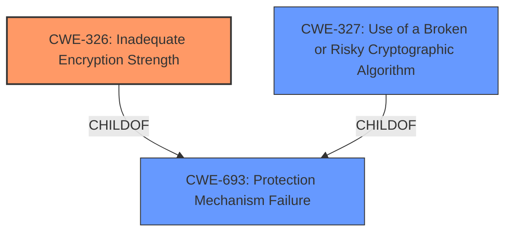

# Raw Analyzer Response for CVE-2022-24116

# Summary

| CWE ID  | CWE Name                       | Confidence | CWE Abstraction Level | CWE Vulnerability Mapping Label | CWE-Vulnerability Mapping Notes |
| :-------- | :----------------------------- | :--------- | :-------------------- | :------------------------------ | :------------------------------ |
| CWE-326   | Inadequate Encryption Strength | 0.9        | Class                 | Primary                         | Allowed-with-Review             |

## Evidence and Confidence

*   **Confidence Score:** 0.9
*   **Evidence Strength:** HIGH

## Relationship Analysis

The primary relationship impacting the decision is the hierarchical structure, specifically the parent-child relationship, where `CWE-326` (Inadequate Encryption Strength) is a class-level CWE. While there might be more specific children, the provided information doesn't offer enough detail to pinpoint a base or variant level CWE. Other CWEs such as `CWE-327` (Use of a Broken or Risky Cryptographic Algorithm) were considered as peers that offered alternative classifications, but they were not as suitable as `CWE-326`. The abstraction levels helped to narrow down the selection to the most appropriate level given the available evidence.

## Vulnerability Chain

The chain of weaknesses starts with **inadequate encryption strength** (`CWE-326`). This leads to the potential compromise of confidentiality, integrity, and availability of the radio network. The vulnerability allows an attacker to potentially intercept and decrypt sensitive data, modify data in transit, or disrupt network operations.

## Summary of Analysis

The analysis is based on the provided vulnerability description and the associated CVE reference links. The key phrase "inadequate encryption strength" from the vulnerability description directly aligns with `CWE-326` (Inadequate Encryption Strength). The CVE reference summary reinforces this by stating that the vulnerability stems from a weakness in the wireless security software and chipset implementations, implying **insufficient encryption strength** or use of weak algorithms.

The graph relationships influenced the final selection by providing context on how `CWE-326` relates to other cryptographic weaknesses. While `CWE-327` (Use of a Broken or Risky Cryptographic Algorithm) was considered, it was deemed less appropriate because the description doesn't explicitly state that a broken or risky algorithm was used, only that the encryption strength was inadequate.

`CWE-326` is selected as the optimal level of specificity because it accurately represents the **root cause** of the vulnerability based on the provided evidence. The evidence explicitly mentions "**inadequate encryption strength**", which directly maps to the description of `CWE-326`. While more specific CWEs might exist, the current information is insufficient to determine if a more specific CWE is applicable. Other CWEs like `CWE-311` (Missing Encryption of Sensitive Data) were not suitable as encryption was present but considered weak. `CWE-328` (Use of Weak Hash) was also not selected as the vulnerability does not refer to use of a hash.