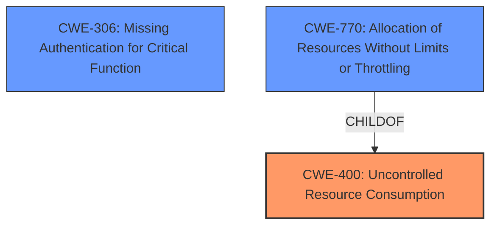

# Raw Analyzer Response for CVE-2022-24118

# Summary

| CWE ID | CWE Name | Confidence | CWE Abstraction Level | CWE Vulnerability Mapping Label | CWE-Vulnerability Mapping Notes |
|---|---|---|---|---|---|
| CWE-400 | Uncontrolled Resource Consumption | 0.8 | Class | Primary | Discouraged |
| CWE-306 | Missing Authentication for Critical Function | 0.7 | Base | Secondary | Allowed |
| CWE-770 | Allocation of Resources Without Limits or Throttling | 0.6 | Base | Secondary | Allowed |

## Evidence and Confidence

*   **Confidence Score:** 0.8
*   **Evidence Strength:** MEDIUM

## Relationship Analysis
The primary CWE is CWE-400, a class-level CWE that indicates a broad category of resource consumption issues. CWE-306 and CWE-770 are base-level CWEs that provide more specific details.

CWE-400 is a parent of CWE-770, suggesting that uncontrolled resource consumption can be due to allocating resources without limits. CWE-306 exists somewhat independently, representing a lack of authentication that allows the attack.

## Vulnerability Chain
The vulnerability chain involves:
1.  **Root Cause:** Missing authentication for critical functionality, allowing unauthorized access to trigger the reset function.
2.  **Weakness:** Uncontrolled resource consumption due to the ability to trigger a factory reset without proper limits.
3.  **Impact:** Device reset to factory default, causing denial of service.

Missing authentication allows the attacker to trigger the resource consumption.

## Summary of Analysis
Initially, the vulnerability description points to a denial-of-service issue caused by triggering a factory reset using a specific code. The **Root Cause of Vulnerability** indicates that an authentication code is used to trigger a factory reset, which should require more robust controls. The **Weaknesses/Vulnerabilities Present** section mentions Uncontrolled Resource Consumption (CWE-400).

CWE-400, **Uncontrolled Resource Consumption**, is a class-level CWE that broadly captures the essence of the denial-of-service vulnerability. However, the MITRE mapping guidance discourages its use due to its high-level nature and potential for misuse. It suggests considering children/descendants such as CWE-770, **Allocation of Resources Without Limits or Throttling**.

CWE-306, **Missing Authentication for Critical Function**, is a base-level CWE that highlights the absence of authentication for the factory reset functionality. This seems to be a more specific root cause, as the vulnerability stems from the ability to trigger the reset without proper authentication. The **CVE Reference Links Content Summary** explicitly states that the vulnerability "stems from the ability to use an authentication code to force a radio device to reset to its factory default configuration and reboot."

CWE-770, **Allocation of Resources Without Limits or Throttling**, is also a base-level CWE that describes the allocation of resources without proper limits. This is relevant because the factory reset can be considered a resource-intensive operation, and the vulnerability allows it to be triggered without limits.

The relationship graph shows that CWE-770 is a child of CWE-400, indicating that allocating resources without limits is a specific type of uncontrolled resource consumption.

Considering the MITRE mapping guidance and the specific details of the vulnerability, CWE-400 is assigned as the primary CWE because the **impact** is resource consumption. CWE-306 and CWE-770 are assigned as secondary CWEs to capture the **root cause** (missing authentication) and the specific mechanism (unlimited resource allocation) that leads to the vulnerability.

Relevant CWE Information:

# Enhanced Context (25 CWEs)
The following CWEs were identified as potentially relevant to this vulnerability:

## CWE-74: Improper Neutralization of Special Elements in Output Used by a Downstream Component ('Injection')
**Abstraction Level**: Class
**Similarity Score**: 0.78
**Source**: dense

**Description**:
The product constructs all or part of a command, data structure, or record using externally-influenced input from an upstream component, but it does not neutralize or incorrectly neutralizes special elements that could modify how it is parsed or interpreted when it is sent to a downstream component.

**Mapping Guidance**:
- Usage: Discouraged
- Rationale: CWE-74 is high-level and often misused when lower-level weaknesses are more appropriate.

## CWE-1289: Improper Validation of Unsafe Equivalence in Input
**Abstraction Level**: Base
**Similarity Score**: 0.77
**Source**: dense

**Description**:
The product receives an input value that is used as a resource identifier or other type of reference, but it does not validate or incorrectly validates that the input is equivalent to a potentially-unsafe value.

**Mapping Guidance**:
- Usage: Allowed
- Rationale: This CWE entry is at the Base level of abstraction, which is a preferred level of abstraction for mapping to the root causes of vulnerabilities.

## CWE-184: Incomplete List of Disallowed Inputs
**Abstraction Level**: Base
**Similarity Score**: 0.77
**Source**: dense

**Description**:
The product implements a protection mechanism that relies on a list of inputs (or properties of inputs) that are not allowed by policy or otherwise require other action to neutralize before additional processing takes place, but the list is incomplete.

**Mapping Guidance**:
- Usage: Allowed
- Rationale: This CWE entry is at the Base level of abstraction, which is a preferred level of abstraction for mapping to the root causes of vulnerabilities.

## CWE-807: Reliance on Untrusted Inputs in a Security Decision
**Abstraction Level**: Base
**Similarity Score**: 0.77
**Source**: dense

**Description**:
The product uses a protection mechanism that relies on the existence or values of an input, but the input can be modified by an untrusted actor in a way that bypasses the protection mechanism.

**Mapping Guidance**:
- Usage: Allowed
- Rationale: This CWE entry is at the Base level of abstraction, which is a preferred level of abstraction for mapping to the root causes of vulnerabilities.

## CWE-138: Improper Neutralization of Special Elements
**Abstraction Level**: Class
**Similarity Score**: 0.77
**Source**: dense

**Description**:
The product receives input from an upstream component, but it does not neutralize or incorrectly neutralizes special elements that could be interpreted as control elements or syntactic markers when they are sent to a downstream component.

**Mapping Guidance**:
- Usage: Discouraged
- Rationale: This CWE entry is a level-1 Class (i.e., a child of a Pillar). It might have lower-level children that would be more appropriate

## CWE-41: Improper Resolution of Path Equivalence
**Abstraction Level**: Base
**Similarity Score**: 0.76
**Source**: dense

**Description**:
The product is vulnerable to file system contents disclosure through path equivalence. Path equivalence involves the use of special characters in file and directory names. The associated manipulations are intended to generate multiple names for the same object.

**Mapping Guidance**:
- Usage: Allowed
- Rationale: This CWE entry is at the Base level of abstraction, which is a preferred level of abstraction for mapping to the root causes of vulnerabilities.

## CWE-668: Exposure of Resource to Wrong Sphere
**Abstraction Level**: Class
**Similarity Score**: 0.76
**Source**: dense

**Description**:
The product exposes a resource to the wrong control sphere, providing unintended actors with inappropriate access to the resource.

**Mapping Guidance**:
- Usage: Discouraged
- Rationale: CWE-668 is high-level and is often misused as a catch-all when lower-level CWE IDs might be applicable. It is sometimes used for low-information vulnerability reports [REF-1287]. It is a level-1 Class (i.e., a child of a Pillar). It is not useful for trend analysis.

## CWE-73: External Control of File Name or Path
**Abstraction Level**: Base
**Similarity Score**: 0.76
**Source**: dense

**Description**:
The product allows user input to control or influence paths or file names that are used in filesystem operations.

**Mapping Guidance**:
- Usage: Allowed
- Rationale: This CWE entry is at the Base level of abstraction, which is a preferred level of abstraction for mapping to the root causes of vulnerabilities.

## CWE-345: Insufficient Verification of Data Authenticity
**Abstraction Level**: Class
**Similarity Score**: 0.76
**Source**: dense

**Description**:
The product does not sufficiently verify the origin or authenticity