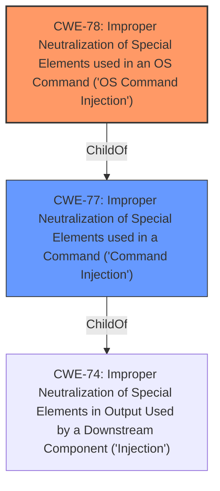

# Analysis Report for CVE-2022-24144

# Vulnerability Analysis Report: CVE-2022-24144

## Description


## Analysis (with Relationship Data)

# Summary
| CWE ID | CWE Name | Confidence | CWE Abstraction Level | CWE Vulnerability Mapping Label | CWE-Vulnerability Mapping Notes |
|---|---|---|---|---|---|
| CWE-78 | Improper Neutralization of Special Elements used in an OS Command ('OS Command Injection') | 1.0 | Base | Allowed | Primary CWE |
| CWE-77 | Improper Neutralization of Special Elements used in a Command ('Command Injection') | 0.7 | Class | Allowed-with-Review | Secondary Candidate |

## Evidence and Confidence

*   **Confidence Score:** 1.0
*   **Evidence Strength:** HIGH

## Relationship Analysis
The primary relationship that influenced the decision was the parent-child relationship between CWE-77 and CWE-78. CWE-78 is a base CWE and a child of CWE-77. The vulnerability description explicitly mentions command injection related to OS commands, making CWE-78 a more specific and appropriate choice than its parent.



## Vulnerability Chain
The vulnerability chain starts with the **improper neutralization** of special elements in the OS command, leading to the ability to execute arbitrary commands. The chain is relatively simple:

1.  **Improper Neutralization (CWE-78):** The root cause is the **improper neutralization** of special elements within the OS command.
2.  **Command Execution (Impact):** The impact is the ability to execute arbitrary commands.

## Summary of Analysis
The initial analysis focused on identifying the root cause of the vulnerability. The vulnerability description clearly states a "**command injection** vulnerability in the function WanParameterSetting. This vulnerability allows attackers to execute arbitrary commands via the gateway, dns1, and dns2 parameters." The key phrase is "**command injection**," which strongly suggests either CWE-77 or CWE-78.

The Retriever Results also highlight CWE-77 and CWE-78 as top candidates. CWE-78, "Improper Neutralization of Special Elements used in an OS Command ('OS Command Injection')," is a Base CWE, while CWE-77, "Improper Neutralization of Special Elements used in a Command ('Command Injection')," is a Class CWE. Given that the vulnerability involves the execution of OS commands, CWE-78 is the more specific and appropriate choice.

CWE-77 was considered as a potential candidate since the vulnerability description states "**command injection**". However, the MITRE mapping guidance for CWE-77 states: "CWE-77 is often misused when OS command injection (CWE-78) was intended instead [REF-1287]." This guidance, combined with the explicit mention of arbitrary command execution, solidifies the choice of CWE-78 as the primary weakness.

Therefore, the selection of CWE-78 is based on the explicit evidence of command injection related to OS commands, the hierarchical relationship between CWE-77 and CWE-78, and the MITRE mapping guidance. The choice of CWE-78 provides the most specific and accurate representation of the vulnerability.

Relevant CWE Information:

*   **CWE-78:** Improper Neutralization of Special Elements used in an OS Command ('OS Command Injection')
    *   **How the Vulnerability Matches:** The vulnerability description clearly indicates a **command injection** flaw, where the system fails to properly neutralize special elements in OS commands. This allows attackers to execute arbitrary commands. The affected parameters (gateway, dns1, dns2) are likely used to construct OS commands without proper sanitization.
    *   **Security Implications:** This can lead to complete system compromise, allowing attackers to perform any action that the compromised process is authorized to perform.
    *   **Parent-Child Relationships:** CWE-78 is a child of CWE-77 (Improper Neutralization of Special Elements used in a Command).
    *   **MITRE Mapping Guidance:** Usage is Allowed, confirming its suitability.
*   **CWE-77:** Improper Neutralization of Special Elements used in a Command ('Command Injection')
    *   **Why Not Used as Primary:** While the description mentions command injection, CWE-77 is often misused when OS command injection (CWE-78) is the actual issue. The vulnerability involves OS commands, making CWE-78 a more precise fit.
    *   **MITRE Mapping Guidance:** Usage is Allowed-with-Review, with a comment to ensure that OS command injection isn't the intended weakness, thus suggesting using CWE-78 when appropriate.


## CWE Relationship Analysis

Current CWEs represent these abstraction levels: .


### Vulnerability Chain Analysis

**Chain starting from CWE-78:**
- 78 (Improper Neutralization of Special Elements used in an OS Command ('OS Command Injection')) - ROOT


**Chain starting from CWE-77:**
- 77 (Improper Neutralization of Special Elements used in a Command ('Command Injection')) - ROOT


### CWE Relationship Diagram

```mermaid
graph TD
    classDef primary fill:#f96,stroke:#333,stroke-width:2px
    classDef secondary fill:#69f,stroke:#333
    classDef tertiary fill:#9e9,stroke:#333
```


*Report generated on 2025-03-31 06:37:00*
