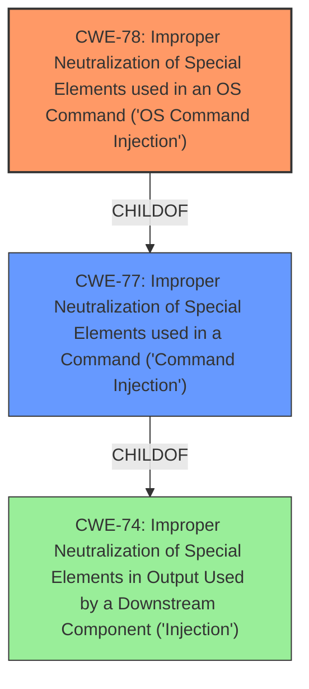

# Raw Analyzer Response for CVE-2022-24150

# Summary
| CWE ID | CWE Name | Confidence | CWE Abstraction Level | CWE Vulnerability Mapping Label | CWE-Vulnerability Mapping Notes |
|---|---|---|---|---|---|
| CWE-78 | Improper Neutralization of Special Elements used in an OS Command ('OS Command Injection') | 1.0 | Base | Allowed | Primary CWE. The vulnerability allows attackers to execute arbitrary commands via the remoteIp parameter due to **command injection**. |

## Evidence and Confidence

*   **Confidence Score:** 1.0
*   **Evidence Strength:** HIGH

## Relationship Analysis
The primary CWE is CWE-78, which is a base-level CWE. It is a child of CWE-77 and CWE-74. CWE-77 is a class-level CWE, and CWE-74 is a pillar-level CWE. The relationship indicates a hierarchy of command injection vulnerabilities, with CWE-78 being the most specific and appropriate for OS command injection.

## Vulnerability Chain
The chain of events is:
1.  **Root Cause:** **Command injection** due to **improper neutralization** of special elements in the `remoteIp` parameter. (CWE-78)
2.  **Impact:** Execution of arbitrary commands.

## Summary of Analysis
The vulnerability description clearly states a **command injection** vulnerability in the `formSetSafeWanWebMan` function, allowing attackers to execute arbitrary commands via the `remoteIp` parameter. This directly aligns with the description of CWE-78, "Improper Neutralization of Special Elements used in an OS Command ('OS Command Injection')", which specifies that the product constructs an OS command using externally-influenced input but fails to neutralize special elements, allowing modification of the intended command.

The retriever results also list CWE-78 as a highly relevant CWE. CWE-77 is a more general case of command injection, but since the vulnerability description specifies OS commands, CWE-78 is more appropriate.

I am confident in this assessment because the description provides direct evidence of OS command injection, and CWE-78 is the most specific CWE that accurately represents this vulnerability.

CWEs considered but not used:

*   CWE-77: Improper Neutralization of Special Elements used in a Command ('Command Injection') - While this is a parent of CWE-78, it is less specific as it applies to command injection in general, not specifically OS commands.
*   CWE-121: Stack-based Buffer Overflow - This is a different type of vulnerability, not related to command injection.
*   CWE-95: Improper Neutralization of Directives in Dynamically Evaluated Code ('Eval Injection') - This is a code injection vulnerability related to dynamic evaluation, not command injection.
*   CWE-790: Improper Filtering of Special Elements - This is a more general class of weakness and CWE-78 is more specific.
*   CWE-259: Use of Hard-coded Password - This is not related to command injection.
*   CWE-184: Incomplete List of Disallowed Inputs - While an incomplete list of disallowed inputs could lead to command injection, the description directly states that the cause is command injection, making CWE-78 more accurate.
*   CWE-88: Improper Neutralization of Argument Delimiters in a Command ('Argument Injection') - This is a related CWE, but CWE-78 is more directly applicable as it describes the **command injection** itself.
*   CWE-138: Improper Neutralization of Special Elements - This is a more general class of weakness and CWE-78 is more specific.
*   CWE-116: Improper Encoding or Escaping of Output - This is a more general class of weakness and CWE-78 is more specific.