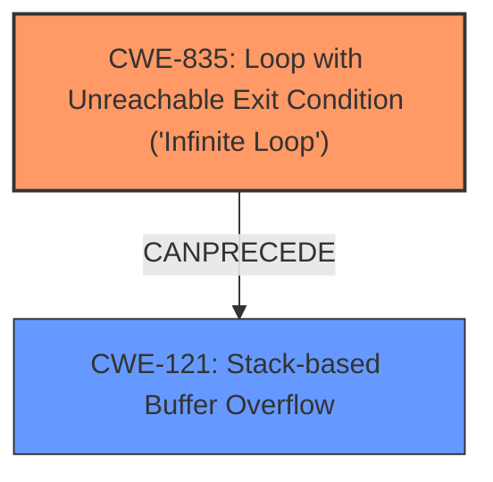

# Analysis for CVE-2022-24191

# Summary
| CWE ID | CWE Name | Confidence | CWE Abstraction Level | CWE Vulnerability Mapping Label | CWE-Vulnerability Mapping Notes |
|---|---|---|---|---|---|
| CWE-835 | Loop with Unreachable Exit Condition ('Infinite Loop') | 1.0 | Base | Allowed | Primary CWE: The root cause is an infinite loop in the `gif_read_lzw` function. |
| CWE-121 | Stack-based Buffer Overflow | 0.9 | Variant | Allowed | Secondary CWE: Due to the incrementing stack pointer `sp` within the infinite loop leading to a stack buffer overflow. |

## Evidence and Confidence

*   **Confidence Score:** 0.95
*   **Evidence Strength:** HIGH

## Relationship Analysis
The primary weakness is **CWE-835 (Loop with Unreachable Exit Condition ('Infinite Loop'))**, which directly leads to the secondary weakness **CWE-121 (Stack-based Buffer Overflow)**. The infinite loop causes a stack pointer to continuously increment, writing past allocated memory.

## Vulnerability Chain
The vulnerability chain starts with the **CWE-835 (Loop with Unreachable Exit Condition ('Infinite Loop'))** in the `gif_read_lzw` function. This leads to an incrementing stack pointer which then causes **CWE-121 (Stack-based Buffer Overflow)**, ultimately resulting in a program crash.

## Summary of Analysis
The analysis indicates a high confidence in assigning **CWE-835 (Loop with Unreachable Exit Condition ('Infinite Loop'))** as the primary CWE because the vulnerability description clearly states an **infinite loop** in the `gif_read_lzw` function. This is directly supported by the **Vulnerability Description Key Phrases** section, which identifies "**infinite loop in the gif_read_lzw function**" as the **rootcause**. The **CVE Reference Links Content Summary** also explicitly states: "The `while` loop in `gif_read_lzw` lacks proper exit conditions, leading to continuous execution." This evidence strongly supports the selection of **CWE-835**.

The secondary CWE, **CWE-121 (Stack-based Buffer Overflow)**, is a consequence of the **infinite loop**. The **CVE Reference Links Content Summary** explains that the stack pointer `sp` is continuously incremented within the loop, causing it to write past allocated memory on the stack. This directly leads to a stack buffer overflow.

The relationship between **CWE-835** and **CWE-121** is a clear chain: the **infinite loop** *causes* the stack buffer overflow. **CWE-835** can precede **CWE-121**, as the loop needs to be present to lead to the overflow.

Other CWEs were considered but not selected because they didn't accurately reflect the root cause or direct consequences. For example, while there was a mention of a "pointer arbitrarily pointing to heap memory", the final analysis identified the issue as a stack overflow. Therefore, heap-related CWEs like **CWE-122 (Heap-based Buffer Overflow)** were not chosen. Integer overflows (**CWE-190**) were also considered, but the primary issue is the **uncontrolled loop** and the subsequent overflow caused by the incrementing stack pointer.

The selected CWEs are at the optimal level of specificity. **CWE-835** is a Base-level CWE that accurately describes the **root cause**, while **CWE-121** is a Variant-level CWE that specifies the type of buffer overflow. Choosing more general CWEs would not provide enough detail about the specific vulnerability.

Relevant CWE Information:

# Enhanced Context (25 CWEs)
The following CWEs were identified as potentially relevant to this vulnerability:

## CWE-674: Uncontrolled Recursion
**Abstraction Level**: Class
**Similarity Score**: 0.76
**Source**: dense

**Description**:
The product does not properly control the amount of recursion that takes place,  consuming excessive resources, such as allocated memory or the program stack.

**Mapping Guidance**:
- Usage: Allowed-with-Review
- Rationale: This CWE entry is a Class and might have Base-level children that would be more appropriate

## CWE-197: Numeric Truncation Error
**Abstraction Level**: Base
**Similarity Score**: 0.75
**Source**: dense

**Description**:
Truncation errors occur when a primitive is cast to a primitive of a smaller size and data is lost in the conversion.

**Mapping Guidance**:
- Usage: Allowed
- Rationale: This CWE entry is at the Base level of abstraction, which is a preferred level of abstraction for mapping to the root causes of vulnerabilities.

## CWE-191: Integer Underflow (Wrap or Wraparound)
**Abstraction Level**: Base
**Similarity Score**: 0.74
**Source**: dense

**Description**:
The product subtracts one value from another, such that the result is less than the minimum allowable integer value, which produces a value that is not equal to the correct result.

**Mapping Guidance**:
- Usage: Allowed
- Rationale: This CWE entry is at the Base level of abstraction, which is a preferred level of abstraction for mapping to the root causes of vulnerabilities.

## CWE-131: Incorrect Calculation of Buffer Size
**Abstraction Level**: Base
**Similarity Score**: 0.74
**Source**: dense

**Description**:
The product does not correctly calculate the size to be used when allocating a buffer, which could lead to a buffer overflow.

**Mapping Guidance**:
- Usage: Allowed
- Rationale: This CWE entry is at the Base level of abstraction, which is a preferred level of abstraction for mapping to the root causes of vulnerabilities.

## CWE-125: Out-of-bounds Read
**Abstraction Level**: Base
**Similarity Score**: 0.74
**Source**: dense

**Description**:
The product reads data past the end, or before the beginning, of the intended buffer.

**Mapping Guidance**:
- Usage: Allowed
- Rationale: This CWE entry is at the Base level of abstraction, which is a preferred level of abstraction for mapping to the root causes of vulnerabilities.

## CWE-404: Improper Resource Shutdown or Release
**Abstraction Level**: Class
**Similarity Score**: 0.74
**Source**: dense

**Description**:
The product does not release or incorrectly releases a resource before it is made available for re-use.

**Mapping Guidance**:
- Usage: Allowed-with-Review
- Rationale: This CWE entry is a Class and might have Base-level children that would be more appropriate

## CWE-667: Improper Locking
**Abstraction Level**: Class
**Similarity Score**: 0.73
**Source**: dense

**Description**:
The product does not properly acquire or release a lock on a resource, leading to unexpected resource state changes and behaviors.

**Mapping Guidance**:
- Usage: Allowed-with-Review
- Rationale: This CWE entry is a Class and might have Base-level children that would be more appropriate

## CWE-226: Sensitive Information in Resource Not Removed Before Reuse
**Abstraction Level**: Base
**Similarity Score**: 0.73
**Source**: dense

**Description**:
The product releases a resource such as memory or a file so that it can be made available for reuse, but it does not clear or "zeroize" the information contained in the resource before the product performs a critical state transition or makes the resource available for reuse by other entities.

**Mapping Guidance**:
- Usage: Allowed
- Rationale: This CWE entry is at the Base level of abstraction, which is a preferred level of abstraction for mapping to the root causes of vulnerabilities.

## CWE-789: Memory Allocation with Excessive Size Value
**Abstraction Level**: Variant
**Similarity Score**: 0.73
**Source**: dense

**Description**:
The product allocates memory based on an untrusted, large size value, but it does not ensure that the size is within expected limits, allowing arbitrary amounts of memory to be allocated.

**Mapping Guidance**:
- Usage: Allowed
- Rationale: This CWE entry is at the Variant level of abstraction, which is a preferred level of abstraction for mapping to the root causes of vulnerabilities.

## CWE-1325: Improperly Controlled Sequential Memory Allocation
**Abstraction Level**: Base
**Similarity Score**: 0.73
**Source**: dense

**Description**:
The product manages a group of objects or resources and performs a separate memory allocation for each object, but it does not properly limit the total amount of memory that is consumed by all of the combined objects.

**Mapping Guidance**:
- Usage: Allowed
- Rationale: This CWE entry is at the Base level of abstraction, which is a preferred level of abstraction for mapping