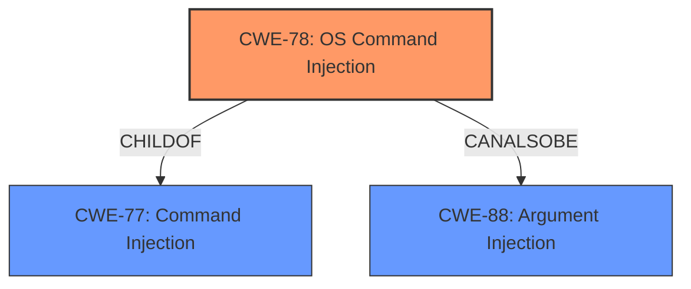

# Enhanced Analysis for CVE-2022-24193

# Summary
| CWE ID | CWE Name | Confidence | CWE Abstraction Level | CWE Vulnerability Mapping Label | CWE-Vulnerability Mapping Notes |
|---|---|---|---|---|---|
| CWE-78 | Improper Neutralization of Special Elements used in an OS Command ('OS Command Injection') | 0.9 | Base | Primary | Allowed |
| CWE-77 | Improper Neutralization of Special Elements used in a Command ('Command Injection') | 0.7 | Class | Secondary | Allowed-with-Review. Considered because it is a parent of CWE-78 and the vulnerability could involve a command language besides OS shell invocation. |
| CWE-88 | Improper Neutralization of Argument Delimiters in a Command ('Argument Injection') | 0.5 | Base | Secondary | Allowed. Considered because argument injection can be related to command injection. |

## Evidence and Confidence

*   **Confidence Score:** 0.9
*   **Evidence Strength:** MEDIUM

## Relationship Analysis
The primary CWE is CWE-78, which is a Base level weakness and a child of CWE-77. CWE-77 is a more general class of command injection, while CWE-78 specifically refers to OS command injection. CWE-88 (Argument Injection) is a peer of CWE-78 and can sometimes be related. The choice of CWE-78 is based on the vulnerability description explicitly mentioning "**command injection**" and the code changes related to the `Language` header, which, if not properly sanitized, could lead to OS commands being executed.



## Vulnerability Chain
The vulnerability chain starts with the **improper handling of the `Language` header**, leading to **command injection**, which can then lead to **controller the system**.
- **Root Cause:** Improper handling/sanitization of the `Language` header in API requests.
- **Weakness:** CWE-78 Improper Neutralization of Special Elements used in an OS Command ('OS Command Injection').
- **Impact:** Gaining control of the CasaOS system.

## Summary of Analysis
The initial analysis focused on the "**command injection**" vulnerability in CasaOS. The evidence provided indicates that the vulnerability is related to how the application handles the `Language` header in API requests. The commit diffs suggest that the application **fails to properly sanitize or validate the `Language` header**, potentially allowing an attacker to inject malicious commands.

The primary CWE chosen is CWE-78 Improper Neutralization of Special Elements used in an OS Command ('OS Command Injection'). This is because the vulnerability description explicitly mentions "**command injection**", and the analysis of the code changes suggests that the injected commands could be executed at the OS level.

CWE-77 Improper Neutralization of Special Elements used in a Command ('Command Injection') was considered as a more general class. However, since the evidence points towards OS command execution, CWE-78 is a more specific and appropriate choice.

CWE-88 Improper Neutralization of Argument Delimiters in a Command ('Argument Injection') was also considered because the `Language` header could be manipulated to inject arguments into existing commands.

The final selection of CWE-78 is based on the evidence of "**command injection**" and its relationship to OS command execution. The confidence level is high (0.9) because the description aligns well with the definition of CWE-78.

Relevant CWE Information:
- The "**Vulnerability Description Key Phrases**" mentions the weakness is "**command injection**".
- The "**CVE Reference Links Content Summary**" states the vulnerability stems from a lack of proper sanitization or validation of the `Language` header passed in API requests. The impact of exploitation is to "will lead to controller the system".


## CWE Relationship Analysis

Current CWEs represent these abstraction levels: .


### Vulnerability Chain Analysis

**Chain starting from CWE-78:**
- 78 (Improper Neutralization of Special Elements used in an OS Command ('OS Command Injection')) - ROOT


**Chain starting from CWE-77:**
- 77 (Improper Neutralization of Special Elements used in a Command ('Command Injection')) - ROOT


### CWE Relationship Diagram

```mermaid
graph TD
    classDef primary fill:#f96,stroke:#333,stroke-width:2px
    classDef secondary fill:#69f,stroke:#333
    classDef tertiary fill:#9e9,stroke:#333
```