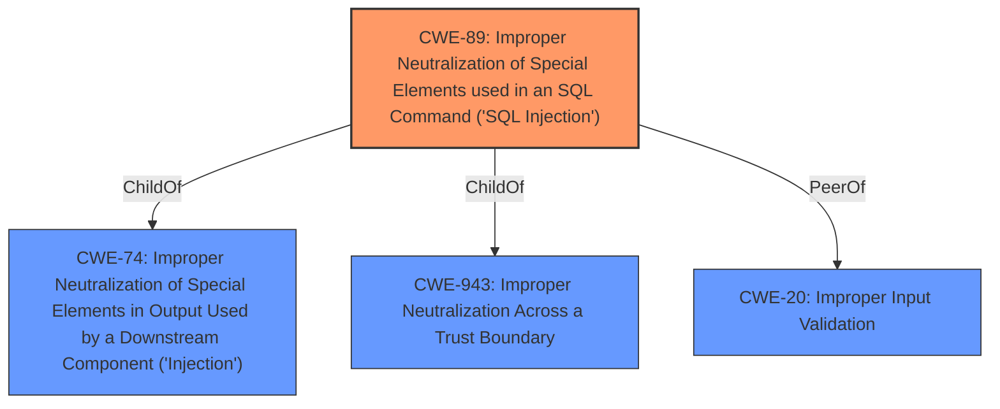

# Analysis for CVE-2022-2422

# Summary
| CWE ID | CWE Name | Confidence | CWE Abstraction Level | CWE Vulnerability Mapping Label | CWE-Vulnerability Mapping Notes |
|---|---|---|---|---|---|
| CWE-89 | Improper Neutralization of Special Elements used in an SQL Command ('SQL Injection') | 1.0 | Base | Allowed | Primary CWE |
| CWE-20 | Improper Input Validation | 0.7 | Class | Discouraged | Secondary Candidate |

## Evidence and Confidence

*   **Confidence Score:** 0.9
*   **Evidence Strength:** MEDIUM

## Relationship Analysis
The primary relationship is that CWE-89 is a child of CWE-74 (Improper Neutralization of Special Elements in Output Used by a Downstream Component ('Injection')) and CWE-943 (Improper Neutralization Across a Trust Boundary). CWE-20 (Improper Input Validation) is a class-level CWE and a parent of CWE-1284 (Improper Validation of Specified Quantity in Input). Since the vulnerability is specifically a SQL injection, CWE-89 is more specific and appropriate than its parents or the general input validation issue represented by CWE-20.

## Vulnerability Chain
The vulnerability chain starts with **improper input validation** leading to a **SQL injection** vulnerability. The chain is:
1.  **Improper Input Validation**: The application fails to properly validate user-supplied input.
2.  **SQL Injection**: This **improperly validated** input is then used in a SQL query, allowing an attacker to inject malicious SQL code.

## Summary of Analysis
The initial analysis identified **improper input validation** as the root cause and **SQL injection** as the resulting weakness. The vulnerability description explicitly states "**improper input validation**" and "**SQL injection**".

The Retriever Results strongly suggest CWE-89 (Improper Neutralization of Special Elements used in an SQL Command ('SQL Injection')) as the most relevant CWE. The retriever score for CWE-89 is 1.0, indicating a strong match. CWE-20 (Improper Input Validation) is also suggested, but its mapping guidance discourages its use when more specific CWEs are available.

CWE-89 is selected because the vulnerability is explicitly a SQL injection. CWE-20 is considered as a secondary candidate because **improper input validation** is the root cause, but CWE-89 directly represents the type of injection.

The decision is based on the provided evidence, relationship analysis, and mapping guidance, and results in selecting CWE-89 as the primary CWE and CWE-20 as a secondary consideration. CWE-89 is at the optimal level of specificity, accurately representing the SQL injection vulnerability resulting from **improper input validation**.