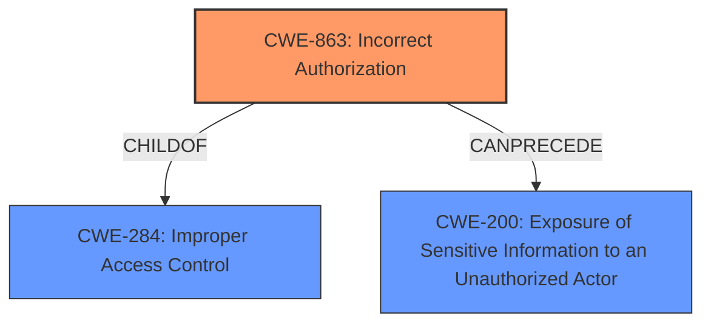

# Enhanced Analysis for CVE-2022-24309

# Summary
| CWE ID | CWE Name | Confidence | CWE Abstraction Level | CWE Vulnerability Mapping Label | CWE-Vulnerability Mapping Notes |
|---|---|---|---|---|---|
| **CWE-863** | **Incorrect Authorization** | 0.8 | Class | Primary | Allowed-with-Review |
| CWE-284 | Improper Access Control | 0.6 | Pillar | Secondary | Discouraged |
| CWE-200 | Exposure of Sensitive Information to an Unauthorized Actor | 0.5 | Class | Secondary | Discouraged |

## Evidence and Confidence

*   **Confidence Score:** 0.7
*   **Evidence Strength:** HIGH

## Relationship Analysis
The primary CWE selected is CWE-863 (Incorrect Authorization). This is a Class-level CWE. The vulnerability stems from the Mendix Runtime's failure to properly apply XPath constraint checks, which directly relates to an authorization process not being correctly performed. CWE-863 is a child of CWE-284 (Improper Access Control), which is a more general, Pillar-level CWE. While CWE-284 broadly applies, CWE-863 provides a more specific classification. CWE-200 (Exposure of Sensitive Information to an Unauthorized Actor) is related as a potential impact of the authorization failure, but it's a consequence rather than the root cause. Therefore, the hierarchical relationship influenced the selection of CWE-863 as the most appropriate primary CWE.



## Vulnerability Chain
The vulnerability chain starts with the **incorrect authorization** mechanism in the Mendix Runtime, specifically the failure to properly apply XPath constraint checks (CWE-863). This leads to the bypass of intended access controls, allowing a malicious user to dump and manipulate sensitive data. The final impact is the **exposure of sensitive information** (CWE-200) and potential data manipulation.

## Summary of Analysis
The initial analysis focused on identifying the root cause of the vulnerability. The description clearly points to the Mendix Runtime's failure to properly apply XPath constraint checks. The "CVE Reference Links Content Summary" section explicitly mentions "Improper Access Control (CWE-284) leading to the bypass of XPath constraints." However, CWE-863 (Incorrect Authorization) is a more specific child of CWE-284 and directly addresses the authorization check being performed incorrectly.

The retriever results also support this assessment, with CWE-863 having a high relevance score. The MITRE mapping guidance for CWE-863 suggests that it is a Class-level CWE and that a more specific Base-level CWE might be more appropriate. However, in this case, CWE-863 accurately captures the essence of the vulnerability.

CWE-284 (Improper Access Control) and CWE-200 (Exposure of Sensitive Information to an Unauthorized Actor) were considered as potential primary CWEs, but they represent higher-level abstractions or impacts rather than the root cause. CWE-284 is a Pillar-level CWE and is too general. CWE-200 is a result of the **incorrect authorization**.

The selected CWEs are at the optimal level of specificity because they accurately represent the root cause and impact of the vulnerability, based on the provided evidence. The evidence from the "CVE Reference Links Content Summary" section is strong, providing explicit details about the **incorrect authorization** and its consequences.

Relevant CWE Information:

# Enhanced Context (25 CWEs)

## CWE-668: Exposure of Resource to Wrong Sphere
**Abstraction Level**: Class
**Similarity Score**: 0.76
**Source**: dense

**Description**:
The product exposes a resource to the wrong control sphere, providing unintended actors with inappropriate access to the resource.

**Mapping Guidance**:
- Usage: Discouraged
- Rationale: CWE-668 is high-level and is often misused as a catch-all when lower-level CWE IDs might be applicable. It is sometimes used for low-information vulnerability reports [REF-1287]. It is a level-1 Class (i.e., a child of a Pillar). It is not useful for trend analysis.

*Reason for not using*: This is too high level and would be better represented by CWE-863.

## CWE-266: Incorrect Privilege Assignment
**Abstraction Level**: Base
**Similarity Score**: 0.75
**Source**: dense

**Description**:
A product incorrectly assigns a privilege to a particular actor, creating an unintended sphere of control for that actor.

**Mapping Guidance**:
- Usage: Allowed
- Rationale: This CWE entry is at the Base level of abstraction, which is a preferred level of abstraction for mapping to the root causes of vulnerabilities.

*Reason for not using*: The issue is not with privilege assignment, but with the **incorrect authorization** checks.

## CWE-280: Improper Handling of Insufficient Permissions or Privileges 
**Abstraction Level**: Base
**Similarity Score**: 0.75
**Source**: dense

**Description**:
The product does not handle or incorrectly handles when it has insufficient privileges to access resources or functionality as specified by their permissions. This may cause it to follow unexpected code paths that may leave the product in an invalid state.

**Mapping Guidance**:
- Usage: Allowed
- Rationale: This CWE entry is at the Base level of abstraction, which is a preferred level of abstraction for mapping to the root causes of vulnerabilities.

*Reason for not using*: The issue is not with handling insufficient privileges, but rather the **incorrect authorization** checks that allow access when it shouldn't be allowed.

## CWE-404: Improper Resource Shutdown or Release
**Abstraction Level**: Class
**Similarity Score**: 0.75
**Source**: dense

**Description**:
The product does not release or incorrectly releases a resource before it is made available for re-use.

**Mapping Guidance**:
- Usage: Allowed-with-Review
- Rationale: This CWE entry is a Class and might have Base-level children that would be more appropriate

*Reason for not using*: Not related to resource shutdown or release.

## CWE-274: Improper Handling of Insufficient Privileges
**Abstraction Level**: Base
**Similarity Score**: 0.75
**Source**: dense

**Description**:
The product does not handle or incorrectly handles when it has insufficient privileges to perform an operation, leading to resultant weaknesses.

**Mapping Guidance**:
- Usage: Discouraged
- Rationale: This CWE entry could be deprecated in a future version of CWE.

*Reason for not using*: This is similar to CWE-280, the issue is not with handling insufficient privileges.

## CWE-653: Improper Isolation or Compartmentalization
**Abstraction Level**: Class
**Similarity Score**: 0.75
**Source**: dense

**Description**:
The product does not properly compartmentalize or isolate functionality, processes, or resources that require different privilege levels, rights, or permissions.

**Mapping Guidance**:
- Usage: Allowed
- Rationale: This CWE entry is at the Base level of abstraction, which is a preferred level of abstraction for mapping to the root causes of vulnerabilities.

*Reason for not using*: Not related to isolation or compartmentalization.

## CWE-538: Insertion of Sensitive Information into Externally-Accessible File or Directory
**Abstraction Level**: Base
**Similarity Score**: 0.75
**Source**: dense

**Description**:
The product places sensitive information into files or directories that are accessible to actors who are allowed to have access to the files, but not to the sensitive information.

**Mapping Guidance**:
- Usage: Allowed
- Rationale: This CWE entry is at the Base level of abstraction, which is a preferred level of abstraction for mapping to the root causes of vulnerabilities.

*Reason for not using*: Not related to inserting sensitive information into externally accessible files.

## CWE-497: Exposure of Sensitive System Information to an Unauthorized Control Sphere
**Abstraction Level**: Base
**Similarity Score**: 0.75
**Source**: dense

**Description**:
The product does not properly prevent sensitive system-level information from being accessed by unauthorized actors who do not have the same level of access to the underlying system as the product does.

**Mapping Guidance**:
- Usage: Allowed
- Rationale: This CWE entry is at the Base level of abstraction, which is a preferred level of abstraction for mapping to the root causes of vulnerabilities.

*Reason for not using*: Although there is information exposure, CWE-863 is a better fit.

## CWE-226: Sensitive Information in Resource Not Removed Before Reuse
**Abstraction Level**: Base
**Similarity Score**: 0.7


## CWE Relationship Analysis

Current CWEs represent these abstraction levels: .


### Vulnerability Chain Analysis

**Chain starting from CWE-200:**
- 200 (Exposure of Sensitive Information to an Unauthorized Actor) - ROOT


**Chain starting from CWE-266:**
- 266 (Incorrect Privilege Assignment) - ROOT


### CWE Relationship Diagram

```mermaid
graph TD
    classDef primary fill:#f96,stroke:#333,stroke-width:2px
    classDef secondary fill:#69f,stroke:#333
    classDef tertiary fill:#9e9,stroke:#333
```