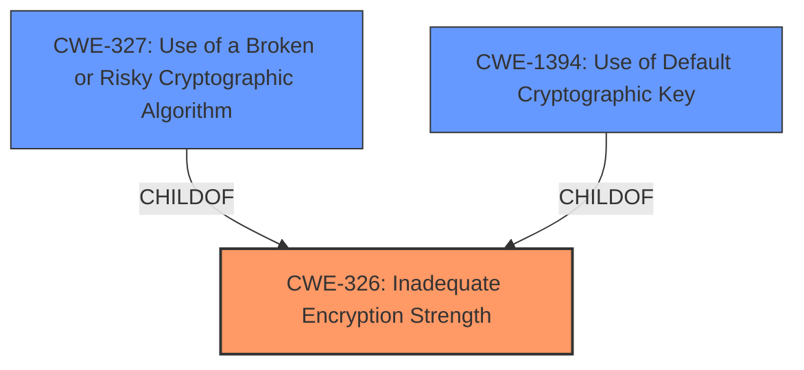

# Raw Analyzer Response for CVE-2022-24318

# Summary
| CWE ID | CWE Name | Confidence | CWE Abstraction Level | CWE Vulnerability Mapping Label | CWE-Vulnerability Mapping Notes |
|---|---|---|---|---|---|
| CWE-326 | Inadequate Encryption Strength | 1.0 | Class | Primary | Allowed-with-Review |
| CWE-327 | Use of a Broken or Risky Cryptographic Algorithm | 0.5 | Class | Secondary | Allowed-with-Review |
| CWE-1394 | Use of Default Cryptographic Key | 0.3 | Base | Secondary | Allowed |

## Evidence and Confidence

*   **Confidence Score:** 0.7
*   **Evidence Strength:** MEDIUM

## Relationship Analysis
The primary relationship that impacts the decision is the hierarchical relationship where CWE-326 is a class-level CWE, and has potential base-level children. In this case, CWE-327 and CWE-1394 are considered as potential children. The choice of CWE-326 is supported by the explicit mention of "**Inadequate Encryption Strength**" in the vulnerability description, making it a direct match.

## Vulnerability Chain
The vulnerability chain starts with the **Inadequate Encryption Strength**, leading to unencrypted communication with the server.

## Summary of Analysis
The initial analysis identified CWE-326 as the primary weakness due to the explicit mention of "**Inadequate Encryption Strength**" in the vulnerability description. The retriever results also ranked CWE-326 as the top candidate.

The evidence supporting this decision is:
- **Vulnerability Description Key Phrases:** "**rootcause:** **Inadequate Encryption Strength**"

The graph relationships influenced the selection by considering potential child CWEs of CWE-326. CWE-327 and CWE-1394 were considered, but ultimately deemed less specific than CWE-326 based on the available evidence. While outdated versions of ViewX client are used, the root cause is the **Inadequate Encryption Strength**.

The selected CWE is at the optimal level of specificity because it directly reflects the stated root cause of the vulnerability.

Relevant CWE Information:

# Enhanced Context (25 CWEs)

## CWE-326: Inadequate Encryption Strength
**Abstraction:** Class
**Status:** Draft

### Description
The product stores or transmits sensitive data using an encryption scheme that is theoretically sound, but is not strong enough for the level of protection required.

## CWE-327: Use of a Broken or Risky Cryptographic Algorithm
**Abstraction:** Class
**Status:** Draft

### Description
The product uses a broken or risky cryptographic algorithm or protocol.

## CWE-1394: Use of Default Cryptographic Key
**Abstraction:** Base
**Status:** Incomplete

### Description
The product uses a default cryptographic key for potentially critical functionality.

## CWEs Considered But Not Used:

*   **CWE-916 (Use of Password Hash With Insufficient Computational Effort):** While related to cryptography, this CWE is specific to password hashing and computational effort, which is not the focus of the vulnerability description.
*   **CWE-311 (Missing Encryption of Sensitive Data):** This CWE focuses on the absence of encryption, while the vulnerability description specifies "**Inadequate Encryption Strength**," implying that encryption is present but insufficient.
*   **CWE-290 (Authentication Bypass by Spoofing) and CWE-294 (Authentication Bypass by Capture-replay):** These CWEs relate to authentication bypass mechanisms, which are not the primary issue described in the vulnerability. The focus is on the encryption strength itself, not the bypass.
*   **CWE-471 (Modification of Assumed-Immutable Data (MAID)):** This CWE is unrelated to the encryption issues described in the vulnerability.
*   **CWE-522 (Insufficiently Protected Credentials):** While related to credentials, this CWE focuses on insecure methods of transmission or storage, whereas the primary issue is **Inadequate Encryption Strength**.
*   **CWE-119 (Improper Restriction of Operations within the Bounds of a Memory Buffer):** This CWE is unrelated to the cryptographic issues described in the vulnerability.
*   **CWE-347 (Improper Verification of Cryptographic Signature):** This CWE relates to signature verification, which is not the focus of this vulnerability.