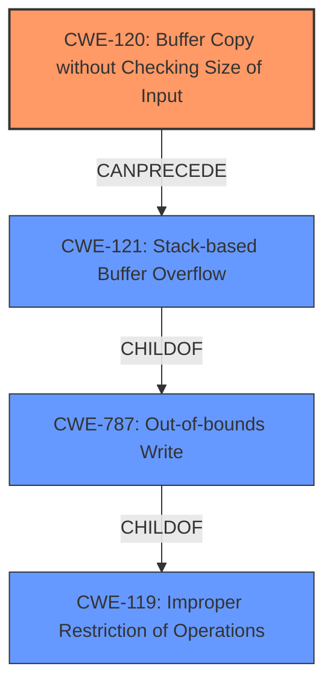

# Raw Analyzer Response for CVE-2022-24324

# Summary
| CWE ID    | CWE Name                                                                 | Confidence | CWE Abstraction Level | CWE Vulnerability Mapping Label | CWE-Vulnerability Mapping Notes |
| :-------- | :----------------------------------------------------------------------- | :--------- | :---------------------- | :------------------------------ | :------------------------------ |
| CWE-120   | Buffer Copy without Checking Size of Input ('Classic Buffer Overflow') | 1          | Base                    | Primary CWE                     | Allowed-with-Review             |
| CWE-121   | Stack-based Buffer Overflow                                                | 0.7        | Variant                 | Secondary CWE                   | Allowed                         |
| CWE-787   | Out-of-bounds Write                                                        | 0.6        | Base                    | Secondary CWE                   | Allowed                         |
| CWE-119   | Improper Restriction of Operations within the Bounds of a Memory Buffer | 0.5        | Class                   | Secondary CWE                   | Discouraged                     |

## Evidence and Confidence

*   **Confidence Score:** 0.8
*   **Evidence Strength:** HIGH

## Relationship Analysis
The primary CWE is CWE-120, which describes the root cause of the vulnerability. CWE-121 is a more specific variant indicating the buffer is on the stack. CWE-787 is a parent of CWE-121 and captures the out-of-bounds write condition that results from the buffer overflow. CWE-119 is a more general class encompassing improper restriction of operations within memory buffers. The relationships reflect the chain of events from a buffer copy without size checking to an out-of-bounds write on the stack, ultimately leading to potential code execution.

## Vulnerability Chain
The chain of events is as follows:
1.  **CWE-120**: The application copies a buffer without checking the input size.
2.  **CWE-121**: Because the buffer is stack-based, a stack-based buffer overflow occurs.
3.  **CWE-787**: This leads to an out-of-bounds write, corrupting memory.
4.  The impact is potential remote code execution.

## Summary of Analysis
The vulnerability description clearly states that a **CWE-120 Buffer Copy without Checking Size of Input** vulnerability exists, leading to a **stack-based buffer overflow**. The CVE Reference Links Content Summary further supports this by stating the root cause is a buffer copy without checking the size of input and identifies the weakness as a stack-based buffer overflow.

The primary mapping is CWE-120, as it accurately reflects the root cause of the vulnerability. CWE-121 is included as a secondary CWE to specify the location of the buffer. CWE-787 describes the resulting out-of-bounds write. CWE-119 is a general class and is less specific than the other CWEs.

The selection of CWE-120 is justified because the vulnerability description explicitly mentions "Buffer Copy without Checking Size of Input". The evidence is strong, and the mapping aligns with the provided information.

The confidence score is high (0.8) because the provided evidence strongly supports the selected CWEs. The retriever results also indicate that CWE-120 and CWE-119 are relevant. The evidence is sufficient to justify the selection of CWE-120 as the primary CWE.