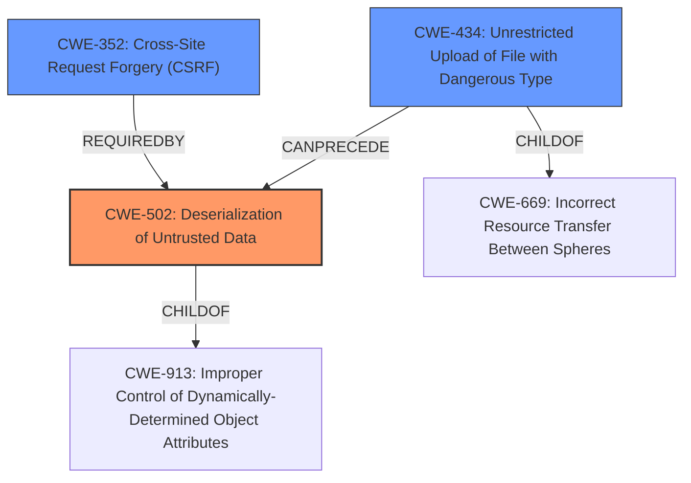

# Raw Analyzer Response for CVE-2022-2433

# Summary

| CWE ID  | CWE Name                                                                   | Confidence | CWE Abstraction Level | CWE Vulnerability Mapping Label | CWE-Vulnerability Mapping Notes |
| ------- | -------------------------------------------------------------------------- | ---------- | --------------------- | ------------------------------- | ------------------------------- |
| CWE-502 | Deserialization of Untrusted Data                                        | 1          | Base                  | Primary                         | Allowed                        |
| CWE-352 | Cross-Site Request Forgery (CSRF)                                          | 0.9        | Compound               | Secondary                       | Allowed                        |
| CWE-434 | Unrestricted Upload of File with Dangerous Type                           | 0.7        | Base                 | Secondary                       | Allowed                        |

## Evidence and Confidence

*   **Confidence Score:** 0.9
*   **Evidence Strength:** HIGH

## Relationship Analysis

The primary weakness is CWE-502, which is the **improper deserialization** of untrusted data. The attack requires tricking an administrator into performing an action (CSRF - CWE-352). The attacker also needs to upload a file with a malicious payload to the server, indicating a potential CWE-434 (Unrestricted Upload of File with Dangerous Type). CWE-502 is a child of CWE-913 (Improper Control of Dynamically-Determined Object Attributes), indicating a potential relationship where the attributes of an object are being modified through deserialization.

## Vulnerability Chain

The vulnerability chain starts with the attacker uploading a file with a dangerous type (CWE-434), then tricking an administrator via CSRF (CWE-352) into triggering the **deserialization of untrusted data** (CWE-502), potentially leading to arbitrary code execution.

## Summary of Analysis

The primary weakness is clearly the **deserialization of untrusted data** (CWE-502). The vulnerability description key phrases highlight "rootcause: **improper deserialization**". The CVE Reference Links Content Summary explicitly states "The vulnerability stems from the **deserialization of untrusted input** within the `alm_repeaters_export` parameter". This evidence strongly supports CWE-502 as the primary CWE.

CWE-352 (Cross-Site Request Forgery) is also present, as the attacker needs to trick an administrator into performing an action. The CVE Reference Links Content Summary states "An attacker can trick an administrator into clicking a malicious link or performing an action that triggers the deserialization". The "Attack Vectors" section also mentions CSRF.

CWE-434 (Unrestricted Upload of File with Dangerous Type) is relevant because the attacker needs to upload a file containing the serialized payload. The CVE Reference Links Content Summary indicates that "The attacker needs to craft a malicious payload, serialize it, and upload a file containing it to the server".

I considered several other CWEs from the Retriever Results but found them less relevant:

*   CWE-79 (Improper Neutralization of Input During Web Page Generation ('Cross-site Scripting')): This is not directly related as the vulnerability isn't about injecting code into a web page.
*   CWE-22 (Improper Limitation of a Pathname to a Restricted Directory ('Path Traversal')): Although file upload is involved, the core issue is not related to traversing directories.
*   CWE-863 (Incorrect Authorization): While authorization is a broad area, the vulnerability is more specifically about **deserialization** and CSRF.

The selected CWEs are at the optimal level of specificity because they accurately represent the root cause and contributing factors to the vulnerability. CWE-502 directly addresses the **improper deserialization**, CWE-352 highlights the CSRF aspect, and CWE-434 covers the file upload requirement.

Relevant CWE Information:

# Enhanced Context (25 CWEs)

## CWE-23: Relative Path Traversal
**Abstraction Level**: Base
**Similarity Score**: 0.77
**Source**: dense

**Description**:
The product uses external input to construct a pathname that should be within a restricted directory, but it does not properly neutralize sequences such as ".." that can resolve to a location that is outside of that directory.

**Mapping Guidance**:
- Usage: Allowed
- Rationale: This CWE entry is at the Base level of abstraction, which is a preferred level of abstraction for mapping to the root causes of vulnerabilities.

## CWE-184: Incomplete List of Disallowed Inputs
**Abstraction Level**: Base
**Similarity Score**: 0.77
**Source**: dense

**Description**:
The product implements a protection mechanism that relies on a list of inputs (or properties of inputs) that are not allowed by policy or otherwise require other action to neutralize before additional processing takes place, but the list is incomplete.

**Mapping Guidance**:
- Usage: Allowed
- Rationale: This CWE entry is at the Base level of abstraction, which is a preferred level of abstraction for mapping to the root causes of vulnerabilities.

## CWE-639: Authorization Bypass Through User-Controlled Key
**Abstraction Level**: Base
**Similarity Score**: 0.77
**Source**: dense

**Description**:
The system's authorization functionality does not prevent one user from gaining access to another user's data or record by modifying the key value identifying the data.

**Mapping Guidance**:
- Usage: Allowed
- Rationale: This CWE entry is at the Base level of abstraction, which is a preferred level of abstraction for mapping to the root causes of vulnerabilities.

## CWE-41: Improper Resolution of Path Equivalence
**Abstraction Level**: Base
**Similarity Score**: 0.77
**Source**: dense

**Description**:
The product is vulnerable to file system contents disclosure through path equivalence. Path equivalence involves the use of special characters in file and directory names. The associated manipulations are intended to generate multiple names for the same object.

**Mapping Guidance**:
- Usage: Allowed
- Rationale: This CWE entry is at the Base level of abstraction, which is a preferred level of abstraction for mapping to the root causes of vulnerabilities.

## CWE-74: Improper Neutralization of Special Elements in Output Used by a Downstream Component ('Injection')
**Abstraction Level**: Class
**Similarity Score**: 0.76
**Source**: dense

**Description**:
The product constructs all or part of a command, data structure, or record using externally-influenced input from an upstream component, but it does not neutralize or incorrectly neutralizes special elements that could modify how it is parsed or interpreted when it is sent to a downstream component.

**Mapping Guidance**:
- Usage: Discouraged
- Rationale: CWE-74 is high-level and often misused when lower-level weaknesses are more appropriate.

## CWE-73: External Control of File Name or Path
**Abstraction Level**: Base
**Similarity Score**: 0.76
**Source**: dense

**Description**:
The product allows user input to control or influence paths or file names that are used in filesystem operations.

**Mapping Guidance**:
- Usage: Allowed
- Rationale: This CWE entry is at the Base level of abstraction, which is a preferred level of abstraction for mapping to the root causes of vulnerabilities.

## CWE-472: External Control of Assumed-Immutable Web Parameter
**Abstraction Level**: Base
**Similarity Score**: 0.76
**Source**: dense

**Description**:
The web application does not sufficiently verify inputs that are assumed to be immutable but are actually externally controllable, such as hidden form fields.

**Mapping Guidance**:
- Usage: Allowed
- Rationale: This CWE entry is at the Base level of abstraction, which is a preferred level of abstraction for mapping to the root causes of vulnerabilities.

## CWE-552: Files or Directories Accessible to External Parties
**Abstraction Level**: Base
**Similarity Score**: 0.76
**Source**: dense

**Description**:
The product makes files or directories accessible to unauthorized actors, even though they should not be.

**Mapping Guidance**:
- Usage: Allowed
- Rationale: This CWE entry is at the Base level of abstraction, which is a preferred level of abstraction for mapping to the root causes of vulnerabilities.

##