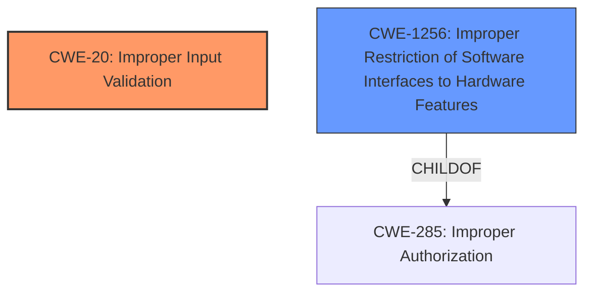

# Analysis Report for CVE-2022-24382

# Vulnerability Analysis Report: CVE-2022-24382

## Description


## Analysis (with Relationship Data)

# Summary
| CWE ID | CWE Name | Confidence | CWE Abstraction Level | CWE Vulnerability Mapping Label | CWE-Vulnerability Mapping Notes |
|---|---|---|---|---|---|
| CWE-20 | Improper Input Validation | 0.9 | Class | Primary | Discouraged |
| CWE-1256 | Improper Restriction of Software Interfaces to Hardware Features | 0.6 | Base | Secondary | Allowed |

## Evidence and Confidence

*   **Confidence Score:** 0.75
*   **Evidence Strength:** MEDIUM

## Relationship Analysis
The primary CWE identified is CWE-20 **Improper Input Validation**, which is a Class-level CWE. While it's discouraged to map directly to Class-level CWEs, the available information strongly points to this weakness as a contributing factor. The secondary CWE identified is CWE-1256 **Improper Restriction of Software Interfaces to Hardware Features**, which is a Base-level CWE, and a child of CWE-285.



## Vulnerability Chain
The vulnerability chain starts with **improper input validation** (CWE-20) which leads to potential escalation of privileges. The attacker is a privileged user with local access.
- **Root Cause**: CWE-20 **Improper Input Validation** in firmware.
- **Impact**: Escalation of Privilege.

## Summary of Analysis
The initial analysis identified **Improper Input Validation** as the root cause, aligning with the description and key phrases. The Retriever Results also listed CWE-20 **Improper Input Validation** as a candidate, although it is discouraged due to its high-level Class abstraction. The description states "**Improper input validation** in firmware for some Intel(R) NUCs may allow a privileged user to potentially enable escalation of privilege via local access." The CVE Reference Links Content Summary confirms this: "**Root Cause:** Improper input validation in the firmware of some Intel NUCs."

The primary assessment is based on the provided evidence, specifically the vulnerability description and CVE reference summary. The graph relationships highlight that CWE-20 is a class-level weakness, and more specific child CWEs should be considered if available. However, based on the current evidence, a more specific CWE related to the type of input or validation is not apparent. I considered CWE-1256 because the vulnerability is in firmware for Intel NUCs, which could involve hardware features; however, the evidence only points to improper input validation, not specifically to issues with hardware interface restrictions, so I rated this as a secondary candidate.

The selected CWEs are at the most optimal level of specificity given the available evidence. While CWE-20 is a class, more specific details about the exact nature of the improper validation are not provided in the description.

Relevant CWE Information:

# Enhanced Context (25 CWEs)
The following CWEs were identified as potentially relevant to this vulnerability:

## CWE-1289: Improper Validation of Unsafe Equivalence in Input
Not selected because there is no evidence to suggest that the input involves unsafe equivalence.

## CWE-691: Insufficient Control Flow Management
Not selected because the vulnerability is more directly related to input validation rather than control flow management.

## CWE-703: Improper Check or Handling of Exceptional Conditions
Not selected because the vulnerability focuses on input validation, not exceptional conditions.

## CWE-1173: Improper Use of Validation Framework
Not selected because the description doesn't specify whether a validation framework was used improperly or not used at all.

## CWE-807: Reliance on Untrusted Inputs in a Security Decision
Not selected because the description doesn't indicate that a security decision relies on untrusted inputs.

## CWE-131: Incorrect Calculation of Buffer Size
Not selected because there's no mention of buffer size calculations in the vulnerability description.

## CWE-191: Integer Underflow (Wrap or Wraparound)
Not selected because integer underflow isn't mentioned in the vulnerability description.

## CWE-667: Improper Locking
Not selected because the vulnerability doesn't involve locking mechanisms.

## CWE-693: Protection Mechanism Failure
Not selected because it's a very high-level pillar, and the problem is more specifically related to input validation.

## CWE-653: Improper Isolation or Compartmentalization
Not selected because the vulnerability doesn't directly relate to isolation or compartmentalization issues.

## CWE-190: Integer Overflow or Wraparound
Not selected because integer overflow isn't mentioned in the vulnerability description.

## CWE-119: Improper Restriction of Operations within the Bounds of a Memory Buffer
Not selected because the description doesn't specifically mention buffer overflows or memory corruption.

## CWE-1284: Improper Validation of Specified Quantity in Input
Not selected because there is no evidence about validating a specified quantity.

## CWE-125: Out-of-bounds Read
Not selected because there is no evidence of out-of-bounds reads.

## CWE-20: Improper Input Validation
Selected as the Primary CWE because the root cause is explicitly identified as "**Improper input validation**".

## CWE-22: Improper Limitation of a Pathname to a Restricted Directory ('Path Traversal')
Not selected because there is no indication of path traversal vulnerabilities.

## CWE-770: Allocation of Resources Without Limits or Throttling
Not selected because there is no indication of resource allocation issues.

## CWE-73: External Control of File Name or Path
Not selected because there is no indication of external control of file names or paths.

## CWE-190: Integer Overflow or Wraparound
Not selected because integer overflow isn't mentioned in the vulnerability description.

## CWE-1284: Improper Validation of Specified Quantity in Input
Not selected because there is no evidence about validating a specified quantity.

## CWE-193: Off-by-one Error
Not selected because there is no indication of off-by-one errors.

## CWE-125: Out-of-bounds Read
Not selected because there is no evidence of out-of-bounds reads.

## CWE-789: Memory Allocation with Excessive Size Value
Not selected because there is no indication of memory allocation issues.

## CWE-128: Wrap-around Error
Not selected because there is no indication of wrap-around errors.

## CWE-1339: Insufficient Precision or Accuracy of a Real Number
Not selected because there is no indication of issues with real number precision.


## CWE Relationship Analysis

Current CWEs represent these abstraction levels: .


### Vulnerability Chain Analysis

**Chain starting from CWE-807:**
- 807 (Reliance on Untrusted Inputs in a Security Decision) - ROOT


**Chain starting from CWE-119:**
- 119 (Improper Restriction of Operations within the Bounds of a Memory Buffer) - ROOT


### CWE Relationship Diagram

```mermaid
graph TD
    classDef primary fill:#f96,stroke:#333,stroke-width:2px
    classDef secondary fill:#69f,stroke:#333
    classDef tertiary fill:#9e9,stroke:#333
```


*Report generated on 2025-03-30 17:23:10*
