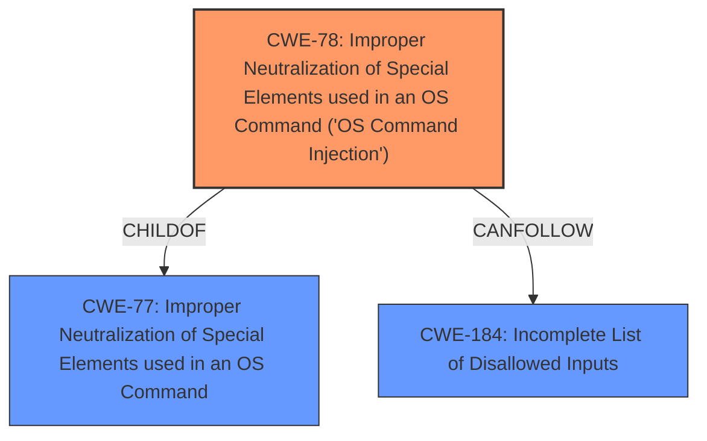

# Analysis for CVE-2022-24389

# Summary
| CWE ID | CWE Name | Confidence | CWE Abstraction Level | CWE Vulnerability Mapping Label | CWE-Vulnerability Mapping Notes |
|---|---|---|---|---|---|
| CWE-78 | Improper Neutralization of Special Elements used in an OS Command ('OS Command Injection') | 1 | Base | Allowed | Primary CWE |

## Evidence and Confidence

*   **Confidence Score:** 1
*   **Evidence Strength:** HIGH

## Relationship Analysis
The primary relationship that impacted my decision was the ChildOf relationship between CWE-78 and CWE-77, which indicates that CWE-78 is a more specific type of command injection. The other relationships such as CanFollow to CWE-184 were less relevant for this specific vulnerability. Given the provided description, CWE-78 is the most accurate and specific representation of the **root cause**.

## Vulnerability Chain
The vulnerability chain starts with the **rconfig cert_utils enabling an attacker with user-level access to inject root-level commands** (CWE-78). This allows the attacker to potentially compromise the Fidelis Network and Deception components.

## Summary of Analysis
The initial analysis indicated that CWE-78 (Improper Neutralization of Special Elements used in an OS Command) is the most appropriate CWE. This is supported by the vulnerability description, which states that the **rconfig cert_utils enables an attacker with user level access to the CLI to inject root level commands**.

The retriever results also listed CWE-78 as the top candidate. The CWE for similar CVE Descriptions also has CWE-77 as the primary match and CWE-78 as a top CWE.

The evidence for this mapping is strong, as the vulnerability description explicitly mentions the ability to inject commands. The relationship analysis further supports this by showing that CWE-78 is a specific type of command injection.

I have chosen CWE-78 because it accurately reflects the **root cause** of the vulnerability, which is the ability to inject OS commands.

Relevant CWE Information:

# Enhanced Context (25 CWEs)
The following CWEs were identified as potentially relevant to this vulnerability:

## CWE-78: Improper Neutralization of Special Elements used in an OS Command ('OS Command Injection')
**Abstraction Level**: Base
**Similarity Score**: 5.03
**Source**: graph

**Description**:
CWE-78: Improper Neutralization of Special Elements used in an OS Command ('OS Command Injection')

**Mapping Guidance**:
- Usage: Allowed
- Rationale: This CWE entry is at the Base level of abstraction, which is a preferred level of abstraction for mapping to the root causes of vulnerabilities.

**Relationships**:
- CANFOLLOW -> CWE-184
- CANALSOBE -> CWE-88
- CHILDOF -> CWE-77
- CHILDOF -> CWE-77
- CHILDOF -> CWE-74

### Other CWEs Considered But Not Used:

*   **CWE-77 (Improper Neutralization of Special Elements used in an OS Command):** While CWE-77 is a parent of CWE-78, it is less specific. Since the vulnerability involves the injection of OS commands, CWE-78 is a more accurate representation.
*   **CWE-22 (Improper Limitation of a Pathname to a Restricted Directory):** This CWE relates to path traversal vulnerabilities, which are not explicitly mentioned in the vulnerability description.
*   **CWE-20 (Improper Input Validation):** This is a broad category and not specific enough to describe the vulnerability. The issue is not just about validating input, but about neutralizing special elements in OS commands.
*   **CWE-184 (Incomplete List of Disallowed Inputs):** While an incomplete list of disallowed inputs could contribute to the vulnerability, the core issue is the improper neutralization of special elements.
*   **CWE-257 (Storing Passwords in a Recoverable Format):** This is not relevant to the vulnerability.
*   **CWE-269 (Improper Privilege Management):** This is a more general class of weakness, and while privilege escalation is a potential consequence, the **root cause** is command injection.
*   **CWE-250 (Execution with Unnecessary Privileges):** This is not directly related to the **root cause**, which is the injection of commands.
*   **CWE-732 (Incorrect Permission Assignment for Critical Resource):** This is not directly related to the **root cause**, which is the injection of commands.