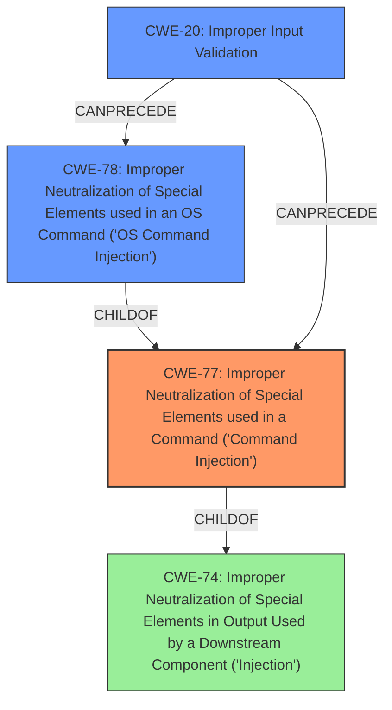

# Raw Analyzer Response for CVE-2022-24390

# Summary
| CWE ID | CWE Name | Confidence | CWE Abstraction Level | CWE Vulnerability Mapping Label | CWE-Vulnerability Mapping Notes |
|---|---|---|---|---|---|
| CWE-77 | Improper Neutralization of Special Elements used in a Command ('Command Injection') | 0.9 | Class | Allowed-with-Review | Primary CWE |
| CWE-78 | Improper Neutralization of Special Elements used in an OS Command ('OS Command Injection') | 0.7 | Base | Allowed | Secondary Candidate |
| CWE-20 | Improper Input Validation | 0.6 | Class | Discouraged | Secondary Candidate |

## Evidence and Confidence

*   **Confidence Score:** 0.8
*   **Evidence Strength:** HIGH

## Relationship Analysis
The primary CWE, CWE-77, is a class-level weakness that describes command injection in general. CWE-78 is a base-level weakness that is a child of CWE-77 and describes specifically OS command injection. CWE-20 is a class-level weakness that describes improper input validation, which can often be a cause of command injection vulnerabilities.
The choice between CWE-77 and CWE-78 depends on whether the injected command is an OS command or a command in another language. If the commands injected are OS commands, CWE-78 would be a better fit. Otherwise, CWE-77 would be appropriate.
CWE-20, Improper Input Validation, can be a parent weakness of CWE-77 and CWE-78, because the command injection vulnerability can occur if the input is not properly validated.

## Vulnerability Chain
The vulnerability chain starts with **improper input validation** in `rconfig remote_text_file`. This **weakness** allows an attacker to perform **command injection**, which leads to the ability to execute user-level commands on the affected system.

## Summary of Analysis
Based on the vulnerability description, the root cause is **improper input validation** in `rconfig remote_text_file`, which leads to a **command injection** vulnerability.

The evidence from the vulnerability description includes:
- "**rootcause:** **improper input validation in rconfig remote_text_file**"
- "**weakness:** **command injection**"
- "**impact:** execute user level commands"

The primary CWE is CWE-77, Improper Neutralization of Special Elements used in a Command ('Command Injection'), because the vulnerability involves injecting commands into a system. CWE-78, Improper Neutralization of Special Elements used in an OS Command ('OS Command Injection'), is also a possibility if the commands being injected are OS commands. Since this is not explicitly stated, I am choosing CWE-77 as the primary CWE. CWE-20, Improper Input Validation, is a contributing factor to the vulnerability, as the command injection is possible due to the lack of proper input validation.

CWE-77 is at the class level of abstraction, while CWE-78 is at the base level. Ideally, the base level CWE should be chosen. However, based on the information provided, the commands could be commands in any language and are not necessarily OS commands. Therefore, the Class level CWE-77 is chosen as the primary CWE in this case.

Other CWEs considered but not used:
- CWE-257: Storing Passwords in a Recoverable Format - This CWE is not relevant to the vulnerability description.
- CWE-23: Relative Path Traversal - This CWE is not relevant to the vulnerability description.
- CWE-303: Incorrect Implementation of Authentication Algorithm - This CWE is not relevant to the vulnerability description.
- CWE-269: Improper Privilege Management - This CWE is not relevant to the vulnerability description.
- CWE-94: Improper Control of Generation of Code ('Code Injection') - While the vulnerability leads to command execution, the root cause is command injection, which is better represented by CWE-77 or CWE-78.

Relevant CWE Information:

# Enhanced Context (25 CWEs)
The following CWEs were identified as potentially relevant to this vulnerability:

## CWE-1289: Improper Validation of Unsafe Equivalence in Input
**Abstraction Level**: Base
**Similarity Score**: 0.79
**Source**: dense

**Description**:
The product receives an input value that is used as a resource identifier or other type of reference, but it does not validate or incorrectly validates that the input is equivalent to a potentially-unsafe value.

**Mapping Guidance**:
- Usage: Allowed
- Rationale: This CWE entry is at the Base level of abstraction, which is a preferred level of abstraction for mapping to the root causes of vulnerabilities.

## CWE-807: Reliance on Untrusted Inputs in a Security Decision
**Abstraction Level**: Base
**Similarity Score**: 0.78
**Source**: dense

**Description**:
The product uses a protection mechanism that relies on the existence or values of an input, but the input can be modified by an untrusted actor in a way that bypasses the protection mechanism.

**Mapping Guidance**:
- Usage: Allowed
- Rationale: This CWE entry is at the Base level of abstraction, which is a preferred level of abstraction for mapping to the root causes of vulnerabilities.

## CWE-345: Insufficient Verification of Data Authenticity
**Abstraction Level**: Class
**Similarity Score**: 0.77
**Source**: dense

**Description**:
The product does not sufficiently verify the origin or authenticity of data, in a way that causes it to accept invalid data.

**Mapping Guidance**:
- Usage: Discouraged
- Rationale: This CWE entry is a level-1 Class (i.e., a child of a Pillar). It might have lower-level children that would be more appropriate

## CWE-74: Improper Neutralization of Special Elements in Output Used by a Downstream Component ('Injection')
**Abstraction Level**: Class
**Similarity Score**: 0.77
**Source**: dense

**Description**:
The product constructs all or part of a command, data structure, or record using externally-influenced input from an upstream component, but it does not neutralize or incorrectly neutralizes special elements that could modify how it is parsed or interpreted when it is sent to a downstream component.

**Mapping Guidance**:
- Usage: Discouraged
- Rationale: CWE-74 is high-level and often misused when lower-level weaknesses are more appropriate.

## CWE-41: Improper Resolution of Path Equivalence
**Abstraction Level**: Base
**Similarity Score**: 0.77
**Source**: dense

**Description**:
The product is vulnerable to file system contents disclosure through path equivalence. Path equivalence involves the use of special characters in file and directory names. The associated manipulations are intended to generate multiple names for the same object.

**Mapping Guidance**:
- Usage: Allowed
- Rationale: This CWE entry is at the Base level of abstraction, which is a preferred level of abstraction for mapping to the root causes of vulnerabilities.

## CWE-138: Improper Neutralization of Special Elements
**Abstraction Level**: Class
**Similarity Score**: 0.77
**Source**: dense

**Description**:
The product receives input from an upstream component, but it does not neutralize or incorrectly neutralizes special elements that could be interpreted as control elements or syntactic markers when they are sent to a downstream component.

**Mapping Guidance**:
- Usage: Discouraged
- Rationale: This CWE entry is a level-1 Class (i.e., a child of a Pillar). It might have lower-level children that would be more appropriate

## CWE-297: Improper Validation of Certificate with Host Mismatch
**Abstraction Level**: Variant
**Similarity Score**: 0.77
**Source**: dense

**Description**:
The product communicates with a host that provides a certificate, but the product does not properly ensure that the certificate is actually associated with that host.

**Mapping Guidance**:
- Usage: Allowed
- Rationale: This CWE entry is at the Variant level of abstraction, which is a preferred level of abstraction for mapping to the root causes of vulnerabilities.

## CWE-184: Incomplete List of Disallowed Inputs
**Abstraction Level**: Base
**Similarity Score**: 0.77
**Source**: dense

**Description**:
The product implements a protection mechanism that relies on a list