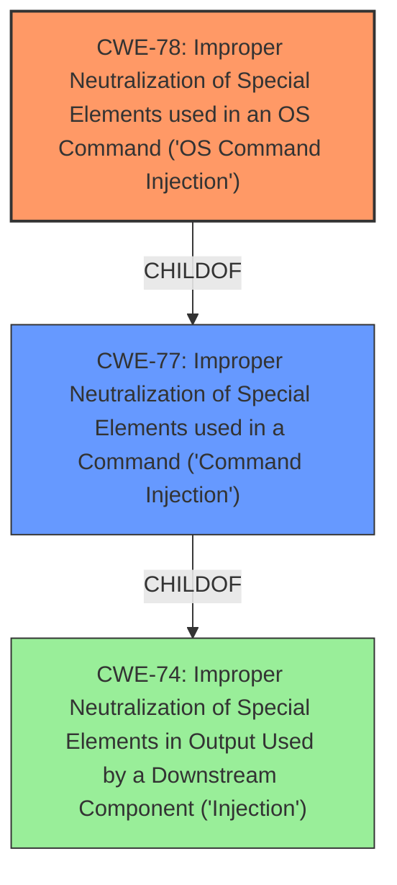

# Enhanced Analysis for CVE-2022-24394

# Summary
| CWE ID | CWE Name | Confidence | CWE Abstraction Level | CWE Vulnerability Mapping Label | CWE-Vulnerability Mapping Notes |
|---|---|---|---|---|---|
| CWE-78 | Improper Neutralization of Special Elements used in an OS Command ('OS Command Injection') | 1.0 | Base | Allowed | Primary CWE |

## Evidence and Confidence

*   **Confidence Score:** 1.0
*   **Evidence Strength:** HIGH

## Relationship Analysis
The primary relationship impacting the decision is the ChildOf relationship between CWE-78 and CWE-77. CWE-78 is a Base level CWE and a specific type of command injection that occurs at the OS level. Since the vulnerability description specifies that the command injection allows execution of *system commands*, this makes CWE-78 the more appropriate choice over the more general Class-level CWE-77.



## Vulnerability Chain
The chain of events is as follows:
1.  **Improper Input Sanitization**: The application fails to properly sanitize user-provided input (`update_checkfile` value for the `filename` parameter).
2.  **OS Command Injection**: This unsanitized input is used in the construction of an OS command.
3.  **Execution of System Commands**: An attacker can inject arbitrary commands into the system.

The root cause is the **improper input sanitization**, which leads to the **OS command injection**, and the final impact is the ability to **execute system commands**.

## Summary of Analysis
The analysis is based on the provided vulnerability description, which explicitly mentions "**command injection** through the web interface using the update_checkfile value for the filename parameter" and states that "the vulnerability could allow a specially crafted HTTP request to execute system commands on the CommandPost". The key phrase "**rootcause: improper input sanitization**" further supports the presence of an injection vulnerability.

The **CWE for similar CVE Descriptions** lists CWE-77 as the Primary CWE Match, and CWE-78 as one of the Top CWEs. The retriever results also list CWE-77 and CWE-78 as top candidates.

The decision to select CWE-78 over CWE-77 is based on the fact that the vulnerability allows execution of *system commands*, which aligns directly with the definition of CWE-78 ("Improper Neutralization of Special Elements used in an OS Command"). CWE-77 is a more general class of command injection. Since the description provides enough information to classify the vulnerability as OS command injection, CWE-78 is the more specific and appropriate choice.

CWE-20 (Improper Input Validation) was considered but not selected because while **improper input sanitization** is listed, CWE-78 is a more precise representation of the vulnerability.

Relevant CWE Information:

# Enhanced Context (25 CWEs)
The following CWEs were identified as potentially relevant to this vulnerability:

## CWE-74: Improper Neutralization of Special Elements in Output Used by a Downstream Component ('Injection')
**Abstraction Level**: Class
**Similarity Score**: 0.77
**Source**: dense

**Description**:
The product constructs all or part of a command, data structure, or record using externally-influenced input from an upstream component, but it does not neutralize or incorrectly neutralizes special elements that could modify how it is parsed or interpreted when it is sent to a downstream component.

**Mapping Guidance**:
- Usage: Discouraged
- Rationale: CWE-74 is high-level and often misused when lower-level weaknesses are more appropriate.

## CWE-78: Improper Neutralization of Special Elements used in an OS Command ('OS Command Injection')
**Abstraction Level**: base
**Similarity Score**: 5.03
**Source**: graph

**Description**:
CWE-78: Improper Neutralization of Special Elements used in an OS Command ('OS Command Injection')

**Mapping Guidance**:
- Usage: Allowed
- Rationale: This CWE entry is at the Base level of abstraction, which is a preferred level of abstraction for mapping to the root causes of vulnerabilities.

**Relationships**:
- CANFOLLOW -> CWE-184
- CANALSOBE -> CWE-88
- CHILDOF -> CWE-77
- CHILDOF -> CWE-77
- CHILDOF -> CWE-74

# Analysis

### CWE-78: Improper Neutralization of Special Elements used in an OS Command ('OS Command Injection')
*   **Technical Explanation:** The vulnerability allows an attacker to inject arbitrary OS commands through the `update_checkfile` value for the `filename` parameter in the web interface. The application fails to neutralize special elements within the input, which allows the attacker to modify the intended OS command.
*   **Security Implications:** An attacker can execute arbitrary system commands on the CommandPost with the privileges of the application, potentially leading to complete system compromise.
*   **Relationship and Chain Patterns:** CWE-78 is a child of CWE-77 (Improper Neutralization of Special Elements used in a Command). The chain involves improper input validation (explicitly listed as **improper input sanitization**) leading to OS command injection.
*   **Mapping Guidance:** The Usage for CWE-78 is "Allowed", and it is a Base level CWE, which is a preferred level of abstraction.
*   **Justification:** The vulnerability description explicitly states that the vulnerability allows "a specially crafted HTTP request to execute system commands," which aligns directly with the definition of CWE-78.


## CWE Relationship Analysis

Current CWEs represent these abstraction levels: .


### Vulnerability Chain Analysis

**Chain starting from CWE-184:**
- 184 (Incomplete List of Disallowed Inputs) - ROOT


**Chain starting from CWE-20:**
- 20 (Improper Input Validation) - ROOT


### CWE Relationship Diagram

```mermaid
graph TD
    classDef primary fill:#f96,stroke:#333,stroke-width:2px
    classDef secondary fill:#69f,stroke:#333
    classDef tertiary fill:#9e9,stroke:#333
```