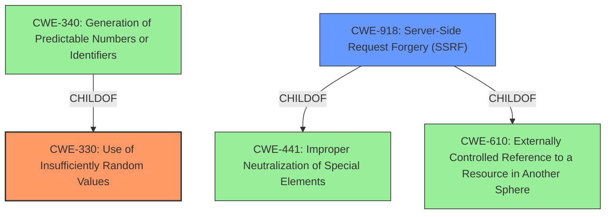

# Analysis for CVE-2022-24406

# Summary
| CWE ID | CWE Name | Confidence | CWE Abstraction Level | CWE Vulnerability Mapping Label | CWE-Vulnerability Mapping Notes |
|---|---|---|---|---|---|
| CWE-330 | Use of Insufficiently Random Values | 0.9 | Class | Primary | Allowed-with-Review |
| CWE-918 | Server-Side Request Forgery (SSRF) | 0.8 | Base | Secondary | Allowed |

## Evidence and Confidence

*   **Confidence Score:** 0.85
*   **Evidence Strength:** HIGH

## Relationship Analysis
The primary weakness is the **predictable** nature of the multipart boundaries, which falls under CWE-330 (Use of Insufficiently Random Values). The resulting impact, Server-Side Request Forgery (SSRF), is represented by CWE-918. CWE-330 is a class-level CWE, and its child CWE-340 (Generation of Predictable Numbers or Identifiers) could be a more specific mapping but the description of CWE-330 is more generally applicable to the **predictable** values. CWE-918 is a base-level CWE and a child of CWE-441 (Improper Neutralization of Special Elements) and CWE-610 (Externally Controlled Reference to a Resource in Another Sphere).

## Vulnerability Chain
The vulnerability chain starts with the **predictable** multipart boundaries (CWE-330), which allows an attacker to inject parameters into internal API calls, ultimately leading to Server-Side Request Forgery (CWE-918).

## Summary of Analysis
The initial analysis identified the root cause as the **predictable** multipart boundaries, which enables the SSRF. The evidence provided in the "CVE Reference Links Content Summary" section confirms that the multipart boundaries are predictable because they are based on a timestamp with millisecond resolution. This allows attackers to predict future boundaries and overwrite their content. The "Vulnerability Description Key Phrases" also highlights the **predictable multipart/form-data boundaries** as the root cause and SSRF as the impact.

The selection of CWE-330 is based on the fact that the boundaries are generated with insufficiently random values, which allows attackers to predict them. The retriever results listed CWE-330 as the top combined result. While CWE-340 (Generation of Predictable Numbers or Identifiers) is a child of CWE-330 and could be considered, the description of CWE-330 more accurately captures the general issue of using insufficiently random values, as the problem isn't strictly about generating *numbers* or *identifiers*. CWE-330 is a class level, which the mapping guidance discourages but since it is the best fit is allowed with review.

The selection of CWE-918 is based on the fact that the **predictable** boundaries enable an attacker to inject parameters into internal API calls, leading to the web server retrieving content from an unexpected destination.

Both CWEs are at appropriate levels of specificity, with CWE-330 representing the root cause and CWE-918 representing the direct impact of the vulnerability. The relationships between these CWEs, as shown in the graph, highlight the chain of events that leads to the vulnerability.

Relevant CWE Information:

# Enhanced Context (25 CWEs)
The following CWEs were identified as potentially relevant to this vulnerability:

## CWE-668: Exposure of Resource to Wrong Sphere
**Abstraction Level**: Class
**Similarity Score**: 0.76
**Source**: dense

**Description**:
The product exposes a resource to the wrong control sphere, providing unintended actors with inappropriate access to the resource.

**Mapping Guidance**:
- Usage: Discouraged
- Rationale: CWE-668 is high-level and is often misused as a catch-all when lower-level CWE IDs might be applicable. It is sometimes used for low-information vulnerability reports [REF-1287]. It is a level-1 Class (i.e., a child of a Pillar). It is not useful for trend analysis.

## CWE-41: Improper Resolution of Path Equivalence
**Abstraction Level**: Base
**Similarity Score**: 0.76
**Source**: dense

**Description**:
The product is vulnerable to file system contents disclosure through path equivalence. Path equivalence involves the use of special characters in file and directory names. The associated manipulations are intended to generate multiple names for the same object.

**Mapping Guidance**:
- Usage: Allowed
- Rationale: This CWE entry is at the Base level of abstraction, which is a preferred level of abstraction for mapping to the root causes of vulnerabilities.

## CWE-639: Authorization Bypass Through User-Controlled Key
**Abstraction Level**: Base
**Similarity Score**: 0.76
**Source**: dense

**Description**:
The system's authorization functionality does not prevent one user from gaining access to another user's data or record by modifying the key value identifying the data.

**Mapping Guidance**:
- Usage: Allowed
- Rationale: This CWE entry is at the Base level of abstraction, which is a preferred level of abstraction for mapping to the root causes of vulnerabilities.

## CWE-74: Improper Neutralization of Special Elements in Output Used by a Downstream Component ('Injection')
**Abstraction Level**: Class
**Similarity Score**: 0.75
**Source**: dense

**Description**:
The product constructs all or part of a command, data structure, or record using externally-influenced input from an upstream component, but it does not neutralize or incorrectly neutralizes special elements that could modify how it is parsed or interpreted when it is sent to a downstream component.

**Mapping Guidance**:
- Usage: Discouraged
- Rationale: CWE-74 is high-level and often misused when lower-level weaknesses are more appropriate.

## CWE-807: Reliance on Untrusted Inputs in a Security Decision
**Abstraction Level**: Base
**Similarity Score**: 0.75
**Source**: dense

**Description**:
The product uses a protection mechanism that relies on the existence or values of an input, but the input can be modified by an untrusted actor in a way that bypasses the protection mechanism.

**Mapping Guidance**:
- Usage: Allowed
- Rationale: This CWE entry is at the Base level of abstraction, which is a preferred level of abstraction for mapping to the root causes of vulnerabilities.

## CWE-404: Improper Resource Shutdown or Release
**Abstraction Level**: Class
**Similarity Score**: 0.75
**Source**: dense

**Description**:
The product does not release or incorrectly releases a resource before it is made available for re-use.

**Mapping Guidance**:
- Usage: Allowed-with-Review
- Rationale: This CWE entry is a Class and might have Base-level children that would be more appropriate

## CWE-23: Relative Path Traversal
**Abstraction Level**: Base
**Similarity Score**: 0.75
**Source**: dense

**Description**:
The product uses external input to construct a pathname that should be within a restricted directory, but it does not properly neutralize sequences such as ".." that can resolve to a location that is outside of that directory.

**Mapping Guidance**:
- Usage: Allowed
- Rationale: This CWE entry is at the Base level of abstraction, which is a preferred level of abstraction for mapping to the root causes of vulnerabilities.

## CWE-1390: Weak Authentication
**Abstraction Level**: Class
**Similarity Score**: 0.75
**Source**: dense

**Description**:
The product uses an authentication mechanism to restrict access to specific users or identities, but the mechanism does not sufficiently prove that the claimed identity is correct.

**Mapping Guidance**:
- Usage: Allowed-with-Review
- Rationale: This CWE entry is a Class and might have Base-level children that would be more appropriate

## CWE-472: External Control of Assumed-Immutable Web Parameter
**Abstraction Level**: Base
**Similarity Score**: 0.75
**Source**: dense

**Description**:
The web application does not sufficiently verify inputs that are assumed to be immutable but are actually externally controllable, such as hidden form fields.

**Mapping Guidance**:
- Usage: Allowed
- Rationale