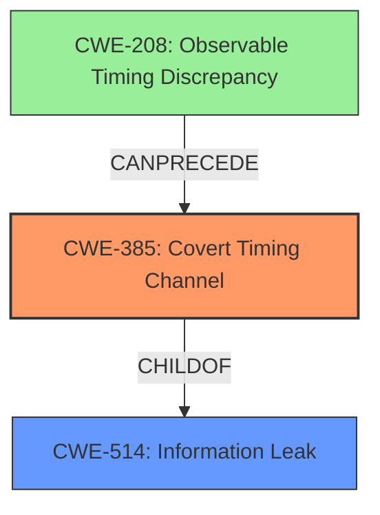

# Raw Analyzer Response for CVE-2022-24409

# Summary
| CWE ID | CWE Name | Confidence | CWE Abstraction Level | CWE Vulnerability Mapping Label | CWE-Vulnerability Mapping Notes |
|---|---|---|---|---|---|
| CWE-385 | Covert Timing Channel | 1.0 | Base | Primary | Allowed |

## Evidence and Confidence

*   **Confidence Score:** 1.0
*   **Evidence Strength:** HIGH

## Relationship Analysis
The primary relationship that influenced the decision was the ChildOf relationship between CWE-385 and CWE-514 (Information Leak). While CWE-514 is a broader category, the vulnerability description specifically mentions a **covert timing channel**, making CWE-385 the more appropriate and specific choice. The Retriever Results also strongly suggested CWE-385.

## Vulnerability Chain
The vulnerability chain starts with the **covert timing channel vulnerability** (CWE-385), which allows an attacker to eavesdrop on encrypted communications, leading to the exposure of sensitive data.

## Summary of Analysis
The analysis is based on the vulnerability description, key phrases, and CVE reference links content summary. The key evidence is the explicit mention of a "**covert timing channel vulnerability**" as the root cause.

The graph relationships and the retriever results both point to CWE-385 as the most suitable classification. The "Usage: Allowed" mapping guidance for CWE-385 further supports this decision.

The selection of CWE-385 is at the optimal level of specificity because it directly describes the root cause of the vulnerability, which is a **covert timing channel**. While other CWEs like CWE-208 (Observable Timing Discrepancy) are related, they are less specific and do not fully capture the nature of the vulnerability.

Relevant CWE Information:

# Enhanced Context (25 CWEs)
The following CWEs were identified as potentially relevant to this vulnerability:

## CWE-1421: Exposure of Sensitive Information in Shared Microarchitectural Structures during Transient Execution
**Abstraction Level**: Base
**Similarity Score**: 0.83
**Source**: dense

**Description**:

			A processor event may allow transient operations to access
			architecturally restricted data (for example, in another address
			space) in a shared microarchitectural structure (for example, a CPU
			cache), potentially exposing the data over a covert channel.
		  

**Mapping Guidance**:
- Usage: Allowed
- Rationale: This CWE entry is at the Base level of abstraction, which is a preferred level of abstraction for mapping to the root causes of vulnerabilities

## CWE-1420: Exposure of Sensitive Information during Transient Execution
**Abstraction Level**: Base
**Similarity Score**: 0.82
**Source**: dense

**Description**:
A processor event or prediction may allow incorrect operations (or correct operations with incorrect data) to execute transiently, potentially exposing data over a covert channel.

**Mapping Guidance**:
- Usage: Allowed-with-Review
- Rationale: This CWE entry is at the Base level of abstraction, which is a preferred level of abstraction for mapping to the root causes of vulnerabilities.

## CWE-1342: Information Exposure through Microarchitectural State after Transient Execution
**Abstraction Level**: Base
**Similarity Score**: 0.79
**Source**: dense

**Description**:
The processor does not properly clear microarchitectural state after incorrect microcode assists or speculative execution, resulting in transient execution.

**Mapping Guidance**:
- Usage: Allowed
- Rationale: This CWE entry is at the Base level of abstraction, which is a preferred level of abstraction for mapping to the root causes of vulnerabilities.

## CWE-1422: Exposure of Sensitive Information caused by Incorrect Data Forwarding during Transient Execution
**Abstraction Level**: Base
**Similarity Score**: 0.79
**Source**: dense

**Description**:
A processor event or prediction may allow incorrect or stale data to
		  be forwarded to transient operations, potentially exposing data over a
		  covert channel.

**Mapping Guidance**:
- Usage: Allowed
- Rationale: This CWE entry is at the Base level of abstraction, which is a preferred level of abstraction for mapping to the root causes of vulnerabilities

## CWE-1423: Exposure of Sensitive Information caused by Shared Microarchitectural Predictor State that Influences Transient Execution
**Abstraction Level**: Base
**Similarity Score**: 0.78
**Source**: dense

**Description**:
Shared microarchitectural predictor state may allow code to influence
				transient execution across a hardware boundary, potentially exposing
				data that is accessible beyond the boundary over a covert channel.
			

**Mapping Guidance**:
- Usage: Allowed
- Rationale: This CWE entry is at the Base level of abstraction, which is a preferred level of abstraction for mapping to the root causes of vulnerabilities

## CWE-1299: Missing Protection Mechanism for Alternate Hardware Interface
**Abstraction Level**: Base
**Similarity Score**: 0.76
**Source**: dense

**Description**:
The lack of protections on alternate paths to access
                control-protected assets (such as unprotected shadow registers
                and other external facing unguarded interfaces) allows an
                attacker to bypass existing protections to the asset that are
		only performed against the primary path.

**Mapping Guidance**:
- Usage: Allowed
- Rationale: This CWE entry is at the Base level of abstraction, which is a preferred level of abstraction for mapping to the root causes of vulnerabilities.

## CWE-208: Observable Timing Discrepancy
**Abstraction Level**: Base
**Similarity Score**: 0.75
**Source**: dense

**Description**:
Two separate operations in a product require different amounts of time to complete, in a way that is observable to an actor and reveals security-relevant information about the state of the product, such as whether a particular operation was successful or not.

**Mapping Guidance**:
- Usage: Allowed
- Rationale: This CWE entry is at the Base level of abstraction, which is a preferred level of abstraction for mapping to the root causes of vulnerabilities.

## CWE-226: Sensitive Information in Resource Not Removed Before Reuse
**Abstraction Level**: Base
**Similarity Score**: 0.75
**Source**: dense

**Description**:
The product releases a resource such as memory or a file so that it can be made available for reuse, but it does not clear or "zeroize" the information contained in the resource before the product performs a critical state transition or makes the resource available for reuse by other entities.

**Mapping Guidance**:
- Usage: Allowed
- Rationale: This CWE entry is at the Base level of abstraction, which is a preferred level of abstraction for mapping to the root causes of vulnerabilities.

## CWE-203: Observable Discrepancy
**Abstraction Level**: Base
**Similarity Score**: 0.75
**Source**: dense

**Description**:
The product behaves differently or sends different responses under different circumstances in a way that is observable to an unauthorized actor, which exposes security-relevant information about the state of the product, such as whether a particular operation was successful or not.

**Mapping Guidance**:
- Usage: Allowed
- Rationale: This CWE entry is at the Base level of abstraction, which is a preferred level of abstraction for mapping to the root causes of vulnerabilities.

## CWE-667: Improper Locking
**Abstraction Level**: Class
**Similarity Score**: 0.75
**Source**: dense

**Description**:
The product does not properly acquire or release a lock on a resource, leading to unexpected resource state changes and behaviors.

**Mapping Guidance**:
- Usage: Allowed-with-Review
- Rationale: This CWE entry is a Class and might have Base-level children that would be more appropriate

## CWE-1423: Exposure of Sensitive Information caused by Shared Microarchitectural Predictor State that Influences Transient Execution
**Abstraction Level**: Base
**Similarity Score**: 8359.96
**Source**: sparse

**Description**:
Shared microarchitectural predictor state may allow code to influence
				transient execution across a hardware boundary, potentially exposing
				data that is accessible beyond the boundary over a covert channel.
			

**Mapping Guidance**:
- Usage: Allowed
- Rationale: This CWE entry is at the Base level of abstraction, which is a preferred level of abstraction for mapping to the root causes of vulnerabilities

## CWE-1420: Exposure of Sensitive Information during Transient Execution
**Abstraction Level**: Base
**Similarity Score**: 8101.71
**Source**: sparse

**Description**:
A processor event or prediction may allow incorrect operations (or correct operations with incorrect data) to execute transient