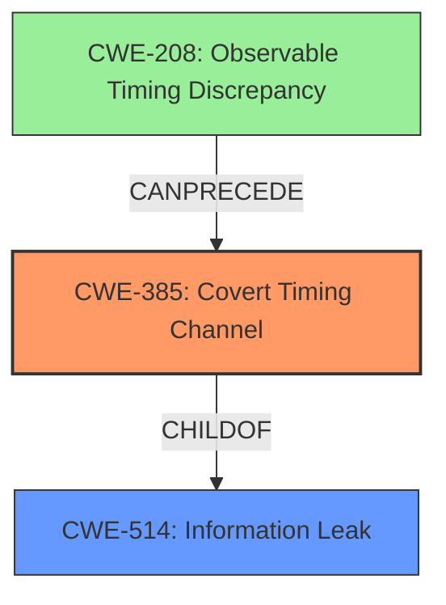

# Analysis for CVE-2022-24409

# Summary
| CWE ID | CWE Name | Confidence | CWE Abstraction Level | CWE Vulnerability Mapping Label | CWE-Vulnerability Mapping Notes |
|---|---|---|---|---|---|
| CWE-385 | Covert Timing Channel | 1.0 | Base | Primary | Allowed |

## Evidence and Confidence

*   **Confidence Score:** 1.0
*   **Evidence Strength:** HIGH

## Relationship Analysis
The primary relationship that influenced the decision was the ChildOf relationship between CWE-385 and CWE-514 (Information Leak). While CWE-514 is a broader category, the vulnerability description specifically mentions a **covert timing channel**, making CWE-385 the more appropriate and specific choice. The Retriever Results also strongly suggested CWE-385.

## Vulnerability Chain
The vulnerability chain starts with the **covert timing channel vulnerability** (CWE-385), which allows an attacker to eavesdrop on encrypted communications, leading to the exposure of sensitive data.

## Summary of Analysis
The analysis is based on the vulnerability description, key phrases, and CVE reference links content summary. The key evidence is the explicit mention of a "**covert timing channel vulnerability**" as the root cause.

The graph relationships and the retriever results both point to CWE-385 as the most suitable classification. The "Usage: Allowed" mapping guidance for CWE-385 further supports this decision.

The selection of CWE-385 is at the optimal level of specificity because it directly describes the root cause of the vulnerability, which is a **covert timing channel**. While other CWEs like CWE-208 (Observable Timing Discrepancy) are related, they are less specific and do not fully capture the nature of the vulnerability.

Relevant CWE Information:

# Enhanced Context (25 CWEs)
The following CWEs were identified as potentially relevant to this vulnerability:

## CWE-1421: Exposure of Sensitive Information in Shared Microarchitectural Structures during Transient Execution
**Abstraction Level**: Base
**Similarity Score**: 0.83
**Source**: dense

**Description**:

			A processor event may allow transient operations to access
			architecturally restricted data (for example, in another address
			space) in a shared microarchitectural structure (for example, a CPU
			cache), potentially exposing the data over a covert channel.
		  

**Mapping Guidance**:
- Usage: Allowed
- Rationale: This CWE entry is at the Base level of abstraction, which is a preferred level of abstraction for mapping to the root causes of vulnerabilities

## CWE-1420: Exposure of Sensitive Information during Transient Execution
**Abstraction Level**: Base
**Similarity Score**: 0.82
**Source**: dense

**Description**:
A processor event or prediction may allow incorrect operations (or correct operations with incorrect data) to execute transiently, potentially exposing data over a covert channel.

**Mapping Guidance**:
- Usage: Allowed-with-Review
- Rationale: This CWE entry is at the Base level of abstraction, which is a preferred level of abstraction for mapping to the root causes of vulnerabilities.

## CWE-1342: Information Exposure through Microarchitectural State after Transient Execution
**Abstraction Level**: Base
**Similarity Score**: 0.79
**Source**: dense

**Description**:
The processor does not properly clear microarchitectural state after incorrect microcode assists or speculative execution, resulting in transient execution.

**Mapping Guidance**:
- Usage: Allowed
- Rationale: This CWE entry is at the Base level of abstraction, which is a preferred level of abstraction for mapping to the root causes of vulnerabilities.

## CWE-1422: Exposure of Sensitive Information caused by Incorrect Data Forwarding during Transient Execution
**Abstraction Level**: Base
**Similarity Score**: 0.79
**Source**: dense

**Description**:
A processor event or prediction may allow incorrect or stale data to
		  be forwarded to transient operations, potentially exposing data over a
		  covert channel.

**Mapping Guidance**:
- Usage: Allowed
- Rationale: This CWE entry is at the Base level of abstraction, which is a preferred level of abstraction for mapping to the root causes of vulnerabilities

## CWE-1423: Exposure of Sensitive Information caused by Shared Microarchitectural Predictor State that Influences Transient Execution
**Abstraction Level**: Base
**Similarity Score**: 0.78
**Source**: dense

**Description**:
Shared microarchitectural predictor state may allow code to influence
				transient execution across a hardware boundary, potentially exposing
				data that is accessible beyond the boundary over a covert channel.
			

**Mapping Guidance**:
- Usage: Allowed
- Rationale: This CWE entry is at the Base level of abstraction, which is a preferred level of abstraction for mapping to the root causes of vulnerabilities

## CWE-1299: Missing Protection Mechanism for Alternate Hardware Interface
**Abstraction Level**: Base
**Similarity Score**: 0.76
**Source**: dense

**Description**:
The lack of protections on alternate paths to access
                control-protected assets (such as unprotected shadow registers
                and other external facing unguarded interfaces) allows an
                attacker to bypass existing protections to the asset that are
		only performed against the primary path.

**Mapping Guidance**:
- Usage: Allowed
- Rationale: This CWE entry is at the Base level of abstraction, which is a preferred level of abstraction for mapping to the root causes of vulnerabilities.

## CWE-208: Observable Timing Discrepancy
**Abstraction Level**: Base
**Similarity Score**: 0.75
**Source**: dense

**Description**:
Two separate operations in a product require different amounts of time to complete, in a way that is observable to an actor and reveals security-relevant information about the state of the product, such as whether a particular operation was successful or not.

**Mapping Guidance**:
- Usage: Allowed
- Rationale: This CWE entry is at the Base level of abstraction, which is a preferred level of abstraction for mapping to the root causes of vulnerabilities.

## CWE-226: Sensitive Information in Resource Not Removed Before Reuse
**Abstraction Level**: Base
**Similarity Score**: 0.75
**Source**: dense

**Description**:
The product releases a resource such as memory or a file so that it can be made available for reuse, but it does not clear or "zeroize" the information contained in the resource before the product performs a critical state transition or makes the resource available for reuse by other entities.

**Mapping Guidance**:
- Usage: Allowed
- Rationale: This CWE entry is at the Base level of abstraction, which is a preferred level of abstraction for mapping to the root causes of vulnerabilities.

## CWE-203: Observable Discrepancy
**Abstraction Level**: Base
**Similarity Score**: 0.75
**Source**: dense

**Description**:
The product behaves differently or sends different responses under different circumstances in a way that is observable to an unauthorized actor, which exposes security-relevant information about the state of the product, such as whether a particular operation was successful or not.

**Mapping Guidance**:
- Usage: Allowed
- Rationale: This CWE entry is at the Base level of abstraction, which is a preferred level of abstraction for mapping to the root causes of vulnerabilities.

## CWE-667: Improper Locking
**Abstraction Level**: Class
**Similarity Score**: 0.75
**Source**: dense

**Description**:
The product does not properly acquire or release a lock on a resource, leading to unexpected resource state changes and behaviors.

**Mapping Guidance**:
- Usage: Allowed-with-Review
- Rationale: This CWE entry is a Class and might have Base-level children that would be more appropriate

## CWE-1423: Exposure of Sensitive Information caused by Shared Microarchitectural Predictor State that Influences Transient Execution
**Abstraction Level**: Base
**Similarity Score**: 8359.96
**Source**: sparse

**Description**:
Shared microarchitectural predictor state may allow code to influence
				transient execution across a hardware boundary, potentially exposing
				data that is accessible beyond the boundary over a covert channel.
			

**Mapping Guidance**:
- Usage: Allowed
- Rationale: This CWE entry is at the Base level of abstraction, which is a preferred level of abstraction for mapping to the root causes of vulnerabilities

## CWE-1420: Exposure of Sensitive Information during Transient Execution
**Abstraction Level**: Base
**Similarity Score**: 8101.71
**Source**: sparse

**Description**:
A processor event or prediction may allow incorrect operations (or correct operations with incorrect data) to execute transient

# Enhanced Query for CVE-2022-24409

## Vulnerability Description
Dell BSAFE SSL-J contains remediation for a **covert timing channel vulnerability** that may be exploited by malicious users to compromise the affected system. Only customers with active BSAFE maintenance contracts can receive details about this vulnerability. Public disclosure of the vulnerability details will be shared at a later date.

### Vulnerability Description Key Phrases
- **rootcause:** **covert timing channel vulnerability**
- **impact:** compromise the affected system
- **attacker:** malicious users
- **product:** Dell BSAFE SSL-J

## CVE Reference Links Content Summary
- **Root cause of vulnerability**: The vulnerability is a covert timing channel in Dell BSAFE SSL-J.
- **Weaknesses/vulnerabilities present**: Covert Timing Channel vulnerability
- **Impact of exploitation**: An attacker can eavesdrop on encrypted communications, leading to the exposure of sensitive data.
- **Attack vectors**: The vulnerability can be exploited remotely over a network, without requiring any user interaction or special privileges.
- **Required attacker capabilities/position**: The attacker needs to be able to send network traffic to the system running the vulnerable software, making network-based attacks possible, and with high attack complexity.

## Retriever Results

### Top Combined Results

| Rank | CWE ID | Name | Abstraction | Usage  | Retrievers | Individual Scores |
|------|--------|------|-------------|-------|------------|-------------------|
| 1 | 385 | Covert Timing Channel | Base | Allowed | sparse | 0.647 |
| 2 | 1420 | Exposure of Sensitive Information during Transient Execution | Base | Allowed-with-Review | sparse | 0.295 |
| 3 | 203 | Observable Discrepancy | Base | Allowed | sparse | 0.276 |
| 4 | 515 | Covert Storage Channel | Base | Allowed | sparse | 0.272 |
| 5 | 208 | Observable Timing Discrepancy | Base | Allowed | sparse | 0.263 |
| 6 | 327 | Use of a Broken or Risky Cryptographic Algorithm | Class | Allowed-with-Review | dense | 0.516 |
| 7 | 1272 | Sensitive Information Uncleared Before Debug/Power State Transition | Base | Allowed | graph | 0.002 |
| 8 | 1423 | Exposure of Sensitive Information caused by Shared Microarchitectural Predictor State that Influences Transient Execution | Base | Allowed | sparse | 0.253 |
| 9 | 295 | Improper Certificate Validation | Base | Allowed | sparse | 0.253 |
| 10 | 1421 | Exposure of Sensitive Information in Shared Microarchitectural Structures during Transient Execution | Base | Allowed | sparse | 0.251 |

# Complete CWE Specifications

## CWE-385: Covert Timing Channel
**Abstraction:** Base
**Status:** Incomplete

### Description
Covert timing channels convey information by modulating some aspect of system behavior over time, so that the program receiving the information can observe system behavior and infer protected information.

### Extended Description

In some instances, knowing when data is transmitted between parties can provide a malicious user with privileged information. Also, externally monitoring the timing of operations can potentially reveal sensitive data. For example, a cryptographic operation can expose its internal state if the time it takes to perform the operation varies, based on the state.

Covert channels are frequently classified as either storage or timing channels. Some examples of covert timing channels are the system's paging rate, the time a certain transaction requires to execute, and the time it takes to gain access to a shared bus.

### Alternative Terms
None

### Relationships
ChildOf -> CWE-514

### Mapping Guidance
**Usage:** Allowed
**Rationale:** This CWE entry is at the Base level of abstraction, which is a preferred level of abstraction for mapping to the root causes of vulnerabilities.
**Comments:** Carefully read both the name and description to ensure that this mapping is an appropriate fit. Do not try to 'force' a mapping to a lower-level Base/Variant simply to comply with this preferred level of abstraction.
**Reasons:**
- Acceptable-Use

### Additional Notes
**[Maintenance]** As of CWE 4.9, members of the CWE Hardware SIG are working to improve CWE's coverage of transient execution weaknesses, which include issues related to Spectre, Meltdown, and other attacks that create or exploit covert channels. As a result of that work, this entry might change in CWE 4.10.

## CWE-1420: Exposure of Sensitive Information during Transient Execution
**Abstraction:** Base
**Status:** Incomplete

### Description
A processor event or prediction may allow incorrect operations (or correct operations with incorrect data) to execute transiently, potentially exposing data over a covert channel.

### Extended Description

When operations execute but do not commit to the processor's architectural state, this is commonly referred to as transient execution. This behavior can occur when the processor mis-predicts an outcome (such as a branch target), or when a processor event (such as an exception or microcode assist, etc.) is handled after younger operations have already executed. Operations that execute transiently may exhibit observable discrepancies (CWE-203) in covert channels [REF-1400] such as data caches. Observable discrepancies of this kind can be detected and analyzed using timing or power analysis techniques, which may allow an attacker to infer information about the operations that executed transiently. For example, the attacker may be able to infer confidential data that was accessed or used by those operations.

Transient execution weaknesses may be exploited using one of two methods. In the first method, the attacker generates a code sequence that exposes data through a covert channel when it is executed transiently (the attacker must also be able to trigger transient execution). Some transient execution weaknesses can only expose data that is accessible within the attacker's processor context. For example, an attacker executing code in a software sandbox may be able to use a transient execution weakness to expose data within the same address space, but outside of the attacker's sandbox. Other transient execution weaknesses can expose data that is architecturally inaccessible, that is, data protected by hardware-enforced boundaries such as page tables or privilege rings. These weaknesses are the subject of CWE-1421.

In the second exploitation method, the attacker first identifies a code sequence in a victim program that, when executed transiently, can expose data that is architecturally accessible within the victim's processor context. For instance, the attacker may search the victim program for code sequences that resemble a bounds-check bypass sequence (see Demonstrative Example 1). If the attacker can trigger a mis-prediction of the conditional branch and influence the index of the out-of-bounds array access, then the attacker may be able to infer the value of out-of-bounds data by monitoring observable discrepancies in a covert channel.

### Alternative Terms
None

### Relationships
ChildOf -> CWE-669

### Mapping Guidance
**Usage:** Allowed-with-Review
**Rationale:** This CWE entry is at the Base level of abstraction, which is a preferred level of abstraction for mapping to the root causes of vulnerabilities.
**Comments:** 

A vulnerability should only map to CWE-1420 if it cannot map to any of CWE-1420's child weaknesses. Follow this diagram:

**Reasons:**
- Acceptable-Use

### Observed Examples
- **CVE-2017-5753:** Microarchitectural conditional branch predictors may allow operations to execute transiently after a misprediction, potentially exposing data over a covert channel.
- **CVE-2021-0089:** A machine clear triggered by self-modifying code may allow incorrect operations to execute transiently, potentially exposing data over a covert channel.
- **CVE-2022-0002:** Microarchitectural indirect branch predictors may allow incorrect operations to execute transiently after a misprediction, potentially exposing data over a covert channel.

## CWE-203: Observable Discrepancy
**Abstraction:** Base
**Status:** Incomplete

### Description
The product behaves differently or sends different responses under different circumstances in a way that is observable to an unauthorized actor, which exposes security-relevant information about the state of the product, such as whether a particular operation was successful or not.

### Extended Description
Discrepancies can take many forms, and variations may be detectable in timing, control flow, communications such as replies or requests, or general behavior. These discrepancies can reveal information about the product's operation or internal state to an unauthorized actor. In some cases, discrepancies can be used by attackers to form a side channel.

### Alternative Terms
Side Channel Attack: Observable Discrepancies are at the root of side channel attacks.

### Relationships
ChildOf -> CWE-200
ChildOf -> CWE-200

### Mapping Guidance
**Usage:** Allowed
**Rationale:** This CWE entry is at the Base level of abstraction, which is a preferred level of abstraction for mapping to the root causes of vulnerabilities.
**Comments:** Carefully read both the name and description to ensure that this mapping is an appropriate fit. Do not try to 'force' a mapping to a lower-level Base/Variant simply to comply with this preferred level of abstraction.
**Reasons:**
- Acceptable-Use

### Observed Examples
- **CVE-2020-8695:** Observable discrepancy in the RAPL interface for some Intel processors allows information disclosure.
- **CVE-2019-14353:** Crypto hardware wallet's power consumption relates to total number of pixels illuminated, creating a side channel in the USB connection that allows attackers to determine secrets displayed such as PIN numbers and passwords
- **CVE-2019-10071:** Java-oriented framework compares HMAC signatures using String.equals() instead of a constant-time algorithm, causing timing discrepancies

## CWE-515: Covert Storage Channel
**Abstraction:** Base
**Status:** Incomplete

### Description
A covert storage channel transfers information through the setting of bits by one program and the reading of those bits by another. What distinguishes this case from that of ordinary operation is that the bits are used to convey encoded information.

### Extended Description
Covert storage channels occur when out-of-band data is stored in messages for the purpose of memory reuse. Covert channels are frequently classified as either storage or timing channels. Examples would include using a file intended to hold only audit information to convey user passwords--using the name of a file or perhaps status bits associated with it that can be read by all users to signal the contents of the file. Steganography, concealing information in such a manner that no one but the intended recipient knows of the existence of the message, is a good example of a covert storage channel.

### Alternative Terms
None

### Relationships
ChildOf -> CWE-514

### Mapping Guidance
**Usage:** Allowed
**Rationale:** This CWE entry is at the Base level of abstraction, which is a preferred level of abstraction for mapping to the root causes of vulnerabilities.
**Comments:** Carefully read both the name and description to ensure that this mapping is an appropriate fit. Do not try to 'force' a mapping to a lower-level Base/Variant simply to comply with this preferred level of abstraction.
**Reasons:**
- Acceptable-Use

### Additional Notes
**[Maintenance]** As of CWE 4.9, members of the CWE Hardware SIG are working to improve CWE's coverage of transient execution weaknesses, which include issues related to Spectre, Meltdown, and other attacks that create or exploit covert channels. As a result of that work, this entry might change in CWE 4.10.

## CWE-208: Observable Timing Discrepancy
**Abstraction:** Base
**Status:** Incomplete

### Description
Two separate operations in a product require different amounts of time to complete, in a way that is observable to an actor and reveals security-relevant information about the state of the product, such as whether a particular operation was successful or not.

### Extended Description
In security-relevant contexts, even small variations in timing can be exploited by attackers to indirectly infer certain details about the product's internal operations. For example, in some cryptographic algorithms, attackers can use timing differences to infer certain properties about a private key, making the key easier to guess. Timing discrepancies effectively form a timing side channel.

### Alternative Terms
None

### Relationships
ChildOf -> CWE-203
CanPrecede -> CWE-385
CanPrecede -> CWE-327

### Mapping Guidance
**Usage:** Allowed
**Rationale:** This CWE entry is at the Base level of abstraction, which is a preferred level of abstraction for mapping to the root causes of vulnerabilities.
**Comments:** Carefully read both the name and description to ensure that this mapping is an appropriate fit. Do not try to 'force' a mapping to a lower-level Base/Variant simply to comply with this preferred level of abstraction.
**Reasons:**
- Acceptable-Use

### Additional Notes
**[Relationship]** Often primary in cryptographic applications and algorithms.

**[Maintenance]** CWE 4.16 removed a demonstrative example for a hardware module because it was inaccurate and unable to be adapted. The CWE team is developing an alternative.

### Observed Examples
- **CVE-2019-10071:** Java-oriented framework compares HMAC signatures using String.equals() instead of a constant-time algorithm, causing timing discrepancies
- **CVE-2019-10482:** Smartphone OS uses comparison functions that are not in constant time, allowing side channels
- **CVE-2014-0984:** Password-checking function in router terminates validation of a password entry when it encounters the first incorrect character, which allows remote attackers to obtain passwords via a brute-force attack that relies on timing differences in responses to incorrect password guesses, aka a timing side-channel attack.

## CWE-327: Use of a Broken or Risky Cryptographic Algorithm
**Abstraction:** Class
**Status:** Draft

### Description
The product uses a broken or risky cryptographic algorithm or protocol.

### Extended Description

Cryptographic algorithms are the methods by which data is scrambled to prevent observation or influence by unauthorized actors. Insecure cryptography can be exploited to expose sensitive information, modify data in unexpected ways, spoof identities of other users or devices, or other impacts.

It is very difficult to produce a secure algorithm, and even high-profile algorithms by accomplished cryptographic experts have been broken. Well-known techniques exist to break or weaken various kinds of cryptography. Accordingly, there are a small number of well-understood and heavily studied algorithms that should be used by most products. Using a non-standard or known-insecure algorithm is dangerous because a determined adversary may be able to break the algorithm and compromise whatever data has been protected.

Since the state of cryptography advances so rapidly, it is common for an algorithm to be considered "unsafe" even if it was once thought to be strong. This can happen when new attacks are discovered, or if computing power increases so much that the cryptographic algorithm no longer provides the amount of protection that was originally thought.

For a number of reasons, this weakness is even more challenging to manage with hardware deployment of cryptographic algorithms as opposed to software implementation. First, if a flaw is discovered with hardware-implemented cryptography, the flaw cannot be fixed in most cases without a recall of the product, because hardware is not easily replaceable like software. Second, because the hardware product is expected to work for years, the adversary's computing power will only increase over time.

### Alternative Terms
None

### Relationships
ChildOf -> CWE-693
PeerOf -> CWE-311

### Mapping Guidance
**Usage:** Allowed-with-Review
**Rationale:** This CWE entry is a Class and might have Base-level children that would be more appropriate
**Comments:** Examine children of this entry to see if there is a better fit
**Reasons:**
- Abstraction

### Additional Notes
**[Maintenance]** Since CWE 4.4, various cryptography-related entries, including CWE-327 and CWE-1240, have been slated for extensive research, analysis, and community consultation to define consistent terminology, improve relationships, and reduce overlap or duplication. As of CWE 4.6, this work is still ongoing.

**[Maintenance]** The Taxonomy_Mappings to ISA/IEC 62443 were added in CWE 4.10, but they are still under review and might change in future CWE versions. These draft mappings were performed by members of the "Mapping CWE to 62443" subgroup of the CWE-CAPEC ICS/OT Special Interest Group (SIG), and their work is incomplete as of CWE 4.10. The mappings are included to facilitate discussion and review by the broader ICS/OT community, and they are likely to change in future CWE versions.

### Observed Examples
- **CVE-2022-30273:** SCADA-based protocol supports a legacy encryption mode that uses Tiny Encryption Algorithm (TEA) in ECB mode, which leaks patterns in messages and cannot protect integrity
- **CVE-2022-30320:** Programmable Logic Controller (PLC) uses a protocol with a cryptographically insecure hashing algorithm for passwords.
- **CVE-2008-3775:** Product uses "ROT-25" to obfuscate the password in the registry.

## CWE-1272: Sensitive Information Uncleared Before Debug/Power State Transition
**Abstraction:** Base
**Status:** Stable

### Description
The product performs a power or debug state transition, but it does not clear sensitive information that should no longer be accessible due to changes to information access restrictions.

### Extended Description

A device or system frequently employs many power and sleep states during its normal operation (e.g., normal power, additional power, low power, hibernate, deep sleep, etc.). A device also may be operating within a debug condition. State transitions can happen from one power or debug state to another. If there is information available in the previous state which should not be available in the next state and is not properly removed before the transition into the next state, sensitive information may leak from the system.

### Alternative Terms
None

### Relationships
ChildOf -> CWE-226
CanPrecede -> CWE-200

### Mapping Guidance
**Usage:** Allowed
**Rationale:** This CWE entry is at the Base level of abstraction, which is a preferred level of abstraction for mapping to the root causes of vulnerabilities.
**Comments:** Carefully read both the name and description to ensure that this mapping is an appropriate fit. Do not try to 'force' a mapping to a lower-level Base/Variant simply to comply with this preferred level of abstraction.
**Reasons:**
- Acceptable-Use

### Observed Examples
- **CVE-2020-12926:** Product software does not set a flag as per TPM specifications, thereby preventing a failed authorization attempt from being recorded after a loss of power.

## CWE-1423: Exposure of Sensitive Information caused by Shared Microarchitectural Predictor State that Influences Transient Execution
**Abstraction:** Base
**Status:** Incomplete

### Description
Shared microarchitectural predictor state may allow code to influence
				transient execution across a hardware boundary, potentially exposing
				data that is accessible beyond the boundary over a covert channel.
			

### Extended Description

Many commodity processors have Instruction Set Architecture (ISA) features that protect software components from one another. These features can include memory segmentation, virtual memory, privilege rings, trusted execution environments, and virtual machines, among others. For example, virtual memory provides each process with its own address space, which prevents processes from accessing each other's private data. Many of these features can be used to form hardware-enforced security boundaries between software components.

When separate software components (for example, two processes) share microarchitectural predictor state across a hardware boundary, code in one component may be able to influence microarchitectural predictor behavior in another component. If the predictor can cause transient execution, the shared predictor state may allow an attacker to influence transient execution in a victim, and in a manner that could allow the attacker to infer private data from the victim by monitoring observable discrepancies (CWE-203) in a covert channel [REF-1400].

Predictor state may be shared when the processor transitions from one component to another (for example, when a process makes a system call to enter the kernel). Many commodity processors have features which prevent microarchitectural predictions that occur before a boundary from influencing predictions that occur after the boundary.

Predictor state may also be shared between hardware threads, for example, sibling hardware threads on a processor that supports simultaneous multithreading (SMT). This sharing may be benign if the hardware threads are simultaneously executing in the same software component, or it could expose a weakness if one sibling is a malicious software component, and the other sibling is a victim software component. Processors that share microarchitectural predictors between hardware threads may have features which prevent microarchitectural predictions that occur on one hardware thread from influencing predictions that occur on another hardware thread.

Features that restrict predictor state sharing across transitions or between hardware threads may be always-on, on by default, or may require opt-in from software.

### Alternative Terms
None

### Relationships
ChildOf -> CWE-1420
ChildOf -> CWE-1420

### Mapping Guidance
**Usage:** Allowed
**Rationale:** This CWE entry is at the Base level of abstraction, which is a preferred level of abstraction for mapping to the root causes of vulnerabilities
**Comments:** Use only when the weakness allows code in one processor context to influence the predictions of code in another processor context via predictor state that is shared between the two contexts. For example, Branch Target Injection, an instance of CWE-1423, can be mitigated by tagging each indirect branch predictor entry according to the processor context in which the entry was created, thus preventing entries created in one context from being used in a different context. However, the mitigated indirect branch predictor can still expose different weaknesses where malicious predictor entries created in one context are used later in the same context (context tags cannot prevent this). One such example is Intra-mode Branch Target Injection. Weaknesses of this sort can map to CWE-1420.
**Reasons:**
- Acceptable-Use
**Suggested Alternatives:**
- CWE-1420: If a weakness involves a microarchitectural predictor whose state is not shared across processor contexts, then CWE-1420 may be more appropriate for the mapping task.

### Observed Examples
- **CVE-2017-5754:** (Branch Target Injection, BTI, Spectre v2). Shared microarchitectural indirect branch predictor state may allow code to influence transient execution across a process, VM, or privilege boundary, potentially exposing data that is accessible beyond the boundary.
- **CVE-2022-0001:** (Branch History Injection, BHI, Spectre-BHB). Shared branch history state may allow user-mode code to influence transient execution in the kernel, potentially exposing kernel data over a covert channel.
- **CVE-2021-33149:** (RSB underflow, Retbleed). Shared return stack buffer state may allow code that executes before a prediction barrier to influence transient execution after the prediction barrier, potentially exposing data that is accessible beyond the barrier over a covert channel.

## CWE-295: Improper Certificate Validation
**Abstraction:** Base
**Status:** Draft

### Description
The product does not validate, or incorrectly validates, a certificate.

### Extended Description
When a certificate is invalid or malicious, it might allow an attacker to spoof a trusted entity by interfering in the communication path between the host and client. The product might connect to a malicious host while believing it is a trusted host, or the product might be deceived into accepting spoofed data that appears to originate from a trusted host.

### Alternative Terms
None

### Relationships
ChildOf -> CWE-287
ChildOf -> CWE-287
PeerOf -> CWE-322

### Mapping Guidance
**Usage:** Allowed
**Rationale:** This CWE entry is at the Base level of abstraction, which is a preferred level of abstraction for mapping to the root causes of vulnerabilities.
**Comments:** Carefully read both the name and description to ensure that this mapping is an appropriate fit. Do not try to 'force' a mapping to a lower-level Base/Variant simply to comply with this preferred level of abstraction.
**Reasons:**
- Acceptable-Use

### Observed Examples
- **CVE-2019-12496:** A Go framework for robotics, drones, and IoT devices skips verification of root CA certificates by default.
- **CVE-2014-1266:** chain: incorrect "goto" in Apple SSL product bypasses certificate validation, allowing Adversary-in-the-Middle (AITM) attack (Apple "goto fail" bug). CWE-705 (Incorrect Control Flow Scoping) -> CWE-561 (Dead Code) -> CWE-295 (Improper Certificate Validation) -> CWE-393 (Return of Wrong Status Code) -> CWE-300 (Channel Accessible by Non-Endpoint).
- **CVE-2021-22909:** Chain: router's firmware update procedure uses curl with "-k" (insecure) option that disables certificate validation (CWE-295), allowing adversary-in-the-middle (AITM) compromise with a malicious firmware image (CWE-494).

## CWE-1421: Exposure of Sensitive Information in Shared Microarchitectural Structures during Transient Execution
**Abstraction:** Base
**Status:** Incomplete

### Description

			A processor event may allow transient operations to access
			architecturally restricted data (for example, in another address
			space) in a shared microarchitectural structure (for example, a CPU
			cache), potentially exposing the data over a covert channel.
		  

### Extended Description

Many commodity processors have Instruction Set Architecture (ISA) features that protect software components from one another. These features can include memory segmentation, virtual memory, privilege rings, trusted execution environments, and virtual machines, among others. For example, virtual memory provides each process with its own address space, which prevents processes from accessing each other's private data. Many of these features can be used to form hardware-enforced security boundaries between software components.

Many commodity processors also share microarchitectural resources that cache (temporarily store) data, which may be confidential. These resources may be shared across processor contexts, including across SMT threads, privilege rings, or others.

When transient operations allow access to ISA-protected data in a shared microarchitectural resource, this might violate users' expectations of the ISA feature that is bypassed. For example, if transient operations can access a victim's private data in a shared microarchitectural resource, then the operations' microarchitectural side effects may correspond to the accessed data. If an attacker can trigger these transient operations and observe their side effects through a covert channel [REF-1400], then the attacker may be able to infer the victim's private data. Private data could include sensitive program data, OS/VMM data, page table data (such as memory addresses), system configuration data (see Demonstrative Example 3), or any other data that the attacker does not have the required privileges to access.

### Alternative Terms
None

### Relationships
ChildOf -> CWE-1420
ChildOf -> CWE-1420

### Mapping Guidance
**Usage:** Allowed
**Rationale:** This CWE entry is at the Base level of abstraction, which is a preferred level of abstraction for mapping to the root causes of vulnerabilities
**Comments:** If a weakness can potentially be exploited to infer data that is accessible inside or outside the current processor context, then the weakness could map to CWE-1421 and to another CWE such as CWE-1420.
**Reasons:**
- Acceptable-Use

### Observed Examples
- **CVE-2017-5715:** A fault may allow transient user-mode operations to access kernel data cached in the L1D, potentially exposing the data over a covert channel.
- **CVE-2018-3615:** A fault may allow transient non-enclave operations to access SGX enclave data cached in the L1D, potentially exposing the data over a covert channel.
- **CVE-2019-1135:** A TSX Asynchronous Abort may allow transient operations to access architecturally restricted data, potentially exposing the data over a covert channel.

