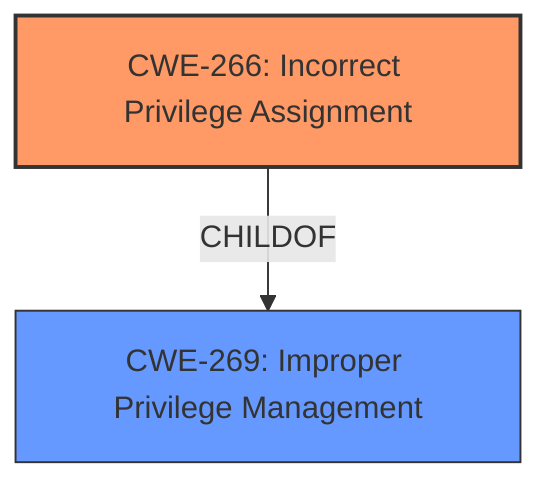

# Raw Analyzer Response for CVE-2022-24411

# Summary
| CWE ID | CWE Name | Confidence | CWE Abstraction Level | CWE Vulnerability Mapping Label | CWE-Vulnerability Mapping Notes |
|---|---|---|---|---|---|
| CWE-266 | Incorrect Privilege Assignment | 0.8 | Base | Primary | Allowed |
| CWE-269 | Improper Privilege Management | 0.6 | Class | Secondary | Discouraged |

## Evidence and Confidence

*   **Confidence Score:** 0.7
*   **Evidence Strength:** MEDIUM

## Relationship Analysis
The primary CWE is CWE-266, which is a base-level CWE. The secondary CWE, CWE-269, is a class-level CWE and a parent of CWE-266. While CWE-269 is a parent of CWE-266 and could be considered, the description explicitly states that a local attacker with specific privileges could exploit the vulnerability, leading to an elevation of privilege. This suggests an **incorrect assignment** of those specific privileges (ISI_PRIV_LOGIN_SSH and/or ISI_PRIV_LOGIN_CONSOLE), rather than a general failure to manage privileges. Therefore, CWE-266 is more specific and appropriate.

## Vulnerability Chain
The vulnerability chain starts with the **incorrect assignment** of privileges (CWE-266) to a local attacker, which leads to an elevation of privilege. This elevation of privilege could then allow the attacker to circumvent PowerScale Compliance Mode guarantees.

## Summary of Analysis
Initially, several CWEs were considered based on the retriever results, including CWE-732, CWE-270, and CWE-269. However, after a thorough analysis of the vulnerability description and the CWE specifications, CWE-266 was chosen as the primary CWE because it best describes the **root cause** of the vulnerability. The description explicitly mentions that an attacker with specific privileges could exploit this vulnerability, leading to an elevation of privilege. This strongly suggests an **incorrect assignment** of these privileges.

CWE-269 was considered as a more general classification, but the presence of specific assigned privileges points towards an assignment issue rather than a general management one.

The evidence supporting this decision comes directly from the vulnerability description: "A local attacker with ISI_PRIV_LOGIN_SSH and/or ISI_PRIV_LOGIN_CONSOLE could potentially exploit this vulnerability, leading to elevation of privilege." This statement clearly indicates that certain privileges are incorrectly assigned to an actor.

The selected CWEs are at the optimal level of specificity because CWE-266 directly addresses the **root cause** of the vulnerability, while CWE-269 provides a broader context but lacks the specificity required to accurately represent the issue.

Relevant CWE Information:

*   **CWE-266: Incorrect Privilege Assignment**
    *   **Technical Explanation:** The product incorrectly assigns a privilege to a particular actor, creating an unintended sphere of control for that actor. In this case, the Dell PowerScale OneFS product assigns the ISI_PRIV_LOGIN_SSH and/or ISI_PRIV_LOGIN_CONSOLE privileges to a local attacker, allowing them to elevate their privileges.
    *   **Security Implications:** This can lead to unauthorized access to sensitive resources and functionalities, potentially allowing the attacker to bypass security mechanisms and compromise the system's integrity.
    *   **Relationship Analysis:** CWE-266 is a child of CWE-269 (Improper Privilege Management). It's a more specific case where the management issue is due to an incorrect assignment.
    *   **Mapping Guidance Influence:** The "Allowed" usage designation supports the selection of this CWE.
*   **CWE-269: Improper Privilege Management**
    *   **Technical Explanation:** The product does not properly assign, modify, track, or check privileges for an actor, creating an unintended sphere of control for that actor.
    *   **Security Implications:** Similar to CWE-266, this can lead to unauthorized access and compromise the system's integrity.
    *   **Relationship Analysis:** It is a parent of CWE-266.
    *   **Mapping Guidance Influence:** The "Discouraged" usage designation suggests that a more specific CWE should be preferred if available.