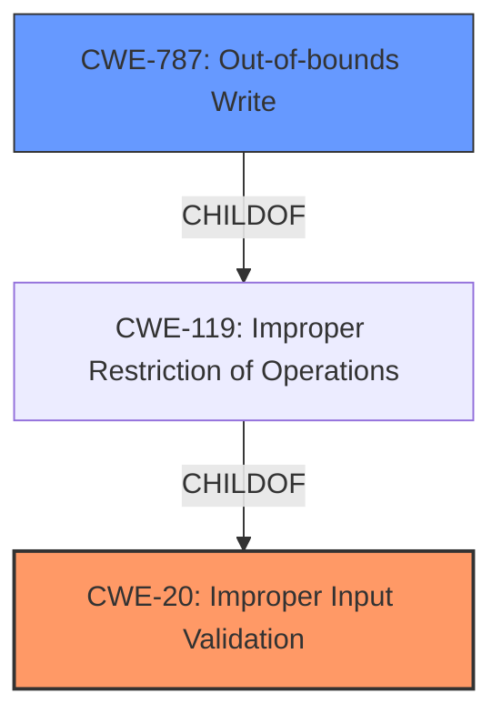

# Analysis Report for CVE-2022-24418

# Vulnerability Analysis Report: CVE-2022-24418

## Description


## Analysis (with Relationship Data)

# Summary
| CWE ID  | CWE Name                                                        | Confidence | CWE Abstraction Level | CWE Vulnerability Mapping Label | CWE-Vulnerability Mapping Notes |
|---------|-----------------------------------------------------------------|------------|-----------------------|---------------------------------|-----------------------------------|
| CWE-20  | Improper Input Validation                                       | 0.9        | Class                 | Primary                         | Discouraged                    |
| CWE-787 | Out-of-bounds Write                                            | 0.6        | Base                  | Secondary                       | Allowed                         |

## Evidence and Confidence

*   **Confidence Score:** 0.75
*   **Evidence Strength:** HIGH

## Relationship Analysis
The primary CWE, CWE-20 [Improper Input Validation], is a Class-level CWE, which is a parent to more specific Base-level CWEs. While it's generally discouraged to map to a Class-level CWE, in this case, the provided evidence doesn't give enough information to pinpoint a more specific input validation issue. The vulnerability description and CVE summary both highlight **improper input validation** as the root cause. CWE-787 [Out-of-bounds Write] is a child of CWE-119 [Improper Restriction of Operations within the Bounds of a Memory Buffer], which in turn is a child of CWE-20 [Improper Input Validation]. The relationships suggest that **improper input validation** could lead to buffer overflows and potentially out-of-bounds writes if the input isn't properly validated before being used to write to memory.



## Vulnerability Chain
The vulnerability chain starts with **improper input validation** (CWE-20), which, if exploited, could lead to an out-of-bounds write (CWE-787) and ultimately arbitrary code execution.
  - **Root Cause:** **Improper Input Validation** (CWE-20)
  - **Weakness:** Potential for Out-of-bounds Write (CWE-787)
  - **Impact:** Arbitrary code execution

## Summary of Analysis
The initial assessment strongly pointed towards CWE-20 [Improper Input Validation] due to the explicit mention of **improper input validation** as the root cause in both the vulnerability description and the CVE reference summary.

The retriever results also listed CWE-20 [Improper Input Validation] as the top match, although it is discouraged for direct mapping due to its high-level abstraction. However, the provided information lacks the specificity needed to pinpoint a more precise variant of **improper input validation**.

The vulnerability description mentions a local authenticated malicious user potentially exploiting the vulnerability using an SMI to gain arbitrary code execution during SMM. This suggests that the **improperly validated input** is used within the System Management Mode (SMM) context, which could involve memory manipulation. Thus, I considered CWE-787 [Out-of-bounds Write] as a potential secondary CWE, given that **improper input validation** could lead to writing data beyond the intended buffer boundaries.

CWE-20 [Improper Input Validation] is selected as the primary CWE because the vulnerability description explicitly states "**improper input validation**" as the root cause. While it's a high-level class, the lack of specific details prevents mapping to a more granular CWE. The CVE Reference Links Content Summary also confirms "**improper input validation**" as both the root cause and the weakness.

CWE-787 [Out-of-bounds Write] is a secondary candidate because it represents a potential consequence of the **improperly validated input**, especially within the context of SMI and SMM where memory manipulation is involved. However, without more details, it's impossible to confirm that an out-of-bounds write actually occurs, so it is assigned a lower confidence.

Relevant CWE Information:
- Vulnerability Description Key Phrases:
  - **rootcause:** **improper input validation**
- CVE Reference Links Content Summary:
  - Root cause of vulnerability:
    - **Improper input validation** within the Dell BIOS.
  - Weaknesses/vulnerabilities present:
    - **Improper input validation**.


## CWE Relationship Analysis

Current CWEs represent these abstraction levels: .


### Vulnerability Chain Analysis

**Chain starting from CWE-787:**
- 787 (Out-of-bounds Write) - ROOT


**Chain starting from CWE-119:**
- 119 (Improper Restriction of Operations within the Bounds of a Memory Buffer) - ROOT


### CWE Relationship Diagram

```mermaid
graph TD
    classDef primary fill:#f96,stroke:#333,stroke-width:2px
    classDef secondary fill:#69f,stroke:#333
    classDef tertiary fill:#9e9,stroke:#333
```


*Report generated on 2025-03-31 09:24:14*
