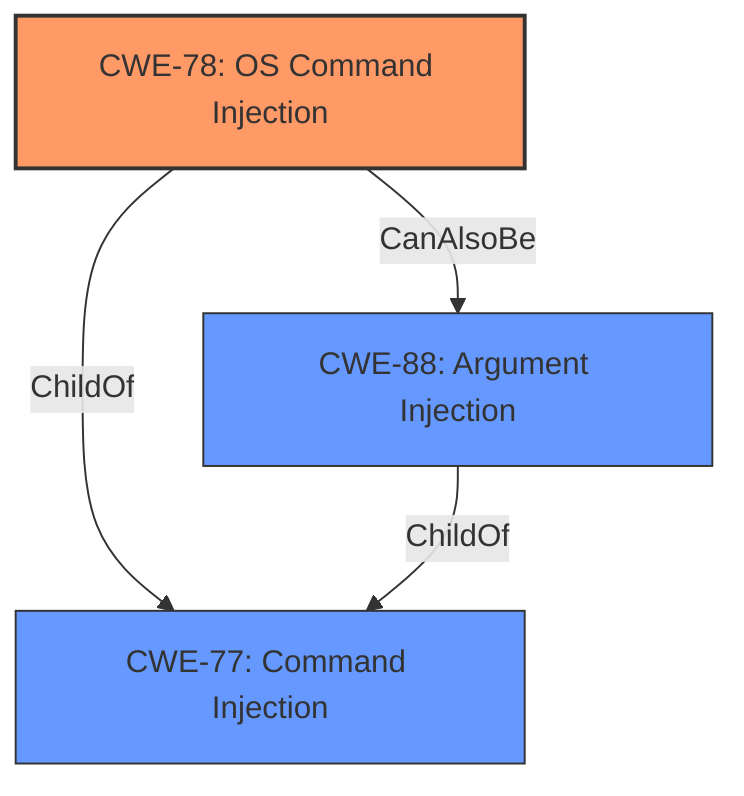

# Enhanced Analysis for CVE-2022-24440

# Summary
| CWE ID | CWE Name | Confidence | CWE Abstraction Level | CWE Vulnerability Mapping Label | CWE-Vulnerability Mapping Notes |
|---|---|---|---|---|---|
| CWE-78 | Improper Neutralization of Special Elements used in an OS Command ('OS Command Injection') | 1.0 | Base | Allowed | Primary CWE |
| CWE-88 | Improper Neutralization of Argument Delimiters in a Command ('Argument Injection') | 0.7 | Base | Allowed | Secondary Candidate |

## Evidence and Confidence

*   **Confidence Score:** 0.9
*   **Evidence Strength:** HIGH

## Relationship Analysis
The primary CWE is CWE-78, which is a Base level weakness and a ChildOf CWE-77 (Command Injection). CWE-88 is also a ChildOf CWE-77 and CanAlsoBe CWE-78, representing a more specific type of command injection related to argument delimiters. The selection of CWE-78 is based on the direct evidence of OS command injection. CWE-88 is considered as a secondary candidate because the vulnerability description mentions git argument injection, which aligns with CWE-88's focus on argument delimiters.



## Vulnerability Chain
The vulnerability chain starts with **improper neutralization** of special elements in the `git` and `branch` parameters, leading to OS command injection. The attacker can inject arbitrary commands through these parameters, resulting in arbitrary command execution on the system.

## Summary of Analysis
The initial analysis focused on the **command injection** vulnerability in cocoapods-downloader. The vulnerability description and CVE details clearly indicate that the **weakness** is due to the **improper neutralization** of special elements in the `git` and `branch` parameters passed to the `git ls-remote` subcommand. This allows for arbitrary command injection.

The selection of CWE-78 is based on the following evidence:

*   The vulnerability description explicitly mentions "Command Injection via git argument injection."
*   The CVE Reference Links Content Summary states, "The vulnerability is due to insufficient input sanitization when calling the `Pod::Downloader.preprocess_options` function with git as the specified method... allowing an attacker to inject arbitrary git options (and thus shell commands)."
*   The CVE Reference Links Content Summary also says "The primary **weakness** is that user-supplied inputs for git and branch options aren't sanitized or validated, allowing an attacker to inject malicious commands through these parameters."

CWE-78 (Improper Neutralization of Special Elements used in an OS Command ('OS Command Injection')) is the most appropriate CWE because it directly addresses the root cause of the vulnerability: the **improper neutralization** of special elements in an OS command, which in this case is the `git ls-remote` subcommand. The **impact** is arbitrary command execution on the system.

CWE-88 is a secondary candidate, the vulnerability description mentions git argument injection, which aligns with CWE-88's focus on argument delimiters. "When calling the PodDownloader.preprocess_options function and using git, both the git and branch parameters are passed to the git ls-remote subcommand in a way that additional flags can be set."

The selected CWEs are at the optimal level of specificity, with CWE-78 being a Base level weakness. The evidence supports this classification, and the relationships between CWE-78 and other related CWEs (e.g., CWE-77, CWE-88) provide additional context and support for the decision.

Relevant CWE Information:

# Enhanced Context (25 CWEs)
The following CWEs were identified as potentially relevant to this vulnerability:

## CWE-74: Improper Neutralization of Special Elements in Output Used by a Downstream Component ('Injection')
**Abstraction Level**: Class
**Similarity Score**: 0.77
**Source**: dense

**Description**:
The product constructs all or part of a command, data structure, or record using externally-influenced input from an upstream component, but it does not neutralize or incorrectly neutralizes special elements that could modify how it is parsed or interpreted when it is sent to a downstream component.

**Mapping Guidance**:
- Usage: Discouraged
- Rationale: CWE-74 is high-level and often misused when lower-level weaknesses are more appropriate.

## CWE-78: Improper Neutralization of Special Elements used in an OS Command ('OS Command Injection')
**Abstraction Level:** Base
**Similarity Score**: 5.03
**Source**: graph

**Description**:
CWE-78: Improper Neutralization of Special Elements used in an OS Command ('OS Command Injection')

**Mapping Guidance**:
- Usage: Allowed
- Rationale: This CWE entry is at the Base level of abstraction, which is a preferred level of abstraction for mapping to the root causes of vulnerabilities.

**Relationships**:
- CANFOLLOW -> CWE-184
- CANALSOBE -> CWE-88
- CHILDOF -> CWE-77
- CHILDOF -> CWE-77
- CHILDOF -> CWE-74

## CWE-88: Improper Neutralization of Argument Delimiters in a Command ('Argument Injection')
**Abstraction Level**: Base
**Similarity Score**: 8805.17
**Source**: sparse

**Description**:
The product constructs a string for a command to be executed by a separate component
in another control sphere, but it does not properly delimit the
intended arguments, options, or switches within that command string.

**Mapping Guidance**:
- Usage: Allowed
- Rationale: This CWE entry is at the Base level of abstraction, which is a preferred level of abstraction for mapping to the root causes of vulnerabilities.

## CWE-184: Incomplete List of Disallowed Inputs
**Abstraction Level**: Base
**Similarity Score**: 0.75
**Source**: dense

**Description**:
The product implements a protection mechanism that relies on a list of inputs (or properties of inputs) that are not allowed by policy or otherwise require other action to neutralize before additional processing takes place, but the list is incomplete.

**Mapping Guidance**:
- Usage: Allowed
- Rationale: This CWE entry is at the Base level of abstraction, which is a preferred level of abstraction for mapping to the root causes of vulnerabilities.

## CWE-95: Improper Neutralization of Directives in Dynamically Evaluated Code ('Eval Injection')
**Abstraction Level**: Variant
**Similarity Score**: 0.75
**Source**: dense

**Description**:
The product receives input from an upstream component, but it does not neutralize or incorrectly neutralizes code syntax before using the input in a dynamic evaluation call (e.g. "eval").

**Mapping Guidance**:
- Usage: Allowed
- Rationale: This CWE entry is at the Variant level of abstraction, which is a preferred level of abstraction for mapping to the root causes of vulnerabilities.

## CWE-77: Improper Neutralization of Special Elements used in a Command ('Command Injection')
**Abstraction:** Class
**Status:** Draft

### Description
The product constructs all or part of a command using externally-influenced input from an upstream component, but it does not neutralize or incorrectly neutralizes special elements that could modify the intended command when it is sent to a downstream component.

### Extended Description


Many protocols and products have their own custom command language. While OS or shell command strings are frequently discovered and targeted, developers may not realize that these other command languages might also be vulnerable to attacks.


### Alternative Terms
Command injection: an attack-oriented phrase for this weakness. Note: often used when "OS command injection" (CWE-78) was intended.

### Relationships
ChildOf -> CWE-74
ChildOf -> CWE-74

### Mapping Guidance
**Usage:** Allowed-with-Review
**Rationale:** CWE-77 is often misused when OS command injection (CWE-78) was intended instead [REF-1287].
**Comments:** Ensure that the analysis focuses on the root-cause error that allows the execution of commands, as there are many weaknesses that can lead to this consequence. See Terminology Notes. If the weakness involves a command language besides OS shell invocation, then CWE-77 could be used.
**Reasons:**
- Frequent Misuse
**Suggested Alternatives:**
- CWE-78: OS Command Injection

### CWEs Considered but Not Used:
*   CWE-77: Improper Neutralization of Special Elements used in a Command ('Command Injection') - Although related, CWE-78 is a more specific case of command injection, focusing on OS commands. Since the vulnerability involves injecting commands into the `git ls-remote` subcommand, CWE-78 is a better fit.
*   CWE-74: Improper Neutralization of Special Elements in Output


## CWE Relationship Analysis

Current CWEs represent these abstraction levels: .


### Vulnerability Chain Analysis

**Chain starting from CWE-184:**
- 184 (Incomplete List of Disallowed Inputs) - ROOT


**Chain starting from CWE-78:**
- 78 (Improper Neutralization of Special Elements used in an OS Command ('OS Command Injection')) - ROOT


### CWE Relationship Diagram

```mermaid
graph TD
    classDef primary fill:#f96,stroke:#333,stroke-width:2px
    classDef secondary fill:#69f,stroke:#333
    classDef tertiary fill:#9e9,stroke:#333
```