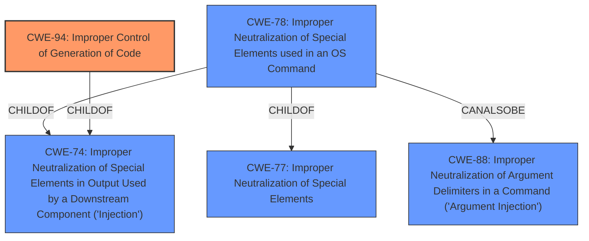

# Raw Analyzer Response for CVE-2022-24441

# Summary
| CWE ID | CWE Name | Confidence | CWE Abstraction Level | CWE Vulnerability Mapping Label | CWE-Vulnerability Mapping Notes |
|---|---|---|---|---|---|
| CWE-94 | Improper Control of Generation of Code ('Code Injection') | 0.9 | Base | Allowed-with-Review | Primary CWE |
| CWE-78 | Improper Neutralization of Special Elements used in an OS Command ('OS Command Injection') | 0.7 | Base | Allowed | Secondary Candidate |

## Evidence and Confidence

*   **Confidence Score:** 0.8
*   **Evidence Strength:** HIGH

## Relationship Analysis
The primary relationship that impacted the decision was the parent-child relationship between CWE-913 (Improper Control of Dynamically-Managed Code Resources) and CWE-94, with CWE-94 being a child of CWE-913. CWE-78 has a peer relationship with CWE-88, which could be a secondary factor. The abstraction levels are Base and Class, which are good levels for specifying root cause.

## Vulnerability Chain
The chain of root cause and weaknesses that followed for the Vulnerability Description:
1.  **Improper input validation**: The application fails to adequately validate input from a project's build files.
2.  **Code Injection (CWE-94)**: Unsanitized input is used to construct code, allowing the injection of malicious commands.
3.  **OS Command Injection (CWE-78)**: The injected code results in the execution of arbitrary OS commands.
4.  **Arbitrary command execution**: The attacker achieves the ability to execute commands with the privileges of the application.

## Summary of Analysis
The initial analysis identified **code injection** as the primary weakness, with the execution of commands being the resulting impact. The Snyk vulnerability description and the supporting CVE details clearly point to the ability to inject commands into build files, leading to their execution.

The selection of CWE-94 is based on the evidence that the vulnerability involves the **improper control of code generation**. The vulnerability allows an attacker to inject malicious code into a build file (e.g., `build.gradle`), which is then executed by the Snyk CLI or IDE plugin. This directly aligns with the description of CWE-94, which states that the product "constructs all or part of a code segment using externally-influenced input... but it does not neutralize or incorrectly neutralizes special elements that could modify the syntax or behavior of the intended code segment." The CVE Reference Links Content Summary provides further evidence, stating the "**root_cause**: Code Injection vulnerability due to the execution of commands within build files like `build.gradle` or `gradle-wrapper.jar` when scanning a project."

CWE-78 (Improper Neutralization of Special Elements used in an OS Command) was considered as a secondary CWE. The injected code allows for arbitrary OS commands to be executed, which aligns with CWE-78. However, the root cause is more accurately represented by CWE-94, as the vulnerability stems from the improper generation of code, which then leads to OS command execution.

The selection of CWE-94 is at the optimal level of specificity. It is a Base-level CWE that directly addresses the root cause of the vulnerability, which is the improper control of code generation. While CWE-78 is also relevant, it represents a consequence of the injected code rather than the root cause itself.

Relevant CWE Information:
# Enhanced Context (25 CWEs)
The following CWEs were identified as potentially relevant to this vulnerability:

## CWE-41: Improper Resolution of Path Equivalence
**Abstraction Level**: Base
**Similarity Score**: 0.79
**Source**: dense

**Description**:
The product is vulnerable to file system contents disclosure through path equivalence. Path equivalence involves the use of special characters in file and directory names. The associated manipulations are intended to generate multiple names for the same object.

**Mapping Guidance**:
- Usage: Allowed
- Rationale: This CWE entry is at the Base level of abstraction, which is a preferred level of abstraction for mapping to the root causes of vulnerabilities.

## CWE-74: Improper Neutralization of Special Elements in Output Used by a Downstream Component ('Injection')
**Abstraction Level**: Class
**Similarity Score**: 0.78
**Source**: dense

**Description**:
The product constructs all or part of a command, data structure, or record using externally-influenced input from an upstream component, but it does not neutralize or incorrectly neutralizes special elements that could modify how it is parsed or interpreted when it is sent to a downstream component.

**Mapping Guidance**:
- Usage: Discouraged
- Rationale: CWE-74 is high-level and often misused when lower-level weaknesses are more appropriate.

## CWE-23: Relative Path Traversal
**Abstraction Level**: Base
**Similarity Score**: 0.78
**Source**: dense

**Description**:
The product uses external input to construct a pathname that should be within a restricted directory, but it does not properly neutralize sequences such as ".." that can resolve to a location that is outside of that directory.

**Mapping Guidance**:
- Usage: Allowed
- Rationale: This CWE entry is at the Base level of abstraction, which is a preferred level of abstraction for mapping to the root causes of vulnerabilities.

## CWE-184: Incomplete List of Disallowed Inputs
**Abstraction Level**: Base
**Similarity Score**: 0.77
**Source**: dense

**Description**:
The product implements a protection mechanism that relies on a list of inputs (or properties of inputs) that are not allowed by policy or otherwise require other action to neutralize before additional processing takes place, but the list is incomplete.

**Mapping Guidance**:
- Usage: Allowed
- Rationale: This CWE entry is at the Base level of abstraction, which is a preferred level of abstraction for mapping to the root causes of vulnerabilities.

## CWE-59: Improper Link Resolution Before File Access ('Link Following')
**Abstraction Level**: Base
**Similarity Score**: 0.77
**Source**: dense

**Description**:
The product attempts to access a file based on the filename, but it does not properly prevent that filename from identifying a link or shortcut that resolves to an unintended resource.

**Mapping Guidance**:
- Usage: Allowed
- Rationale: This CWE entry is at the Base level of abstraction, which is a preferred level of abstraction for mapping to the root causes of vulnerabilities.

## CWE-36: Absolute Path Traversal
**Abstraction Level**: Base
**Similarity Score**: 0.77
**Source**: dense

**Description**:
The product uses external input to construct a pathname that should be within a restricted directory, but it does not properly neutralize absolute path sequences such as "/abs/path" that can resolve to a location that is outside of that directory.

**Mapping Guidance**:
- Usage: Allowed
- Rationale: This CWE entry is at the Base level of abstraction, which is a preferred level of abstraction for mapping to the root causes of vulnerabilities.

## CWE-138: Improper Neutralization of Special Elements
**Abstraction Level**: Class
**Similarity Score**: 0.76
**Source**: dense

**Description**:
The product receives input from an upstream component, but it does not neutralize or incorrectly neutralizes special elements that could be interpreted as control elements or syntactic markers when they are sent to a downstream component.

**Mapping Guidance**:
- Usage: Discouraged
- Rationale: This CWE entry is a level-1 Class (i.e., a child of a Pillar). It might have lower-level children that would be more appropriate

## CWE-73: External Control of File Name or Path
**Abstraction Level**: Base
**Similarity Score**: 0.76
**Source**: dense

**Description**:
The product allows user input to control or influence paths or file names that are used in filesystem operations.

**Mapping Guidance**:
- Usage: Allowed
- Rationale: This CWE entry is at the Base level of abstraction, which is a preferred level of abstraction for mapping to the root causes of vulnerabilities.

## CWE-427: Uncontrolled Search Path Element
**Abstraction Level**: Base
**Similarity Score**: 0.76
**Source**: dense

**Description**:
The product