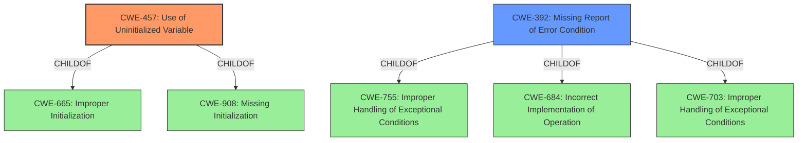

# Analysis Report for CVE-2022-24448

# Vulnerability Analysis Report: CVE-2022-24448

## Description


## Analysis (with Relationship Data)

# Summary
| CWE ID  | CWE Name                                                                | Confidence | CWE Abstraction Level | CWE Vulnerability Mapping Label | CWE-Vulnerability Mapping Notes |
| :-------- | :---------------------------------------------------------------------- | :--------- | :---------------------- | :------------------------------ | :------------------------------ |
| CWE-457   | Use of Uninitialized Variable                                           | 0.9        | Variant               | Primary CWE                     | Allowed                       |
| CWE-392   | Missing Report of Error Condition                                       | 0.6        | Base                  | Secondary CWE                   | Allowed                       |

## Evidence and Confidence

*   **Confidence Score:** 0.8
*   **Evidence Strength:** HIGH

## Relationship Analysis
The primary CWE is CWE-457, which indicates the **use of an uninitialized variable**. This is directly supported by the vulnerability description, where **uninitialized data** is returned in the file descriptor. CWE-457 is a variant of CWE-665 (Improper Initialization) and CWE-908 (Missing Initialization).

CWE-392 is included as a secondary CWE because the expected error condition (ENOTDIR) is not properly reported, leading to the **return of uninitialized data**. It indicates that the function fails to properly report an error condition. CWE-392 is a base CWE and is a child of several class CWEs like CWE-755, CWE-684, and CWE-703.



## Vulnerability Chain
The vulnerability chain starts with the incorrect handling of the `O_DIRECTORY` flag when opening a regular file, leading to the **failure to return the expected ENOTDIR error**. This results in the **return of uninitialized data in the file descriptor**, creating an information leak.

`Incorrect Flag Handling` -> `Missing Error Report (CWE-392)` -> `Use of Uninitialized Variable (CWE-457)` -> `Information Leak`

## Summary of Analysis
The primary weakness is the **use of uninitialized data (CWE-457)** in the file descriptor when an application attempts to open a regular file with the `O_DIRECTORY` flag. The supporting evidence is the vulnerability description indicating that the "server instead returns **uninitialized data** in the file descriptor." This maps directly to the description of CWE-457.

The secondary weakness, **missing report of error condition (CWE-392)**, is considered due to the failure to return the expected `ENOTDIR` error. The analysis of CVE Reference Links indicates "**Incorrect Handling of `O_DIRECTORY` Flag:** The kernel doesn't correctly enforce the `O_DIRECTORY` flag when a regular file is found on an NFS share after a lookup."

CWE-476 (NULL Pointer Dereference) was considered but deemed less relevant. While dereferencing an uninitialized pointer could lead to a NULL pointer dereference, the primary issue is the **exposure of uninitialized data**, not necessarily a NULL pointer.

CWE-789 (Memory Allocation with Excessive Size Value) and CWE-1284 (Improper Validation of Specified Quantity in Input) were also considered but are not applicable because the vulnerability does not involve excessive memory allocation or improper input validation of size or quantity. Instead, the core problem is the **failure to initialize the file descriptor properly**, leading to exposure of uninitialized memory.

The final selection of CWE-457 and CWE-392 provides the most accurate and specific representation of the vulnerability, focusing on the root cause (uninitialized data) and the contributing factor (missing error report).

Relevant CWE Information:
- **CWE-457 (Use of Uninitialized Variable):** The code uses a variable that has not been initialized, leading to unpredictable or unintended results. This aligns directly with the vulnerability's impact of returning uninitialized data in the file descriptor.
- **CWE-392 (Missing Report of Error Condition):** The product encounters an error but does not provide a status code or return value to indicate that an error has occurred. This is relevant because the system should have returned an `ENOTDIR` error but failed to do so.


## CWE Relationship Analysis

Current CWEs represent these abstraction levels: .


### Vulnerability Chain Analysis

**Chain starting from CWE-476:**
- 476 (NULL Pointer Dereference) - ROOT


**Chain starting from CWE-755:**
- 755 (Improper Handling of Exceptional Conditions) - ROOT


### CWE Relationship Diagram

```mermaid
graph TD
    classDef primary fill:#f96,stroke:#333,stroke-width:2px
    classDef secondary fill:#69f,stroke:#333
    classDef tertiary fill:#9e9,stroke:#333
```


*Report generated on 2025-03-30 21:32:12*
