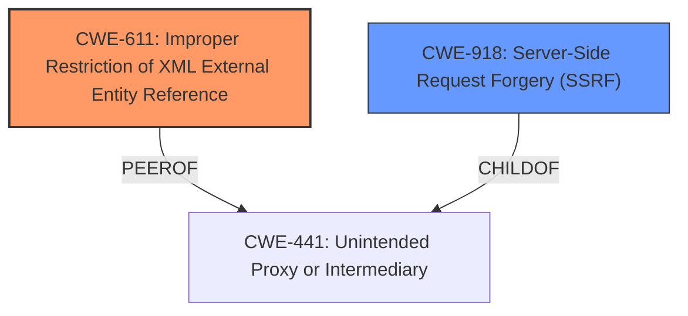

# Raw Analyzer Response for CVE-2022-24449

# Summary
| CWE ID | CWE Name | Confidence | CWE Abstraction Level | CWE Vulnerability Mapping Label | CWE-Vulnerability Mapping Notes |
|---|---|---|---|---|---|
| CWE-611 | Improper Restriction of XML External Entity Reference | 1.0 | Base | Allowed | Primary CWE: The vulnerability is due to the failure to restrict XML external entities. |
| CWE-918 | Server-Side Request Forgery (SSRF) | 0.8 | Base | Allowed | Secondary CWE: The vulnerability allows for SSRF attacks. |

## Evidence and Confidence

*   **Confidence Score:** 0.9
*   **Evidence Strength:** HIGH

## Relationship Analysis
The primary weakness is CWE-611 (**CWE-611: Improper Restriction of XML External Entity Reference**) because the application fails to restrict XML external entities.
A secondary weakness is CWE-918 (**CWE-918: Server-Side Request Forgery (SSRF)**) because the **XXE** can be used to perform a server side request forgery.
CWE-611 is a peer of CWE-441 (**CWE-441: Unintended Proxy or Intermediary**).
CWE-918 is a child of CWE-441 (**CWE-441: Unintended Proxy or Intermediary**).
Both CWE-611 and CWE-918 are at the Base level of abstraction.

## Vulnerability Chain
The vulnerability chain starts with the application **not validating the presence of a license**, which leads to the acceptance of a crafted XML document. The crafted XML document contains **XXE** payloads. The **XXE** allows for information disclosure and **SSRF** attacks.

## Summary of Analysis
The vulnerability is due to the application **not validating the presence of a license**, which leads to the acceptance of a crafted XML document containing **XXE** payloads. The **XXE** allows for information disclosure and **SSRF** attacks.

The vulnerability description states: "Solar appScreener through 3.10.4, when a valid license is not present, allows **XXE** and SSRF attacks via a crafted XML document."
The "CVE Reference Links Content Summary" states: "The vulnerability stems from the improper handling of XML External Entity (XXE) references within the Solar AppScreener license update mechanism. Specifically, the tool does not properly restrict the parsing of external entities in XML files provided by users during the license update process."
The "CVE Reference Links Content Summary" also states: "The application fails to properly validate or sanitize user-supplied XML files, leading to the ability to inject malicious XML payloads."

The primary weakness is CWE-611 (**CWE-611: Improper Restriction of XML External Entity Reference**) because the application fails to restrict XML external entities.
CWE-611 is at the Base level of abstraction, which is the preferred level of abstraction. The mapping guidance for CWE-611 states: "This CWE entry is at the Base level of abstraction, which is a preferred level of abstraction for mapping to the root causes of vulnerabilities."
The retriever results list CWE-611 as the top combined result, with a score of 1.0.

A secondary weakness is CWE-918 (**CWE-918: Server-Side Request Forgery (SSRF)**) because the **XXE** can be used to perform a server side request forgery.
CWE-918 is at the Base level of abstraction, which is the preferred level of abstraction. The mapping guidance for CWE-918 states: "This CWE entry is at the Base level of abstraction, which is a preferred level of abstraction for mapping to the root causes of vulnerabilities."

CWE-502 (**CWE-502: Deserialization of Untrusted Data**) was considered because XML is used to serialize data. However, the vulnerability is not due to deserialization of untrusted data, but rather due to the improper handling of XML external entities.

Relevant CWE Information:

# Enhanced Context (25 CWEs)
The following CWEs were identified as potentially relevant to this vulnerability:

## CWE-611: Improper Restriction of XML External Entity Reference
**Abstraction Level**: Base
**Similarity Score**: 0.77
**Source**: dense

**Description**:
The product processes an XML document that can contain XML entities with URIs that resolve to documents outside of the intended sphere of control, causing the product to embed incorrect documents into its output.

**Mapping Guidance**:
- Usage: Allowed
- Rationale: This CWE entry is at the Base level of abstraction, which is a preferred level of abstraction for mapping to the root causes of vulnerabilities.

## CWE-74: Improper Neutralization of Special Elements in Output Used by a Downstream Component ('Injection')
**Abstraction Level**: Class
**Similarity Score**: 0.77
**Source**: dense

**Description**:
The product constructs all or part of a command, data structure, or record using externally-influenced input from an upstream component, but it does not neutralize or incorrectly neutralizes special elements that could modify how it is parsed or interpreted when it is sent to a downstream component.

**Mapping Guidance**:
- Usage: Discouraged
- Rationale: CWE-74 is high-level and often misused when lower-level weaknesses are more appropriate.

## CWE-502: Deserialization of Untrusted Data
**Abstraction Level**: Base
**Similarity Score**: 0.76
**Source**: dense

**Description**:
The product deserializes untrusted data without sufficiently ensuring that the resulting data will be valid.

**Mapping Guidance**:
- Usage: Allowed
- Rationale: This CWE entry is at the Base level of abstraction, which is a preferred level of abstraction for mapping to the root causes of vulnerabilities.

## CWE-1289: Improper Validation of Unsafe Equivalence in Input
**Abstraction Level**: Base
**Similarity Score**: 0.76
**Source**: dense

**Description**:
The product receives an input value that is used as a resource identifier or other type of reference, but it does not validate or incorrectly validates that the input is equivalent to a potentially-unsafe value.

**Mapping Guidance**:
- Usage: Allowed
- Rationale: This CWE entry is at the Base level of abstraction, which is a preferred level of abstraction for mapping to the root causes of vulnerabilities.

## CWE-138: Improper Neutralization of Special Elements
**Abstraction Level**: Class
**Similarity Score**: 0.76
**Source**: dense

**Description**:
The product receives input from an upstream component, but it does not neutralize or incorrectly neutralizes special elements that could be interpreted as control elements or syntactic markers when they are sent to a downstream component.

**Mapping Guidance**:
- Usage: Discouraged
- Rationale: This CWE entry is a level-1 Class (i.e., a child of a Pillar). It might have lower-level children that would be more appropriate

## CWE-345: Insufficient Verification of Data Authenticity
**Abstraction Level**: Class
**Similarity Score**: 0.75
**Source**: dense

**Description**:
The product does not sufficiently verify the origin or authenticity of data, in a way that causes it to accept invalid data.

**Mapping Guidance**:
- Usage: Discouraged
- Rationale: This CWE entry is a level-1 Class (i.e., a child of a Pillar). It might have lower-level children that would be more appropriate

## CWE-113: Improper Neutralization of CRLF Sequences in HTTP Headers ('HTTP Request/Response Splitting')
**Abstraction Level**: Variant
**Similarity Score**: 0.75
**Source**: dense

**Description**:
The product receives data from an HTTP agent/component (e.g., web server, proxy, browser, etc.), but it does not neutralize or incorrectly neutralizes CR and LF characters before the data is included in outgoing HTTP headers.

**Mapping Guidance**:
- Usage: Allowed
- Rationale: This CWE entry is at the Variant level of abstraction, which is a preferred level of abstraction for mapping to the root causes of vulnerabilities.

## CWE-41: Improper Resolution of Path Equivalence
**Abstraction Level**: Base
**Similarity Score**: 0.75
**Source**: dense

**Description**:
The product is vulnerable to file system contents disclosure through path equivalence. Path equivalence involves the use of special characters in file and directory names. The associated manipulations are intended to generate multiple names for the same object.

**Mapping Guidance**:
- Usage: