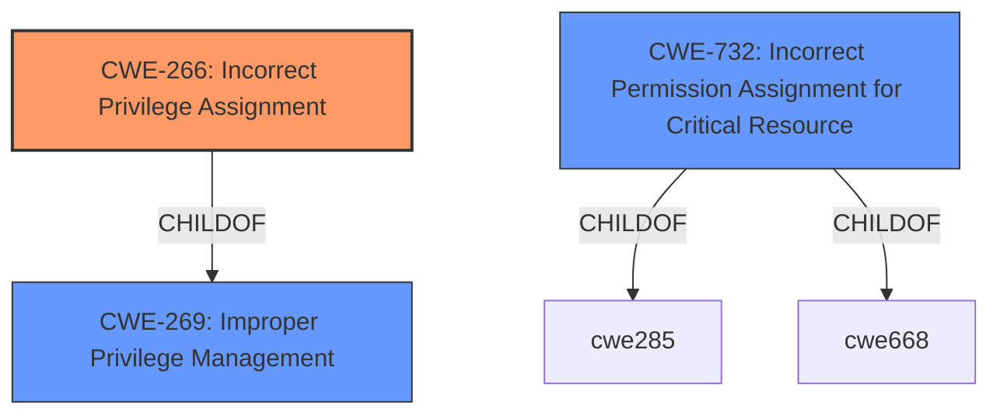

# Analysis for CVE-2022-24521

# Summary
| CWE ID | CWE Name | Confidence | CWE Abstraction Level | CWE Vulnerability Mapping Label | CWE-Vulnerability Mapping Notes |
|---|---|---|---|---|---|
| CWE-266 | Incorrect Privilege Assignment | 0.75 | Base | Allowed | Primary CWE |

## Evidence and Confidence

*   **Confidence Score:** 0.75
*   **Evidence Strength:** MEDIUM

## Relationship Analysis
The primary CWE identified is CWE-266 (Incorrect Privilege Assignment), which is a Base-level CWE. This selection is influenced by the vulnerability's root cause, described as "**improper access control**", which directly relates to assigning incorrect privileges. Although CWE-732 (Incorrect Permission Assignment for Critical Resource) was considered, the description leans more towards incorrect *privilege* assignment, making CWE-266 a more appropriate fit. The relationship between CWE-266 and its parent, CWE-269 (Improper Privilege Management), highlights the broader category of privilege management failures.

## Vulnerability Chain
The vulnerability chain is relatively simple:
1.  **Root Cause**: **Improper access control** (CWE-266)
2.  **Impact**: Elevation of privilege

## Summary of Analysis
The analysis is based on the provided vulnerability description and the associated CWE information. The key phrase "**improper access control**" directly supports the selection of CWE-266 (Incorrect Privilege Assignment). This CWE aligns with the observed impact, which is elevation of privilege.

The retriever results listed several potential CWEs, including CWE-732 (Incorrect Permission Assignment for Critical Resource), CWE-667 (Improper Locking), and CWE-367 (Time-of-check Time-of-use (TOCTOU) Race Condition). However, these were not selected because they did not directly align with the root cause as strongly as CWE-266. While CWE-732 is related to permission assignments, the vulnerability description specifically mentions access control and privilege, making CWE-266 more suitable. The other CWEs are related to concurrency and resource management, which are not explicitly mentioned in the description.

The selection of CWE-266 is at the optimal level of specificity because it is a Base-level CWE that accurately represents the **improper access control** leading to elevation of privilege.

Relevant CWE Information:
- **Vulnerability Description Key Phrases:**
  - **rootcause:** **improper access control**
  - **impact:** elevation of privilege

- **CWE-266: Incorrect Privilege Assignment**
  - **Description:** A product incorrectly assigns a privilege to a particular actor, creating an unintended sphere of control for that actor.