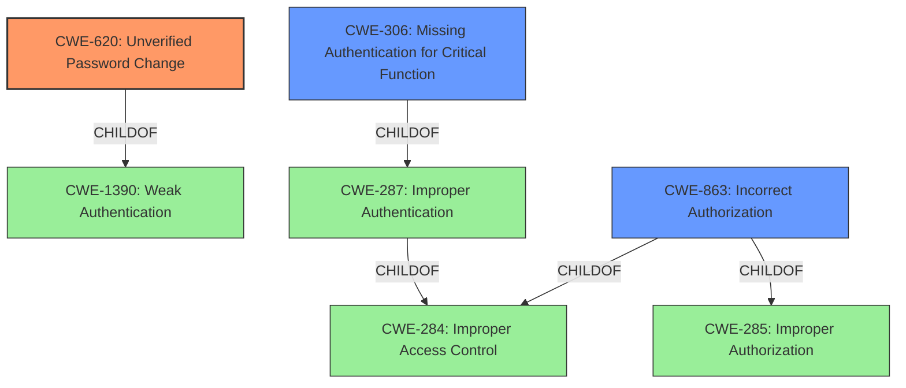

# Analysis for CVE-2022-24551

# Summary
| CWE ID | CWE Name | Confidence | CWE Abstraction Level | CWE Vulnerability Mapping Label | CWE-Vulnerability Mapping Notes |
|---|---|---|---|---|---|
| CWE-620 | Unverified Password Change | 1.0 | Base | Allowed | Primary CWE |
| CWE-306 | Missing Authentication for Critical Function | 0.8 | Base | Allowed | Secondary Candidate |
| CWE-863 | Incorrect Authorization | 0.6 | Class | Allowed-with-Review | Secondary Candidate |

## Evidence and Confidence

*   **Confidence Score:** 0.9
*   **Evidence Strength:** HIGH

## Relationship Analysis
The primary CWE, CWE-620, is a child of CWE-1390 (Weak Authentication). This indicates that the **unverified password change** is a specific type of weak authentication. CWE-306 (Missing Authentication for Critical Function) is a child of CWE-287 (Improper Authentication), which is related but less specific than CWE-620. CWE-863 (Incorrect Authorization) is a child of CWE-285 (Improper Authorization) and CWE-284 (Improper Access Control), representing a broader category of authorization issues. Selecting CWE-620 provides the most precise classification.

## Vulnerability Chain
The vulnerability chain starts with the **missing check for the current username and old password** during the password reset process. This **root cause** leads directly to the impact of an attacker being able to reset any local user password, including the administrator.

## Summary of Analysis
The initial analysis identified that the vulnerability lies in the **failure to verify the current username and old password** when resetting a password. This allows an attacker to reset any user's password.

Based on the provided evidence, including the vulnerability description key phrases and the CVE reference links content summary, the primary weakness is the **lack of verification during the password change process**. The description states that "**The endpoint for setting a new password doesnt check the current username and old password**." The CVE reference confirms this, stating that "The endpoint for setting a new password does not validate the current username and old password."

The graph relationships helped clarify the specificity of CWE-620 as a direct child of CWE-1390. This confirms that it is more specific than other authentication-related CWEs.

CWE-620 is the most appropriate because it directly addresses the **root cause** of the vulnerability, which is the **lack of verification during the password change process**. This CWE is at the Base level of abstraction, which is the preferred level.

Relevant CWE Information:

# Enhanced Context (25 CWEs)
The following CWEs were identified as potentially relevant to this vulnerability:

## CWE-620: Unverified Password Change
**Abstraction Level**: Base
**Similarity Score**: 0.522
**Source**: sparse

**Description**:
When setting a new password for a user, the product does not require knowledge of the original password, or using another form of authentication.

**Mapping Guidance**:
- Usage: Allowed
- Rationale: This CWE entry is at the Base level of abstraction, which is a preferred level of abstraction for mapping to the root causes of vulnerabilities.

### Technical Explanation for CWE-620: Unverified Password Change
The vulnerability perfectly matches CWE-620. The password reset endpoint does not require the current password or any other form of authentication before allowing a password change. This allows an attacker, with knowledge of a valid username, to reset the password.

*   **Security Implications:** Unauthorized password resets, potential privilege escalation.
*   **Relationship:** ChildOf CWE-1390 (Weak Authentication).
*   **Mapping Guidance:** Usage: ALLOWED. Rationale is that it is at the Base level of abstraction.

## CWE-306: Missing Authentication for Critical Function
**Abstraction Level**: Base
**Similarity Score**: 0.324
**Source**: sparse

**Description**:
The product does not perform any authentication for functionality that requires a provable user identity or consumes a significant amount of resources.

**Mapping Guidance**:
- Usage: Allowed
- Rationale: This CWE entry is at the Base level of abstraction, which is a preferred level of abstraction for mapping to the root causes of vulnerabilities.

### Technical Explanation for CWE-306: Missing Authentication for Critical Function
While the vulnerability involves **missing authentication** in the context of a password reset, the function itself isn't entirely missing authentication, since the user must be logged in. It's more specific than simply missing authentication; it's a failure to verify the user's identity *during the password change process*.

*   **Security Implications:** Unauthorized access, potential privilege escalation.
*   **Relationship:** ChildOf CWE-287 (Improper Authentication).
*   **Mapping Guidance:** Usage: ALLOWED. Rationale is that it is at the Base level of abstraction.

## CWE-863: Incorrect Authorization
**Abstraction Level**: Class
**Similarity Score**: 0.302
**Source**: sparse

**Description**:
The product performs an authorization check when an actor attempts to access a resource or perform an action, but it does not correctly perform the check.

**Mapping Guidance**:
- Usage: Allowed-with-Review
- Rationale: This CWE entry is a Class and might have Base-level children that would be more appropriate

### Technical Explanation for CWE-863: Incorrect Authorization
The authorization check is performed incorrectly because it fails to verify the current password. This allows any logged-in user to change the password of any other user. While this could be considered incorrect authorization, it is more accurately described as **unverified password change**.

*   **Security Implications:** Unauthorized access, privilege escalation.
*   **Relationship:** ChildOf CWE-285 (Improper Authorization).
*   **Mapping Guidance:** Usage: ALLOWED-WITH-REVIEW. Rationale is that it is a Class and might have more appropriate children.

## Other CWEs Considered and Rejected:

*   **CWE-287: Improper Authentication**: Too general. CWE-620 is a more specific case of improper authentication.
*   **CWE-285: Improper Authorization**: Too general. CWE-620 is more specific.
*   **CWE-204: Observable Response Discrepancy**: This is not about information leakage through different responses.
*   **CWE-201: Insertion of Sensitive Information Into Sent Data**: This is not about sensitive information being sent.