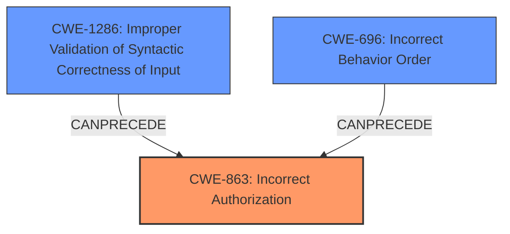

# Analysis Report for CVE-2022-2456

# Vulnerability Analysis Report: CVE-2022-2456

## Description


## Analysis (with Relationship Data)

# Summary
| CWE ID | CWE Name | Confidence | CWE Abstraction Level | CWE Vulnerability Mapping Label | CWE-Vulnerability Mapping Notes |
|---|---|---|---|---|---|
| CWE-863 | Incorrect Authorization | 0.9 | Class | Primary | Allowed-with-Review |
| CWE-1286 | Improper Validation of Syntactic Correctness of Input | 0.7 | Base | Secondary | Allowed |
| CWE-696 | Incorrect Behavior Order | 0.6 | Class | Secondary | Allowed-with-Review |

## Evidence and Confidence

*   **Confidence Score:** 0.8
*   **Evidence Strength:** HIGH

## Relationship Analysis
The primary weakness is **CWE-863 (Incorrect Authorization)**, indicating a flaw in the authorization check itself. This is a Class-level CWE and has more specific Base-level children that could be considered. The vulnerability also involves **CWE-1286 (Improper Validation of Syntactic Correctness of Input)**, contributing to the authorization bypass by **failing to properly validate the input** used for visibility levels. Additionally, **CWE-696 (Incorrect Behavior Order)** highlights that the permission check occurs *after* the visibility level is determined, leading to the bypass.



## Vulnerability Chain
The vulnerability chain begins with **improper input validation (CWE-1286)**, which leads to an **incorrect order of operations (CWE-696)**, and ultimately results in an **authorization bypass (CWE-863)**. The attacker can then change group or project visibility, leading to potential data exposure.

## Summary of Analysis
Initially, the most relevant CWE appeared to be **CWE-639 (Authorization Bypass Through User-Controlled Key)** due to the ability to modify the visibility level. However, after carefully analyzing the **root cause** described in the CVE Reference Links Content Summary, it became clear that the primary issue is the **incorrect authorization check (CWE-863)** stemming from **improper input validation (CWE-1286)** and **incorrect behavior order (CWE-696)**. The description states the permission check happens *after* the visibility level is determined and the user-supplied visibility level isn't properly validated.

The evidence from the CVE Reference Links Content Summary states: "The vulnerability stems from a flaw in how GitLab handles visibility level changes for projects and groups. Specifically, the permission check is performed *after* determining if the new visibility level is different from the current one."

The graph relationships further support this conclusion by showing how **CWE-1286** and **CWE-696** can precede **CWE-863**. The selected CWEs are at the optimal level of specificity as they directly address the **root cause** and contributing factors of the vulnerability. While **CWE-639** is a possible consequence, it doesn't accurately represent the fundamental **weakness**.

Relevant CWE Information:

# Enhanced Context (25 CWEs)
The following CWEs were identified as potentially relevant to this vulnerability:

## CWE-639: Authorization Bypass Through User-Controlled Key
**Abstraction Level**: Base
**Similarity Score**: 0.77
**Source**: dense

**Description**:
The system's authorization functionality does not prevent one user from gaining access to another user's data or record by modifying the key value identifying the data.

**Mapping Guidance**:
- Usage: Allowed
- Rationale: This CWE entry is at the Base level of abstraction, which is a preferred level of abstraction for mapping to the root causes of vulnerabilities.

## CWE-696: Incorrect Behavior Order
**Abstraction Level**: Class
**Similarity Score**: 0.76
**Source**: dense

**Description**:
The product performs multiple related behaviors, but the behaviors are performed in the wrong order in ways which may produce resultant weaknesses.

**Mapping Guidance**:
- Usage: Allowed-with-Review
- Rationale: This CWE entry is a Class and might have Base-level children that would be more appropriate

## CWE-1286: Improper Validation of Syntactic Correctness of Input
**Abstraction Level**: Base
**Similarity Score**: 0.529
**Source**: dense

**Description**:
The product receives input that is expected to be well-formed - i.e., to comply with a certain syntax - but it does not validate or incorrectly validates that the input complies with the syntax.

**Mapping Guidance**:
- Usage: Allowed
- Rationale: This CWE entry is at the Base level of abstraction, which is a preferred level of abstraction for mapping to the root causes of vulnerabilities.

## CWE-863: Incorrect Authorization
**Abstraction Level**: Class
**Similarity Score**: 7045.16
**Source**: sparse

**Description**:
The product performs an authorization check when an actor attempts to access a resource or perform an action, but it does not correctly perform the check.

**Mapping Guidance**:
- Usage: Allowed-with-Review
- Rationale: This CWE entry is a Class and might have Base-level children that would be more appropriate

## CWE-285: Improper Authorization
**Abstraction Level**: Class
**Similarity Score**: 6815.25
**Source**: sparse

**Description**:
The product does not perform or incorrectly performs an authorization check when an actor attempts to access a resource or perform an action.

**Mapping Guidance**:
- Usage: Discouraged
- Rationale: CWE-285 is high-level and lower-level CWEs can frequently be used instead. It is a level-1 Class (i.e., a child of a Pillar).

## Technical Explanation for Selected CWEs:

### CWE-863: Incorrect Authorization
*   **Match:** The vulnerability description explicitly states that a malicious actor can change group or project visibility by crafting a malicious POST request, which bypasses the intended authorization mechanism. The permission check is flawed.
*   **Implication:** This allows unauthorized modifications of sensitive settings, potentially leading to data exposure.
*   **Relationship:** This is the primary CWE, representing the core authorization failure.
*   **Guidance:** The MITRE mapping guidance suggests this is a Class-level CWE, and more specific children might exist. However, given the details, this level is appropriate as the check is performed but incorrectly.

### CWE-1286: Improper Validation of Syntactic Correctness of Input
*   **Match:** The `level_value` method parses the user-supplied visibility level but does not properly validate the input before processing it.
*   **Implication:** This allows for an attacker to input values that default to private during permission checks but are later parsed into public/internal.
*   **Relationship:** This CWE can precede **CWE-863** by providing a means to bypass authorization checks.
*   **Guidance:** The MITRE mapping guidance allows this CWE.

### CWE-696: Incorrect Behavior Order
*   **Match:** The application checks if the new visibility level is different from the current one **before** checking if the user has permission to change the visibility level.
*   **Implication:** This allows an attacker to bypass the authorization check.
*   **Relationship:** This CWE can precede **CWE-863** by creating a scenario where the authorization check is performed under incorrect conditions.
*   **Guidance:** The MITRE mapping guidance allows this CWE.

## CWEs Considered But Not Used:

*   **CWE-639 (Authorization Bypass Through User-Controlled Key):** While the attacker modifies the visibility level, the **root cause** is not a direct manipulation of a key but rather a flaw in the authorization logic and input validation. Therefore, **CWE-639** is less accurate than **CWE-863**.
*   **CWE-285 (Improper Authorization):** This is a high-level Class CWE, and **CWE-863** (Incorrect Authorization) is a more specific child that better captures the **weakness**.
*   **CWE-425 (Direct Request ('Forced Browsing')):** This CWE is not a good fit because the attacker is not directly requesting a resource without authorization but is exploiting a flaw in the authorization process itself.


## CWE Relationship Analysis

Current CWEs represent these abstraction levels: .


### Vulnerability Chain Analysis

**Chain starting from CWE-425:**
- 425 (Direct Request ('Forced Browsing')) - ROOT


**Chain starting from CWE-696:**
- 696 (Incorrect Behavior Order) - ROOT


### CWE Relationship Diagram

```mermaid
graph TD
    classDef primary fill:#f96,stroke:#333,stroke-width:2px
    classDef secondary fill:#69f,stroke:#333
    classDef tertiary fill:#9e9,stroke:#333
```


*Report generated on 2025-03-31 13:46:15*
