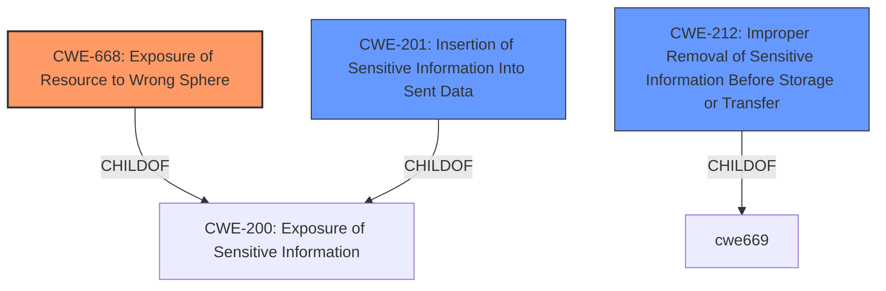

# Raw Analyzer Response for CVE-2022-2466

# Summary
| CWE ID | CWE Name | Confidence | CWE Abstraction Level | CWE Vulnerability Mapping Label | CWE-Vulnerability Mapping Notes |
|---|---|---|---|---|---|
| CWE-668 | Exposure of Resource to Wrong Sphere | 0.8 | Class | Primary | Allowed-with-Review |
| CWE-201 | Insertion of Sensitive Information Into Sent Data | 0.7 | Base | Secondary | Allowed |
| CWE-212 | Improper Removal of Sensitive Information Before Storage or Transfer | 0.6 | Base | Secondary | Allowed |

## Evidence and Confidence

*   **Confidence Score:** 0.7
*   **Evidence Strength:** MEDIUM

## Relationship Analysis
The primary relationship influencing the selection was the parent-child relationship between CWE-200 and CWE-668. CWE-668 is a child of CWE-200 (Exposure of Sensitive Information), indicating that it is a more specific type of information exposure. The chain relationship was considered because it showed how **improper termination of the HTTP request header context** (the root cause) can lead to the insertion of sensitive information into sent data or improper removal of sensitive information. The abstraction levels were carefully considered, favoring the more specific Class level for the primary CWE, and Base for secondary CWEs.

## Vulnerability Chain
The vulnerability chain starts with the **failure to terminate the HTTP request header context**. This leads to the re-use of stale request information across different requests. The consequence is that sensitive information from previous requests can be inadvertently inserted into subsequent requests or not properly removed from resources before they are re-used or shared.

## Summary of Analysis
The initial analysis focused on identifying the core weakness, which is the **failure to terminate the HTTP request header context** in Quarkus 2.10.x. This **weakness** allows stale request information to be re-used, leading to unpredictable behavior and potential exposure of sensitive information. The retriever results suggested CWE-444 and CWE-113, but these seemed more focused on request/response manipulation and splitting, rather than the core issue of incorrect context handling.

The final decision favors CWE-668 because it captures the essence of exposing resources (in this case, HTTP request context) to the wrong sphere (subsequent requests). This is supported by the CVE Reference Links Content Summary, which states that "the request context was not being terminated correctly," causing components to "access and use request headers from a previous request."

The selection of CWE-668 is also based on the understanding that the request context, including headers, is a resource that should be properly isolated between requests. By failing to terminate the context, the application is exposing this resource to subsequent requests that should not have access to it.

The secondary CWEs, CWE-201 and CWE-212, capture the potential consequences of this exposure, namely the insertion of sensitive information into sent data and the improper removal of sensitive information before storage or transfer.

The choice of CWE-668 as the primary CWE is at the optimal level of specificity because it directly addresses the root cause of the vulnerability, whereas CWE-201 and CWE-212 are more related to the impact of the vulnerability.

Relevant CWE Information:

# Enhanced Context (25 CWEs)
The following CWEs were identified as potentially relevant to this vulnerability:

## CWE-113: Improper Neutralization of CRLF Sequences in HTTP Headers ('HTTP Request/Response Splitting')
**Abstraction Level**: Variant
**Similarity Score**: 0.79
**Source**: dense

**Description**:
The product receives data from an HTTP agent/component (e.g., web server, proxy, browser, etc.), but it does not neutralize or incorrectly neutralizes CR and LF characters before the data is included in outgoing HTTP headers.

**Mapping Guidance**:
- Usage: Allowed
- Rationale: This CWE entry is at the Variant level of abstraction, which is a preferred level of abstraction for mapping to the root causes of vulnerabilities.

*Reason for not selecting*: This CWE relates to the **improper neutralization of CRLF sequences**, which is not the case here. The issue is with context termination, not specific character handling.*

## CWE-444: Inconsistent Interpretation of HTTP Requests ('HTTP Request/Response Smuggling')
**Abstraction Level**: Base
**Similarity Score**: 0.77
**Source**: dense

**Description**:
The product acts as an intermediary HTTP agent
         (such as a proxy or firewall) in the data flow between two
         entities such as a client and server, but it does not
         interpret malformed HTTP requests or responses in ways that
         are consistent with how the messages will be processed by
         those entities that are at the ultimate destination.

**Mapping Guidance**:
- Usage: Allowed
- Rationale: This CWE entry is at the Base level of abstraction, which is a preferred level of abstraction for mapping to the root causes of vulnerabilities.

*Reason for not selecting*: This CWE concerns inconsistent interpretation of HTTP requests by intermediaries, which is not the primary issue in this vulnerability.*

## CWE-1289: Improper Validation of Unsafe Equivalence in Input
**Abstraction Level**: Base
**Similarity Score**: 0.76
**Source**: dense

**Description**:
The product receives an input value that is used as a resource identifier or other type of reference, but it does not validate or incorrectly validates that the input is equivalent to a potentially-unsafe value.

**Mapping Guidance**:
- Usage: Allowed
- Rationale: This CWE entry is at the Base level of abstraction, which is a preferred level of abstraction for mapping to the root causes of vulnerabilities.

*Reason for not selecting*: This CWE is not related to input validation or equivalence issues. The core problem is about context handling.*

## CWE-74: Improper Neutralization of Special Elements in Output Used by a Downstream Component ('Injection')
**Abstraction Level**: Class
**Similarity Score**: 0.76
**Source**: dense

**Description**:
The product constructs all or part of a command, data structure, or record using externally-influenced input from an upstream component, but it does not neutralize or incorrectly neutralizes special elements that could modify how it is parsed or interpreted when it is sent to a downstream component.

**Mapping Guidance**:
- Usage: Discouraged
- Rationale: CWE-74 is high-level and often misused when lower-level weaknesses are more appropriate.

*Reason for not selecting*: While there could be an injection-like effect, the **root cause** is not about **improper neutralization**. It's about incorrect context propagation.*

## CWE-212: Improper Removal of Sensitive Information Before Storage or Transfer
**Abstraction Level**: Base
**Similarity Score**: 0.76
**Source**: dense

**Description**:
The product stores, transfers, or shares a resource that contains sensitive information, but it does not properly remove that information before the product makes the resource available to unauthorized actors.

**Mapping Guidance**:
- Usage: Allowed
- Rationale: This CWE entry is at the Base level of abstraction, which is a preferred level of abstraction for mapping to the root causes of vulnerabilities.

*Reason for selecting*: This is a secondary CWE. The vulnerability could result in sensitive data not being removed, as stated in the CVE summary.*

## CWE-668: Exposure of Resource to Wrong Sphere
**Abstraction Level**: Class
**Similarity Score**: 0.75
**Source**: dense

**Description**:
The product exposes a resource to the wrong control sphere, providing unintended actors with inappropriate access to the resource.

**Mapping Guidance**:
- Usage: Discouraged
- Rationale: CWE-668 is high-level and is often misused as a catch-all when lower-level CWE IDs might be applicable. It is sometimes used for low-information vulnerability reports [REF-1287]. It is a level-1 Class (i.e., a child of a Pillar). It is not useful for trend analysis.

*Reason for selecting*: This is the Primary CWE. While generally discouraged, in this case it accurately reflects the core issue of exposing the HTTP request context to the wrong sphere (subsequent requests). The summary explicitly mentions stale request information being re-used.*

## CWE-138: Improper Neutralization of Special Elements
**Abstraction Level**: Class
**Similarity Score**: 0.75
**Source**: dense

**Description**:
The product receives input from an upstream component,