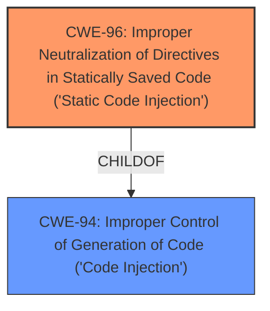

# Raw Analyzer Response for CVE-2022-24663

# Summary
| CWE ID | CWE Name | Confidence | CWE Abstraction Level | CWE Vulnerability Mapping Label | CWE-Vulnerability Mapping Notes |
|---|---|---|---|---|---|
| CWE-96 | Improper Neutralization of Directives in Statically Saved Code ('Static Code Injection') | 0.9 | Base | Allowed | Primary CWE |
| CWE-94 | Improper Control of Generation of Code ('Code Injection') | 0.7 | Base | Allowed-with-Review | Secondary Candidate |

## Evidence and Confidence

*   **Confidence Score:** 0.8
*   **Evidence Strength:** HIGH

## Relationship Analysis
The primary CWE is CWE-96, which is a child of CWE-94. This hierarchical relationship indicates that CWE-96 is a more specific form of code injection where the injected code is saved statically. The choice of CWE-96 is due to the fact that the PHP code is injected into WordPress shortcodes, which can be considered statically saved code within the WordPress environment.

## Vulnerability Chain
The vulnerability chain starts with **improper input sanitization**, leading to the ability to inject PHP code via WordPress shortcodes. This results in arbitrary PHP code execution, potentially leading to complete site takeover.
  - The chain shows that the root cause is the **lack of proper input sanitization**, and the impact is arbitrary code execution.

## Summary of Analysis
The initial analysis identified CWE-96 as the primary candidate due to the nature of the injected code being saved within WordPress shortcodes. The **Vulnerability Description Key Phrases** highlight the **improper input sanitization** as the root cause. The **CVE Reference Links Content Summary** confirms this, stating that the plugin allowed execution of PHP code snippets via WordPress shortcodes. The weakness lies in the insecure use of shortcodes and **lack of proper permission checks** for shortcode execution. The retriever results also list CWE-96 as the top candidate.

The decision to select CWE-96 is based on the evidence that the injected code is statically saved. The alternative, CWE-94, is a broader category of code injection but does not specifically address the static nature of the injection.

Relevant CWE Information:

# Enhanced Context (25 CWEs)
The following CWEs were identified as potentially relevant to this vulnerability:

## CWE-96: Improper Neutralization of Directives in Statically Saved Code ('Static Code Injection')
**Abstraction:** Base
**Similarity Score**: 0.75
**Source**: dense

**Description**:
The product receives input from an upstream component, but it does not neutralize or incorrectly neutralizes code syntax before inserting the input into an executable resource, such as a library, configuration file, or template.

## CWE-94: Improper Control of Generation of Code ('Code Injection')
**Abstraction:** Base
**Similarity Score**: 4.33
**Source**: graph

**Description**:
CWE-94: Improper Control of Generation of Code ('Code Injection')

**Mapping Guidance**:
- Usage: Allowed-with-Review
- Rationale: This entry is frequently misused for vulnerabilities with a technical impact of "code execution," which does not by itself indicate a root cause weakness, since dozens of weaknesses can enable code execution.

## Vulnerability Details and Rationale

### CWE-96: Improper Neutralization of Directives in Statically Saved Code ('Static Code Injection')
*   **Technical Explanation:** The PHP Everywhere plugin allowed execution of PHP code snippets via WordPress shortcodes. The **improper input sanitization** allowed authenticated users to inject PHP code, which was then stored as part of the shortcode. When the shortcode was processed, the injected PHP code was executed.
*   **Security Implications:** This vulnerability allowed any authenticated user to execute arbitrary PHP code on the site, potentially leading to complete site takeover.
*   **Relationship:** CWE-96 is a child of CWE-94, making it a more specific classification for code injection where the injected code is statically saved.
*   **MITRE Mapping Guidance:** The mapping guidance for CWE-96 states that it is at the Base level of abstraction, which is a preferred level for mapping to the root causes of vulnerabilities.
*   **Supporting Evidence:**
    *   **Vulnerability Description Key Phrases:** "**improper input sanitization**"
    *   **CVE Reference Links Content Summary:** "The PHP Everywhere plugin allowed execution of PHP code snippets via WordPress shortcodes."
*   **Confidence:** 0.9

### CWE-94: Improper Control of Generation of Code ('Code Injection')
*   **Technical Explanation:** This CWE covers the broader category of code injection. While it is applicable, CWE-96 is more specific as it involves code being injected into statically saved resources (shortcodes in this case).
*   **Security Implications:** Similar to CWE-96, this could lead to arbitrary code execution.
*   **Relationship:** CWE-94 is the parent of CWE-96.
*   **MITRE Mapping Guidance:** The mapping guidance for CWE-94 suggests a review due to its frequent misuse. However, in this case, it is a relevant but less specific classification.
*   **Supporting Evidence:**
    *   The ability to execute arbitrary PHP code implies a code injection vulnerability.
*   **Confidence:** 0.7

### Other CWEs Considered and Rejected:
*   CWE-79 (Improper Neutralization of Input During Web Page Generation ('Cross-site Scripting')): While the vulnerability involves web pages, the core issue is the execution of PHP code, not the injection of script into web pages.
*   CWE-89 (Improper Neutralization of Special Elements used in an SQL Command ('SQL Injection')): The vulnerability does not involve SQL injection.
*   CWE-434 (Unrestricted Upload of File with Dangerous Type): The vulnerability does not involve uploading files.
*   CWE-352 (Cross-Site Request Forgery (CSRF)): The vulnerability does not involve CSRF.