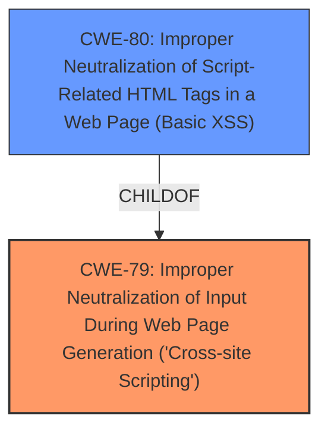

# Analysis Report for CVE-2022-24682

# Vulnerability Analysis Report: CVE-2022-24682

## Description


## Analysis (with Relationship Data)

# Summary
| CWE ID  | CWE Name                                                                            | Confidence | CWE Abstraction Level | CWE Vulnerability Mapping Label | CWE-Vulnerability Mapping Notes |
|---------|-------------------------------------------------------------------------------------|------------|-----------------------|---------------------------------|-----------------------------------|
| CWE-79  | Improper Neutralization of Input During Web Page Generation ('Cross-site Scripting') | 1.0        | Base                  | Primary CWE                     | Allowed                             |
| CWE-80  | Improper Neutralization of Script-Related HTML Tags in a Web Page (Basic XSS)        | 0.8        | Variant               | Secondary Candidate           | Allowed                             |

## Evidence and Confidence

*   **Confidence Score:** 0.9
*   **Evidence Strength:** HIGH

## Relationship Analysis
The primary relationship is between CWE-79 and its variant CWE-80. CWE-80 is a more specific type of XSS that focuses on script-related HTML tags, whereas CWE-79 is a broader category. The choice of CWE-79 as primary is because the vulnerability description states that the attacker could place HTML containing executable JavaScript inside element attributes, leading to arbitrary markup injection. Since the description focuses on the injection of HTML containing Javascript, CWE-79 becomes the most appropriate. CWE-80 can be considered as a secondary candidate, further detailing the nature of the injected content.



## Vulnerability Chain
The vulnerability chain starts with **improper input sanitization**, leading to the injection of HTML containing executable JavaScript. This results in arbitrary markup being injected into the document, ultimately allowing the execution of JavaScript code.

## Summary of Analysis
The initial assessment identified the vulnerability as an XSS issue due to **improper input sanitization**. The CVE description key phrases support this, specifically noting the **rootcause** as "**improper input sanitization**" and the impact as the ability to "execute JavaScript code." The CVE Reference Links Content Summary confirms that the root cause of the vulnerability is insufficient input sanitization which allows an attacker to inject arbitrary JavaScript code.

The Retriever Results indicated several potential CWEs, including CWE-116 (Improper Encoding or Escaping of Output), CWE-79 (Improper Neutralization of Input During Web Page Generation ('Cross-site Scripting')), CWE-93 (Improper Neutralization of CRLF Sequences ('CRLF Injection')), and CWE-80 (Improper Neutralization of Script-Related HTML Tags in a Web Page (Basic XSS)).

CWE-79 was selected as the primary CWE because it directly addresses the core issue of **improper neutralization** of user-controllable input before it is placed in output that is used as a web page, aligning with the vulnerability description.

CWE-80 was considered as a secondary candidate because it is a variant of CWE-79 that specifically relates to script-related HTML tags, which is relevant given the attacker's ability to inject HTML containing executable JavaScript.

CWE-116 and CWE-93 were not selected because, while related to **improper neutralization**, they do not specifically address the XSS context of this vulnerability. CWE-116 is too general, and CWE-93 relates to CRLF injection, which is not the focus of this vulnerability.

The selection of CWE-79 and CWE-80 provides the optimal level of specificity, accurately reflecting the nature of the vulnerability.

Relevant CWE Information:

# Enhanced Context (25 CWEs)

## CWE-113: Improper Neutralization of CRLF Sequences in HTTP Headers ('HTTP Request/Response Splitting')
**Abstraction Level**: Variant
**Similarity Score**: 0.78
**Source**: dense

**Description**:
The product receives data from an HTTP agent/component (e.g., web server, proxy, browser, etc.), but it does not neutralize or incorrectly neutralizes CR and LF characters before the data is included in outgoing HTTP headers.

**Mapping Guidance**:
- Usage: Allowed
- Rationale: This CWE entry is at the Variant level of abstraction, which is a preferred level of abstraction for mapping to the root causes of vulnerabilities.

## CWE-80: Improper Neutralization of Script-Related HTML Tags in a Web Page (Basic XSS)
**Abstraction Level**: Variant
**Similarity Score**: 0.77
**Source**: dense

**Description**:
The product receives input from an upstream component, but it does not neutralize or incorrectly neutralizes special characters such as "<", ">", and "&" that could be interpreted as web-scripting elements when they are sent to a downstream component that processes web pages.

**Mapping Guidance**:
- Usage: Allowed
- Rationale: This CWE entry is at the Variant level of abstraction, which is a preferred level of abstraction for mapping to the root causes of vulnerabilities.

## CWE-74: Improper Neutralization of Special Elements in Output Used by a Downstream Component ('Injection')
**Abstraction Level**: Class
**Similarity Score**: 0.77
**Source**: dense

**Description**:
The product constructs all or part of a command, data structure, or record using externally-influenced input from an upstream component, but it does not neutralize or incorrectly neutralizes special elements that could modify how it is parsed or interpreted when it is sent to a downstream component.

**Mapping Guidance**:
- Usage: Discouraged
- Rationale: CWE-74 is high-level and often misused when lower-level weaknesses are more appropriate.

## CWE-918: Server-Side Request Forgery (SSRF)
**Abstraction Level**: Base
**Similarity Score**: 0.76
**Source**: dense

**Description**:
The web server receives a URL or similar request from an upstream component and retrieves the contents of this URL, but it does not sufficiently ensure that the request is being sent to the expected destination.

**Mapping Guidance**:
- Usage: Allowed
- Rationale: This CWE entry is at the Base level of abstraction, which is a preferred level of abstraction for mapping to the root causes of vulnerabilities.

## CWE-1289: Improper Validation of Unsafe Equivalence in Input
**Abstraction Level**: Base
**Similarity Score**: 0.76
**Source**: dense

**Description**:
The product receives an input value that is used as a resource identifier or other type of reference, but it does not validate or incorrectly validates that the input is equivalent to a potentially-unsafe value.

**Mapping Guidance**:
- Usage: Allowed
- Rationale: This CWE entry is at the Base level of abstraction, which is a preferred level of abstraction for mapping to the root causes of vulnerabilities.

## CWE-184: Incomplete List of Disallowed Inputs
**Abstraction Level**: Base
**Similarity Score**: 0.75
**Source**: dense

**Description**:
The product implements a protection mechanism that relies on a list of inputs (or properties of inputs) that are not allowed by policy or otherwise require other action to neutralize before additional processing takes place, but the list is incomplete.

**Mapping Guidance**:
- Usage: Allowed
- Rationale: This CWE entry is at the Base level of abstraction, which is a preferred level of abstraction for mapping to the root causes of vulnerabilities.

## CWE-41: Improper Resolution of Path Equivalence
**Abstraction Level**: Base
**Similarity Score**: 0.75
**Source**: dense

**Description**:
The product is vulnerable to file system contents disclosure through path equivalence. Path equivalence involves the use of special characters in file and directory names. The associated manipulations are intended to generate multiple names for the same object.

**Mapping Guidance**:
- Usage: Allowed
- Rationale: This CWE entry is at the Base level of abstraction, which is a preferred level of abstraction for mapping to the root causes of vulnerabilities.

## CWE-116: Improper Encoding or Escaping of Output
**Abstraction Level**: Class
**Similarity Score**: 0.75
**Source**: dense

**Description**:
The product prepares a structured message for communication with another component, but encoding or escaping of the data is either missing or done incorrectly. As a result, the intended structure of the message is not preserved.

**Mapping Guidance**:
- Usage: Allowed-with-Review
- Rationale: This CWE entry is a Class and might have Base-level children that would be more appropriate

## CWE-611: Improper Restriction of XML External Entity Reference
**Abstraction Level**: Base
**Similarity Score**: 0.75
**Source**: dense

**Description**:
The product processes an XML document that can contain XML entities with URIs that resolve to documents outside of the intended sphere of control, causing the product to embed incorrect documents into its output.

**Mapping Guidance**:
- Usage: Allowed
- Rationale: This CWE entry is at the Base level of abstraction, which is a preferred level of abstraction for mapping to the root causes of vulnerabilities.

## CWE-610


## CWE Relationship Analysis

Current CWEs represent these abstraction levels: .


### Vulnerability Chain Analysis

**Chain starting from CWE-80:**
- 80 (Improper Neutralization of Script-Related HTML Tags in a Web Page (Basic XSS)) - ROOT


**Chain starting from CWE-918:**
- 918 (Server-Side Request Forgery (SSRF)) - ROOT


### CWE Relationship Diagram

```mermaid
graph TD
    classDef primary fill:#f96,stroke:#333,stroke-width:2px
    classDef secondary fill:#69f,stroke:#333
    classDef tertiary fill:#9e9,stroke:#333
```


*Report generated on 2025-03-31 11:38:00*
