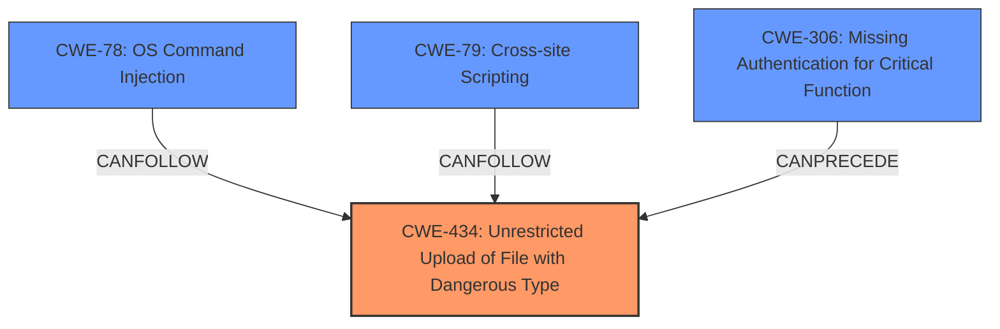

# Analysis for CVE-2022-24688

# Summary
| CWE ID  | CWE Name                                                                                             | Confidence | CWE Abstraction Level | CWE Vulnerability Mapping Label | CWE-Vulnerability Mapping Notes |
| :-------- | :----------------------------------------------------------------------------------------------------- | :--------- | :---------------------- | :------------------------------ | :-------------------------------- |
| CWE-434 | Unrestricted Upload of File with Dangerous Type                                                        | 1.0        | Base                    | Primary                         | Allowed                           |
| CWE-78  | Improper Neutralization of Special Elements used in an OS Command ('OS Command Injection')            | 0.7        | Base                    | Secondary                       | Allowed                           |
| CWE-79  | Improper Neutralization of Input During Web Page Generation ('Cross-site Scripting')                    | 0.6        | Base                    | Secondary                       | Allowed                           |
| CWE-306 | Missing Authentication for Critical Function                                                           | 0.5        | Base                    | Secondary                       | Allowed                           |

## Evidence and Confidence

*   **Confidence Score:** 0.8
*   **Evidence Strength:** MEDIUM

## Relationship Analysis
The primary CWE is CWE-434, which directly addresses the **unrestricted file upload** issue. Related weaknesses like CWE-78 and CWE-79 could arise as a consequence of the **unrestricted file upload**, where uploaded files with malicious content are processed by the server. CWE-306 is potentially related because the attacker needs to "hijack or obtain privileged user access" to exploit the upload functionality, indicating a possible **lack of authentication** on a critical function, though the description states they can get access through other means.

## Vulnerability Chain
The vulnerability chain starts with the **unrestricted file upload** (CWE-434). If an attacker uploads a file containing OS commands, it can lead to OS command injection (CWE-78). If the uploaded file contains script code, it can lead to cross-site scripting (CWE-79). If the application lacks proper authentication, the attacker can easily access the upload function (CWE-306).

## Summary of Analysis
The primary weakness is CWE-434, as the vulnerability description explicitly mentions "**unrestricted file upload**". This is the root cause that allows the attacker to upload malicious files. The description also states the attacker must "hijack or obtain privileged user access to the Parameters page in order to exploit this issue. (That can be easily achieved by exploiting the Broken Access Control with further Brute-force attack or SQL Injection.)" This potentially introduces CWE-306, however since the description states "That can be easily achieved by exploiting the Broken Access Control with further Brute-force attack or SQL Injection" it is more of an impact than a rootcause.

The high retriever score for CWE-434 and the explicit mention of "**unrestricted file upload**" in the vulnerability description solidify this choice. The additional CWEs are secondary because they depend on the successful exploitation of the **unrestricted file upload**.

*   **CWE-434 (Unrestricted Upload of File with Dangerous Type):** The vulnerability description states, "The Touch settings allow **unrestricted file upload** (and consequently Remote Code Execution) via PDF upload with PHP content and a .php extension." This directly matches the description of CWE-434, which is allowing the upload of dangerous file types. Confidence: 1.0
*   **CWE-78 (Improper Neutralization of Special Elements used in an OS Command ('OS Command Injection'))**: If the uploaded file contains OS commands, it can lead to OS command injection. This is a potential consequence of CWE-434. Confidence: 0.7
*   **CWE-79 (Improper Neutralization of Input During Web Page Generation ('Cross-site Scripting'))**: If the uploaded file contains script code, it can lead to cross-site scripting. This is another potential consequence of CWE-434. Confidence: 0.6
*   **CWE-306 (Missing Authentication for Critical Function)**: The attacker must "hijack or obtain privileged user access to the Parameters page in order to exploit this issue." This suggests that the upload function may lack proper authentication, although, since the description states "That can be easily achieved by exploiting the Broken Access Control with further Brute-force attack or SQL Injection" it is more of an impact than a rootcause. Confidence: 0.5

CWE-22 (Improper Limitation of a Pathname to a Restricted Directory ('Path Traversal')) was considered because the uploaded file is "copied to the sync web folder." However, the description does not specify that the file path is constructed from user input and not properly neutralized. Therefore, it is not a good fit.

CWE-89 (Improper Neutralization of Special Elements used in an SQL Command ('SQL Injection')) was considered because the description states "(That can be easily achieved by exploiting the Broken Access Control with further Brute-force attack or SQL Injection.)" However, this is a separate means to obtain privileged access, not related to the file upload itself.