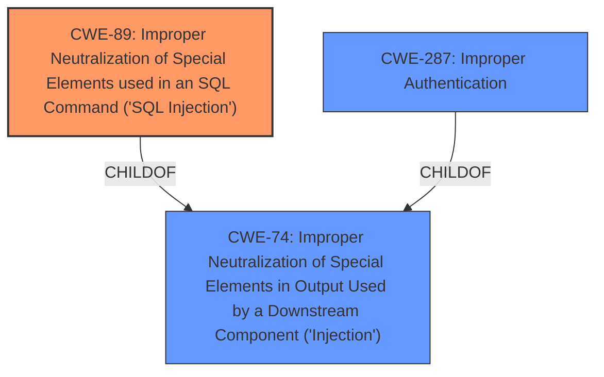

# Raw Analyzer Response for CVE-2022-24690

# Summary
| CWE ID | CWE Name | Confidence | CWE Abstraction Level | CWE Vulnerability Mapping Label | CWE-Vulnerability Mapping Notes |
|---|---|---|---|---|---|
| CWE-89 | Improper Neutralization of Special Elements used in an SQL Command ('SQL Injection') | 1.0 | Base | Allowed | Primary CWE |
| CWE-287 | Improper Authentication | 0.5 | Class | Discouraged | Secondary Candidate |

## Evidence and Confidence

*   **Confidence Score:** 0.75
*   **Evidence Strength:** MEDIUM

## Relationship Analysis
The primary relationship influencing the CWE selection is the ChildOf relationship between CWE-89 and CWE-74 (Improper Neutralization of Special Elements in Output Used by a Downstream Component ('Injection')). While CWE-74 is a broader class, CWE-89 provides a more specific characterization of the **SQL injection** vulnerability. Additionally, the CANALSOBE relationship between CWE-78 (Improper Neutralization of Special Elements used in an OS Command ('OS Command Injection')) and CWE-88 (Improper Neutralization of Argument Delimiters in a Command ('Argument Injection')) was considered, but deemed less relevant as the vulnerability description specifically mentions SQL injection rather than OS command injection.

## Vulnerability Chain
The vulnerability chain starts with the **SQL injection vulnerability** in `PresAbs.php`. This allows an unauthenticated attacker to discover the endpoint and gather user badge numbers and PIN codes. The chain is:

1.  **CWE-89 (Root Cause): Improper Neutralization of Special Elements used in an SQL Command ('SQL Injection')** within `PresAbs.php`.
2.  **CWE-287 (Improper Authentication)** allows the attacker to bypass authentication and extract sensitive information.

## Summary of Analysis
The initial analysis strongly pointed towards CWE-89 due to the explicit mention of **SQL injection vulnerability** in the vulnerability description key phrases: "**rootcause: SQL injection vulnerability in PresAbs.php**". The retriever results also ranked CWE-89 as the top candidate with a score of 0.800. Further supporting this decision is the allowed usage rationale for CWE-89, which states that it is at the Base level of abstraction, a preferred level for mapping.

The vulnerability description also mentions "Broken Access Control issue with further SQL injection attacks to gather all users badge numbers and PIN codes" which may indicate a secondary weakness of CWE-287, Improper Authentication. However, without further evidence, it is less clear how the **improper authentication** is implemented. Therefore, it is classified as a secondary candidate with a lower confidence score.

The decision to select CWE-89 as the primary CWE is based on direct evidence from the vulnerability description, the retriever results, and the MITRE mapping guidance. It is at the optimal level of specificity because it accurately represents the **root cause of the vulnerability**, which is the **improper neutralization of special elements used in an SQL command**.

Relevant CWE Information:

# Enhanced Context (25 CWEs)

## CWE-80: Improper Neutralization of Script-Related HTML Tags in a Web Page (Basic XSS)
**Abstraction Level**: Variant
**Similarity Score**: 0.79
**Source**: dense

**Description**:
The product receives input from an upstream component, but it does not neutralize or incorrectly neutralizes special characters such as "<", ">", and "&" that could be interpreted as web-scripting elements when they are sent to a downstream component that processes web pages.

**Mapping Guidance**:
- Usage: Allowed
- Rationale: This CWE entry is at the Variant level of abstraction, which is a preferred level of abstraction for mapping to the root causes of vulnerabilities.

*Reason for not using this CWE*: This CWE is for Cross-Site Scripting (XSS), but the **root cause** is **SQL Injection**.

## CWE-74: Improper Neutralization of Special Elements in Output Used by a Downstream Component ('Injection')
**Abstraction Level**: Class
**Similarity Score**: 0.78
**Source**: dense

**Description**:
The product constructs all or part of a command, data structure, or record using externally-influenced input from an upstream component, but it does not neutralize or incorrectly neutralizes special elements that could modify how it is parsed or interpreted when it is sent to a downstream component.

**Mapping Guidance**:
- Usage: Discouraged
- Rationale: CWE-74 is high-level and often misused when lower-level weaknesses are more appropriate.

*Reason for not using this CWE*: Although this is a parent of CWE-89, it is too general and the description specifically mentions **SQL Injection**, making CWE-89 a better fit.

## CWE-838: Inappropriate Encoding for Output Context
**Abstraction Level**: Base
**Similarity Score**: 0.76
**Source**: dense

**Description**:
The product uses or specifies an encoding when generating output to a downstream component, but the specified encoding is not the same as the encoding that is expected by the downstream component.

**Mapping Guidance**:
- Usage: Allowed
- Rationale: This CWE entry is at the Base level of abstraction, which is a preferred level of abstraction for mapping to the root causes of vulnerabilities.

*Reason for not using this CWE*: The **root cause** is **SQL Injection**, not inappropriate encoding.

## CWE-116: Improper Encoding or Escaping of Output
**Abstraction Level**: Class
**Similarity Score**: 0.76
**Source**: dense

**Description**:
The product prepares a structured message for communication with another component, but encoding or escaping of the data is either missing or done incorrectly. As a result, the intended structure of the message is not preserved.

**Mapping Guidance**:
- Usage: Allowed-with-Review
- Rationale: This CWE entry is a Class and might have Base-level children that would be more appropriate

*Reason for not using this CWE*: Although this is related to injection, the description specifically mentions **SQL Injection**, making CWE-89 a better fit.

## CWE-138: Improper Neutralization of Special Elements
**Abstraction Level**: Class
**Similarity Score**: 0.76
**Source**: dense

**Description**:
The product receives input from an upstream component, but it does not neutralize or incorrectly neutralizes special elements that could be interpreted as control elements or syntactic markers when they are sent to a downstream component.

**Mapping Guidance**:
- Usage: Discouraged
- Rationale: This CWE entry is a level-1 Class (i.e., a child of a Pillar). It might have lower-level children that would be more appropriate

*Reason for not using this CWE*: The description specifically mentions **SQL Injection**, making CWE-89 a better fit.

## CWE-184: Incomplete List of Disallowed Inputs
**Abstraction Level**: Base
**Similarity Score**: 0.76
**Source**: dense

**Description**:
The product implements a protection mechanism that relies on a list of inputs (or properties of inputs) that are not allowed by policy or otherwise require other action to neutralize before additional processing takes place, but the list is incomplete.

**Mapping Guidance**:
- Usage: Allowed
- Rationale: This CWE entry is at the Base level of abstraction, which is a preferred level of abstraction for mapping to the root causes of vulnerabilities.

*Reason for not using this CWE*: The **root cause** is **SQL Injection**, not an incomplete list of disallowed inputs.

## CWE-1289: Improper Validation of Unsafe Equivalence in Input
**Abstraction Level**: Base
**Similarity Score**: 0.75
**Source**: dense

**Description**:
The product receives an input value that is used as a resource identifier or other type of reference, but it does not validate or incorrectly validates that the input is equivalent to a potentially-unsafe value.

**Mapping Guidance**:
- Usage: Allowed
- Rationale: This CWE entry is at the Base level of abstraction, which is a preferred level of abstraction for mapping to the root causes of vulnerabilities.

*Reason for not using this CWE*: The **root cause** is **SQL Injection**, not improper validation of unsafe equivalence in input.

## CWE-917: Improper Neutralization of Special Elements used in an Expression Language Statement ('Expression Language Injection')
**Abstraction Level**: Base
**Similarity Score**: 0.75
**Source**: dense

**Description**:
The product constructs all or part of an expression language (EL) statement in a framework such as a Java Server Page (JSP) using externally-influenced input from an upstream component,