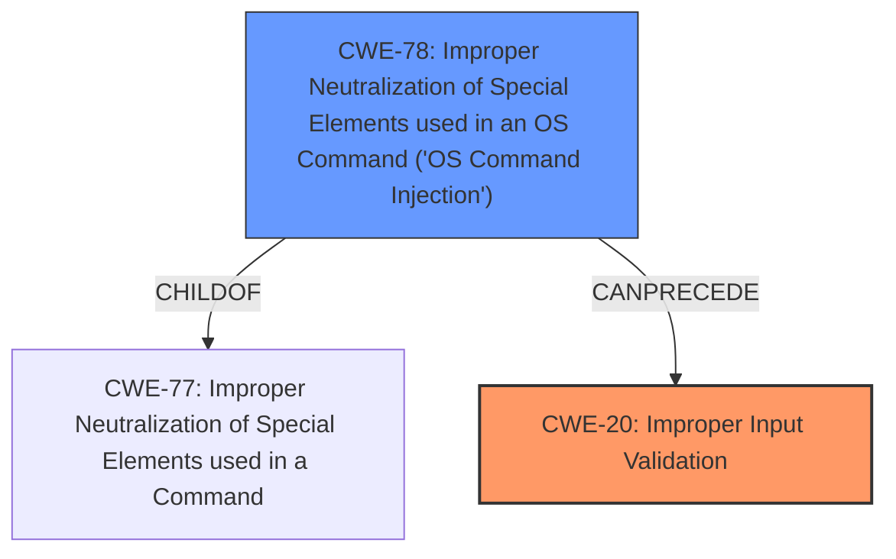

# Enhanced Analysis for CVE-2022-24711

# Summary
| CWE ID | CWE Name | Confidence | CWE Abstraction Level | CWE Vulnerability Mapping Label | CWE-Vulnerability Mapping Notes |
|---|---|---|---|---|---|
| CWE-20 | Improper Input Validation | 0.9 | Class | Primary | Allowed-with-Review |
| CWE-78 | Improper Neutralization of Special Elements used in an OS Command ('OS Command Injection') | 0.7 | Base | Secondary | Allowed |

## Evidence and Confidence

*   **Confidence Score:** 0.8
*   **Evidence Strength:** HIGH

## Relationship Analysis
The primary relationship that influenced the CWE selection is that CWE-20 **Improper Input Validation** is a broad Class-level CWE, while CWE-78 **Improper Neutralization of Special Elements used in an OS Command ('OS Command Injection')** is a more specific Base-level CWE and a ChildOf CWE-77 **Improper Neutralization of Special Elements used in a Command**. Because the vulnerability description highlights **improper input validation** as the root cause, and the impact is the ability to execute CLI routes, CWE-20 is chosen as the primary. However, because the impact leads to OS Command Injection, CWE-78 is added as a secondary weakness.



## Vulnerability Chain
The vulnerability chain starts with **improper input validation** (CWE-20), leading to the execution of CLI routes via HTTP requests, which ultimately results in OS Command Injection (CWE-78).
  - **Root Cause:** Improper Input Validation (CWE-20)
  - **Weakness:** Allowing HTTP requests to execute CLI routes
  - **Impact:** OS Command Injection (CWE-78)

## Summary of Analysis
The initial assessment identified **improper input validation** as the root cause, which is supported by the "Vulnerability Description Key Phrases" section. The "CVE Reference Links Content Summary" section confirms that the application **fails to properly validate** request sources, allowing HTTP requests to be processed as CLI commands, leading to remote command execution. The patch involves adding a check for the request method to prevent HTTP requests from triggering CLI routes, which validates the **improper input validation** assessment.

Given this evidence, CWE-20 **Improper Input Validation** is the primary CWE. While CWE-20 is a Class-level CWE and typically discouraged, it accurately captures the root cause. However, the ability to execute CLI commands through HTTP requests leads to OS command injection (CWE-78), which is included as a secondary CWE to reflect the impact.

The selected CWEs are at the optimal level of specificity, considering the available evidence. CWE-20 represents the broad **improper input validation**, while CWE-78 captures the specific consequence of OS command injection.

Other considered CWEs:
*   CWE-1336 Improper Neutralization of Special Elements Used in a Template Engine, CWE-79 Improper Neutralization of Input During Web Page Generation ('Cross-site Scripting'), CWE-78 Improper Neutralization of Special Elements used in an OS Command ('OS Command Injection'), CWE-22 Improper Limitation of a Pathname to a Restricted Directory ('Path Traversal'), CWE-117 Improper Output Neutralization for Logs, CWE-494 Download of Code Without Integrity Check, CWE-770 Allocation of Resources Without Limits or Throttling, CWE-190 Integer Overflow or Wraparound, CWE-1284 Improper Validation of Specified Quantity in Input, CWE-613 Insufficient Session Expiration, CWE-789 Memory Allocation with Excessive Size Value:
These CWEs were considered but deemed less relevant as the primary weakness is **improper input validation** that leads to the ability to execute CLI commands and not these other types of vulnerabilities.

Relevant CWE Information:

# Enhanced Context (25 CWEs)

## CWE-74: Improper Neutralization of Special Elements in Output Used by a Downstream Component ('Injection')
**Abstraction Level**: Class
**Similarity Score**: 0.79
**Source**: dense

**Description**:
The product constructs all or part of a command, data structure, or record using externally-influenced input from an upstream component, but it does not neutralize or incorrectly neutralizes special elements that could modify how it is parsed or interpreted when it is sent to a downstream component.

**Mapping Guidance**:
- Usage: Discouraged
- Rationale: CWE-74 is high-level and often misused when lower-level weaknesses are more appropriate.

## CWE-184: Incomplete List of Disallowed Inputs
**Abstraction Level**: Base
**Similarity Score**: 0.77
**Source**: dense

**Description**:
The product implements a protection mechanism that relies on a list of inputs (or properties of inputs) that are not allowed by policy or otherwise require other action to neutralize before additional processing takes place, but the list is incomplete.

**Mapping Guidance**:
- Usage: Allowed
- Rationale: This CWE entry is at the Base level of abstraction, which is a preferred level of abstraction for mapping to the root causes of vulnerabilities.

## CWE-138: Improper Neutralization of Special Elements
**Abstraction Level**: Class
**Similarity Score**: 0.77
**Source**: dense

**Description**:
The product receives input from an upstream component, but it does not neutralize or incorrectly neutralizes special elements that could be interpreted as control elements or syntactic markers when they are sent to a downstream component.

**Mapping Guidance**:
- Usage: Discouraged
- Rationale: This CWE entry is a level-1 Class (i.e., a child of a Pillar). It might have lower-level children that would be more appropriate

## CWE-80: Improper Neutralization of Script-Related HTML Tags in a Web Page (Basic XSS)
**Abstraction Level**: Variant
**Similarity Score**: 0.77
**Source**: dense

**Description**:
The product receives input from an upstream component, but it does not neutralize or incorrectly neutralizes special characters such as "<", ">", and "&" that could be interpreted as web-scripting elements when they are sent to a downstream component that processes web pages.

**Mapping Guidance**:
- Usage: Allowed
- Rationale: This CWE entry is at the Variant level of abstraction, which is a preferred level of abstraction for mapping to the root causes of vulnerabilities.

## CWE-1289: Improper Validation of Unsafe Equivalence in Input
**Abstraction Level**: Base
**Similarity Score**: 0.77
**Source**: dense

**Description**:
The product receives an input value that is used as a resource identifier or other type of reference, but it does not validate or incorrectly validates that the input is equivalent to a potentially-unsafe value.

**Mapping Guidance**:
- Usage: Allowed
- Rationale: This CWE entry is at the Base level of abstraction, which is a preferred level of abstraction for mapping to the root causes of vulnerabilities.

## CWE-113: Improper Neutralization of CRLF Sequences in HTTP Headers ('HTTP Request/Response Splitting')
**Abstraction Level**: Variant
**Similarity Score**: 0.77
**Source**: dense

**Description**:
The product receives data from an HTTP agent/component (e.g., web server, proxy, browser, etc.), but it does not neutralize or incorrectly neutralizes CR and LF characters before the data is included in outgoing HTTP headers.

**Mapping Guidance**:
- Usage: Allowed
- Rationale: This CWE entry is at the Variant level of abstraction, which is a preferred level of abstraction for mapping to the root causes of vulnerabilities.

## CWE-116: Improper Encoding or Escaping of Output
**Abstraction Level**: Class
**Similarity Score**: 0.76
**Source**: dense

**Description**:
The product prepares a structured message for communication with another component, but encoding or escaping of the data is either missing or done incorrectly. As a result, the intended structure of the message is not preserved.

**Mapping Guidance**:
- Usage: Allowed-with-Review
- Rationale: This CWE entry is a Class and might have Base-level children that would be more appropriate

## CWE-917: Improper Neutralization of Special Elements used in an Expression Language Statement ('Expression Language Injection')
**Abstraction Level**: Base
**Similarity Score**: 0.76
**Source**: dense

**Description**:
The product constructs all or part of an expression language (EL) statement in a framework such as a Java Server Page (JSP) using externally-influenced input from an upstream component, but it does not neutralize or incorrectly neutralizes special elements that could modify the intended EL statement before it is executed.

**Mapping Guidance**:
- Usage: Allowed
- Rationale: This CWE entry is at the Base level of abstraction, which is a preferred


## CWE Relationship Analysis

Current CWEs represent these abstraction levels: .


### Vulnerability Chain Analysis

**Chain starting from CWE-494:**
- 494 (Download of Code Without Integrity Check) - ROOT


**Chain starting from CWE-917:**
- 917 (Improper Neutralization of Special Elements used in an Expression Language Statement ('Expression Language Injection')) - ROOT


### CWE Relationship Diagram

```mermaid
graph TD
    classDef primary fill:#f96,stroke:#333,stroke-width:2px
    classDef secondary fill:#69f,stroke:#333
    classDef tertiary fill:#9e9,stroke:#333
```