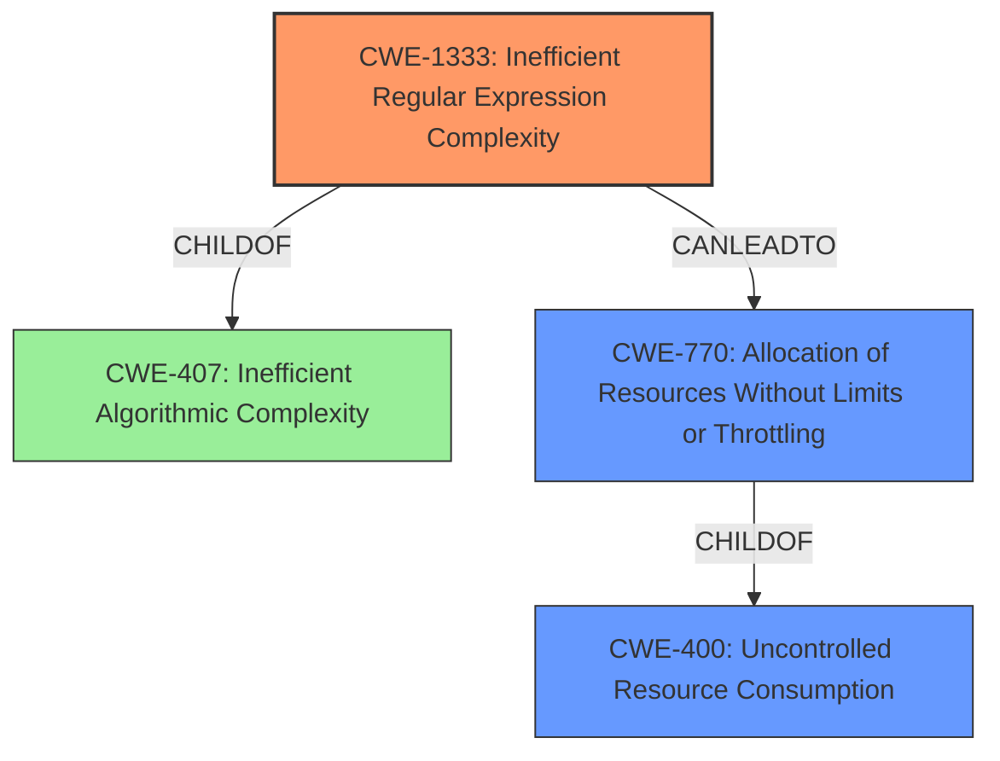

# Analysis Report for CVE-2022-24713

# Vulnerability Analysis Report: CVE-2022-24713

## Description


## Analysis (with Relationship Data)

# Summary
| CWE ID  | CWE Name  | Confidence | CWE Abstraction Level | CWE Vulnerability Mapping Label | CWE-Vulnerability Mapping Notes |
|---|---|---|---|---|---|
| CWE-1333 | Inefficient Regular Expression Complexity | 1.00 | Base | Allowed | Primary CWE |
| CWE-400 | Uncontrolled Resource Consumption | 0.75 | Class | Allowed-with-Review | Secondary Candidate |
| CWE-770 | Allocation of Resources Without Limits or Throttling | 0.60 | Base | Allowed | Secondary Candidate |

## Evidence and Confidence

*   **Confidence Score:** 0.85
*   **Evidence Strength:** HIGH

## Relationship Analysis
The primary CWE is CWE-1333, which is a child of CWE-407 (Inefficient Algorithmic Complexity). CWE-770 is also related as it describes allocating resources without limits, which can lead to uncontrolled resource consumption (CWE-400). The relationships show a progression from inefficient regex complexity (CWE-1333) leading to resource allocation issues (CWE-770) and ultimately uncontrolled resource consumption (CWE-400), which is a more general outcome.



## Vulnerability Chain
The vulnerability chain starts with a **bug in the mitigations** within the `regex` crate, specifically related to handling regular expressions. This leads to **inefficient regular expression complexity** (CWE-1333) which causes excessive CPU consumption. Consequently, the excessive CPU consumption represents **uncontrolled resource consumption** (CWE-400) because the system is not able to properly handle the crafted regexes.

## Summary of Analysis
The initial analysis pointed towards CWE-1333 as the primary weakness, which aligns with the description of the vulnerability concerning regular expression complexity. The Retriever Results also listed CWE-1333 as the top combined result. The vulnerability description key phrases highlights "regular expression denial of service" which can occur from inefficient regular expression complexity.

The evidence from the CVE Reference Links Content Summary states: "The `regex` crate had a flaw in its mitigations against denial-of-service (DoS) attacks during regex parsing... Specifically, the mitigations failed to account for the computational cost of compiling regexes with large repetitions of empty sub-expressions... The regex compiler could be made to consume excessive CPU time by compiling a large number of empty sub-expressions." This directly supports the selection of CWE-1333.

CWE-400 and CWE-770 were considered as secondary weaknesses, as the **inefficient regular expression complexity** (CWE-1333) can lead to **uncontrolled resource consumption** (CWE-400) by **allocation of resources without limits or throttling** (CWE-770).

The selected CWEs are at the optimal level of specificity because CWE-1333 is a Base level CWE that accurately describes the root cause, while the others are the results of the root cause.

Relevant CWE Information:

# Enhanced Context (25 CWEs)
The following CWEs were identified as potentially relevant to this vulnerability:

## CWE-1333: Inefficient Regular Expression Complexity
**Abstraction Level**: Base
**Similarity Score**: 8110.47
**Source**: sparse

**Description**:
The product uses a regular expression with an inefficient, possibly exponential worst-case computational complexity that consumes excessive CPU cycles.

**Mapping Guidance**:
- Usage: Allowed
- Rationale: This CWE entry is at the Base level of abstraction, which is a preferred level of abstraction for mapping to the root causes of vulnerabilities.

## CWE-400: Uncontrolled Resource Consumption
**Abstraction Level**: Class
**Similarity Score**: N/A
**Source**: N/A

**Description**: The product does not properly control the consumption of resources, possibly leading to denial of service or reduced performance.

**Mapping Guidance**:
- Usage: Allowed-with-Review

## CWE-770: Allocation of Resources Without Limits or Throttling
**Abstraction Level**: Base
**Similarity Score**: 7829.79
**Source**: sparse

**Description**:
The product allocates a reusable resource or group of resources on behalf of an actor without imposing any restrictions on the size or number of resources that can be allocated, in violation of the intended security policy for that actor.

**Mapping Guidance**:
- Usage: Allowed
- Rationale: This CWE entry is at the Base level of abstraction, which is a preferred level of abstraction for mapping to the root causes of vulnerabilities.


## CWE Relationship Analysis

Current CWEs represent these abstraction levels: .


### Vulnerability Chain Analysis

**Chain starting from CWE-1333:**
- 1333 (Inefficient Regular Expression Complexity) - ROOT


**Chain starting from CWE-770:**
- 770 (Allocation of Resources Without Limits or Throttling) - ROOT


### CWE Relationship Diagram

```mermaid
graph TD
    classDef primary fill:#f96,stroke:#333,stroke-width:2px
    classDef secondary fill:#69f,stroke:#333
    classDef tertiary fill:#9e9,stroke:#333
```


*Report generated on 2025-03-31 05:10:30*
