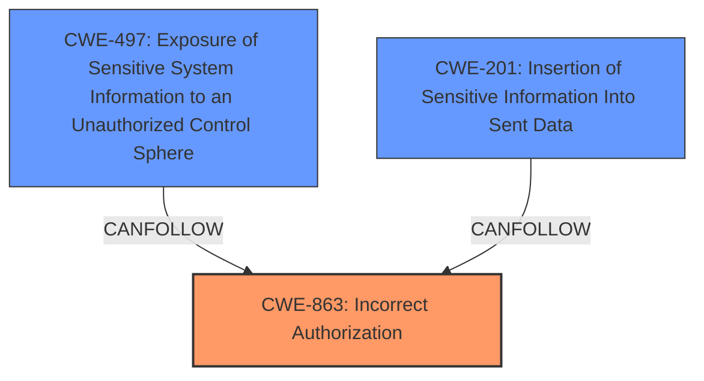

# Analysis Report for CVE-2022-24714

# Vulnerability Analysis Report: CVE-2022-24714

## Description


## Analysis (with Relationship Data)

# Summary
| CWE ID | CWE Name | Confidence | CWE Abstraction Level | CWE Vulnerability Mapping Label | CWE-Vulnerability Mapping Notes |
|---|---|---|---|---|---|
| **CWE-863** | **Incorrect Authorization** | 0.9 | Class | Primary | Allowed-with-Review |
| CWE-497 | Exposure of Sensitive System Information to an Unauthorized Control Sphere | 0.7 | Base | Secondary | Allowed |
| CWE-201 | Insertion of Sensitive Information Into Sent Data | 0.6 | Base | Secondary | Allowed |

## Evidence and Confidence

*   **Confidence Score:** 0.8
*   **Evidence Strength:** HIGH

## Relationship Analysis
The primary CWE is CWE-863 (Incorrect Authorization), which is a Class-level CWE. While it's recommended to look for more specific Base-level CWEs, in this case, the description directly states a failure in authorization checks. CWE-497 (Exposure of Sensitive System Information) and CWE-201 (Insertion of Sensitive Information Into Sent Data) are potential consequences of the authorization failure.



## Vulnerability Chain
The vulnerability chain starts with **incorrect role restriction** management based on service custom variables, leading to **incorrect authorization**, ultimately resulting in the **exposure of sensitive host information**.

## Summary of Analysis
The initial assessment focused on identifying the root cause. The vulnerability description explicitly mentions that "**If you use service custom variables in role restrictions**, users with said roles may still have access to a collection of content." The CVE Reference Links Content Summary states the **weakness** is "***Incorrect Access Control:*** The core issue is that role-based access control, intended to limit access to specific resources, fails to properly revoke access to host-related data when the associated service objects are decommissioned." This points towards an authorization issue.

The Retriever Results suggested CWE-863 (Incorrect Authorization) as a potential candidate. Looking at the Complete CWE Specifications for CWE-863, the description "The product performs an authorization check when an actor attempts to access a resource or perform an action, but it does not correctly perform the check" aligns well with the vulnerability description. The "Mapping Guidance" suggests "Allowed-with-Review" because it's a Class-level CWE, advising to check for more specific children. However, no child CWE adequately captures the **root cause** of the authorization failure itself.

CWE-497 (Exposure of Sensitive System Information to an Unauthorized Control Sphere) is considered a secondary CWE because it describes the *impact* of the failed authorization. The system exposes host information (contactgroups, contacts, hosts, etc.) to unauthorized users.

CWE-201 (Insertion of Sensitive Information Into Sent Data) is also considered as a secondary CWE since the host information is being inserted into the data being sent to the user.

The final decision is to map CWE-863 as the primary CWE due to its direct relevance to the **incorrect authorization**, with CWE-497 and CWE-201 as secondary CWEs to represent the resulting information exposure. This provides the optimal level of specificity, focusing on the **root cause** while acknowledging the consequences.

Relevant CWE Information:

# Enhanced Context (25 CWEs)
The following CWEs were identified as potentially relevant to this vulnerability:

## CWE-668: Exposure of Resource to Wrong Sphere
**Abstraction Level**: Class
**Similarity Score**: 0.78
**Source**: dense

**Description**:
The product exposes a resource to the wrong control sphere, providing unintended actors with inappropriate access to the resource.

**Mapping Guidance**:
- Usage: Discouraged
- Rationale: CWE-668 is high-level and is often misused as a catch-all when lower-level CWE IDs might be applicable. It is sometimes used for low-information vulnerability reports [REF-1287]. It is a level-1 Class (i.e., a child of a Pillar). It is not useful for trend analysis.

*Reason for not using CWE-668*: While the vulnerability does expose resources to the wrong sphere, the **root cause** is the incorrect authorization, making CWE-863 a more appropriate primary classification. CWE-497 is more descriptive of the **impact** than CWE-668, and it is at the Base level of abstraction.

## CWE-266: Incorrect Privilege Assignment
**Abstraction Level**: Base
**Similarity Score**: 0.77
**Source**: dense

**Description**:
A product incorrectly assigns a privilege to a particular actor, creating an unintended sphere of control for that actor.

**Mapping Guidance**:
- Usage: Allowed
- Rationale: This CWE entry is at the Base level of abstraction, which is a preferred level of abstraction for mapping to the root causes of vulnerabilities.

*Reason for not using CWE-266*: The issue isn't directly about assigning the wrong privileges, but about failing to revoke them when services are decommissioned, hence an authorization failure.

## CWE-653: Improper Isolation or Compartmentalization
**Abstraction Level**: Class
**Similarity Score**: 0.77
**Source**: dense

**Description**:
The product does not properly compartmentalize or isolate functionality, processes, or resources that require different privilege levels, rights, or permissions.

**Mapping Guidance**:
- Usage: Allowed
- Rationale: This CWE entry is at the Base level of abstraction, which is a preferred level of abstraction for mapping to the root causes of vulnerabilities.

*Reason for not using CWE-653*: This is not an isolation issue, it is an authorization issue.

## CWE-267: Privilege Defined With Unsafe Actions
**Abstraction Level**: Base
**Similarity Score**: 0.77
**Source**: dense

**Description**:
A particular privilege, role, capability, or right can be used to perform unsafe actions that were not intended, even when it is assigned to the correct entity.

**Mapping Guidance**:
- Usage: Allowed
- Rationale: This CWE entry is at the Base level of abstraction, which is a preferred level of abstraction for mapping to the root causes of vulnerabilities.

*Reason for not using CWE-267*: The vulnerability isn't about unsafe actions associated with privileges, but the **failure** to properly control access based on those privileges when associated services are decommissioned.

## CWE-274: Improper Handling of Insufficient Privileges
**Abstraction Level**: Base
**Similarity Score**: 0.76
**Source**: dense

**Description**:
The product does not handle or incorrectly handles when it has insufficient privileges to perform an operation, leading to resultant weaknesses.

**Mapping Guidance**:
- Usage: Discouraged
- Rationale: This CWE entry could be deprecated in a future version of CWE.

*Reason for not using CWE-274*: The users have the privileges, but are still getting access to things after they should have lost them.

## CWE-497: Exposure of Sensitive System Information to an Unauthorized Control Sphere
**Abstraction Level**: Base
**Similarity Score**: 0.76
**Source**: dense

**Description**:
The product does not properly prevent sensitive system-level information from being accessed by unauthorized actors who do not have the same level of access to the underlying system as the product does.

**Mapping Guidance**:
- Usage: Allowed
- Rationale: This CWE entry is at the Base level of abstraction, which is a preferred level of abstraction for mapping to the root causes of vulnerabilities.

*Reason for using CWE-497*: This CWE describes the impact of the vulnerability, as sensitive system information is being exposed.

## CWE-41: Improper Resolution of Path Equivalence
**Abstraction Level**: Base
**Similarity Score**: 0.75
**Source**: dense

**Description**:
The product is vulnerable to file system contents disclosure through path equivalence. Path equivalence involves the use of special characters in file and directory names. The associated manipulations are intended to generate multiple names for the same object.

**Mapping Guidance**:
- Usage: Allowed
- Rationale: This CWE entry is at the Base level of abstraction, which is a preferred level of abstraction for mapping to the root causes of vulnerabilities.

*Reason for not using CWE-41*: Not relevant to the **root cause**.

## CWE-280: Improper Handling of Insufficient Permissions or Privileges
**Abstraction Level**: Base
**Similarity Score**: 0.75
**Source**: dense

**Description**:
The product does not handle or incorrectly handles when it has insufficient privileges to access resources or functionality as specified by their permissions. This may cause it to follow unexpected code paths that may leave the product in an


## CWE Relationship Analysis

Current CWEs represent these abstraction levels: .


### Vulnerability Chain Analysis

**Chain starting from CWE-201:**
- 201 (Insertion of Sensitive Information Into Sent Data) - ROOT


**Chain starting from CWE-266:**
- 266 (Incorrect Privilege Assignment) - ROOT


### CWE Relationship Diagram

```mermaid
graph TD
    classDef primary fill:#f96,stroke:#333,stroke-width:2px
    classDef secondary fill:#69f,stroke:#333
    classDef tertiary fill:#9e9,stroke:#333
```


*Report generated on 2025-03-31 05:02:21*
