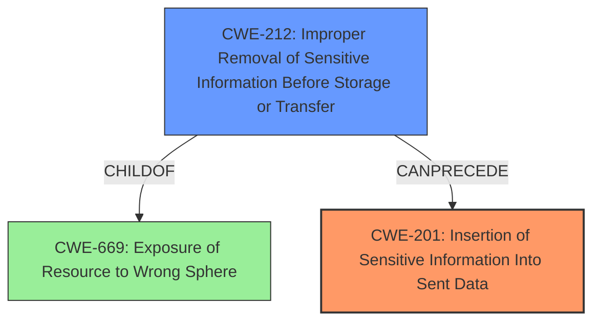

# Analysis Report for CVE-2022-24719

# Vulnerability Analysis Report: CVE-2022-24719

## Description


## Analysis (with Relationship Data)

# Summary
| CWE ID | CWE Name | Confidence | CWE Abstraction Level | CWE Vulnerability Mapping Label | CWE-Vulnerability Mapping Notes |
|---|---|---|---|---|---|
| CWE-201 | Insertion of Sensitive Information Into Sent Data | 1.0 | Base | Primary | Allowed |
| CWE-212 | Improper Removal of Sensitive Information Before Storage or Transfer | 0.8 | Base | Secondary | Allowed |

## Evidence and Confidence

*   **Confidence Score:** 0.9
*   **Evidence Strength:** HIGH

## Relationship Analysis
The primary relationship that impacted my decision was the ChildOf relationship between CWE-212 and CWE-669, and the CanPrecede relationship between CWE-212 and CWE-201. CWE-201 directly addresses the **insertion of sensitive information into sent data**, and CWE-212 addresses the **improper removal of sensitive information** before the data is sent. The vulnerability description highlights the failure to remove confidential headers before redirecting the request, which causes the **exposure of sensitive information**. Both CWEs are at the Base level of abstraction, which is preferred.



## Vulnerability Chain
The chain of events starts with the **weakness** of the application:

1.  **Improper Handling of Sensitive Data (CWE-212)**: The application does not properly remove sensitive headers like "Authorization" or "Cookie" before a redirect.
2.  **Insertion of Sensitive Information (CWE-201)**: Because the sensitive headers are not removed, they are inadvertently included in the redirected request.
3.  **Exposure of Sensitive Information**: This results in the headers being sent to a third-party, potentially malicious server, leading to information disclosure.

## Summary of Analysis
Initially, the high retriever score of CWE-212 (Improper Removal of Sensitive Information Before Storage or Transfer) made it seem like the primary candidate. However, analyzing the vulnerability description more closely, the root cause is the **insertion of sensitive information** into the sent data. While the **improper removal** is a prerequisite, the direct result and impact are due to the **insertion** of that un-redacted information. Therefore, CWE-201 is more directly representative of the core issue.

The evidence from the vulnerability description clearly supports this: "Using `followRedirects` or `followRedirectsWith` with any of the redirection strategies built into fluture-node 4.0.0 or 4.0.1, paired with a request that includes confidential headers such as Authorization or Cookie, exposes you to a vulnerability where, if the destination server were to redirect the request to a server on a third-party domain... the headers would be included in the follow-up request and be **exposed** to the third party."

CWE-201 aligns well with this description. The application "transmits data to another actor, but a portion of the data includes sensitive information that should not be accessible to that actor." This is the core of the vulnerability.

CWE-212 is still relevant because the **improper removal** is a necessary condition for the vulnerability to occur. If the sensitive information had been removed, it would not have been **inserted** into the sent data. Therefore, CWE-212 is a secondary contributing factor.

Other CWEs like CWE-79 (Cross-Site Scripting), CWE-863 (Incorrect Authorization), CWE-601 (Open Redirect), and CWE-923 (Improper Restriction of Communication Channel to Intended Endpoints) were considered but deemed less relevant. They address different types of vulnerabilities, such as script injection, authorization flaws, or redirection to untrusted sites. While redirection is involved in this vulnerability, the core issue is the mishandling of sensitive information during the redirection process, not the redirection itself.

The selected CWEs are at the optimal level of specificity because they directly address the **weakness** and the resulting **exposure** of sensitive data.

Relevant CWE Information:
* **CWE-201: Insertion of Sensitive Information Into Sent Data**
  * Confidence: 1.0
  * The vulnerability involves the inclusion of sensitive headers (Authorization, Cookie) in redirected requests without proper redaction. This directly corresponds to the CWE's description: "The code transmits data to another actor, but a portion of the data includes sensitive information that should not be accessible to that actor." The security implication is the potential exposure of sensitive credentials to unauthorized third parties.
  * Abstraction Level: Base
  * Vulnerability Mapping Notes: Allowed
* **CWE-212: Improper Removal of Sensitive Information Before Storage or Transfer**
  * Confidence: 0.8
  * While CWE-201 is the primary issue, CWE-212 represents the underlying cause: the failure to remove sensitive information before the transfer. The description "The product stores, transfers, or shares a resource that contains sensitive information, but it does not properly remove that information before the product makes the resource available to unauthorized actors" reflects this. The security implication is that this failure leads to the sensitive data being included in the transmitted data.
  * Abstraction Level: Base
  * Vulnerability Mapping Notes: Allowed


## CWE Relationship Analysis

Current CWEs represent these abstraction levels: .


### Vulnerability Chain Analysis

**Chain starting from CWE-201:**
- 201 (Insertion of Sensitive Information Into Sent Data) - ROOT


**Chain starting from CWE-601:**
- 601 (URL Redirection to Untrusted Site ('Open Redirect')) - ROOT


### CWE Relationship Diagram

```mermaid
graph TD
    classDef primary fill:#f96,stroke:#333,stroke-width:2px
    classDef secondary fill:#69f,stroke:#333
    classDef tertiary fill:#9e9,stroke:#333
```


*Report generated on 2025-03-31 08:04:48*
