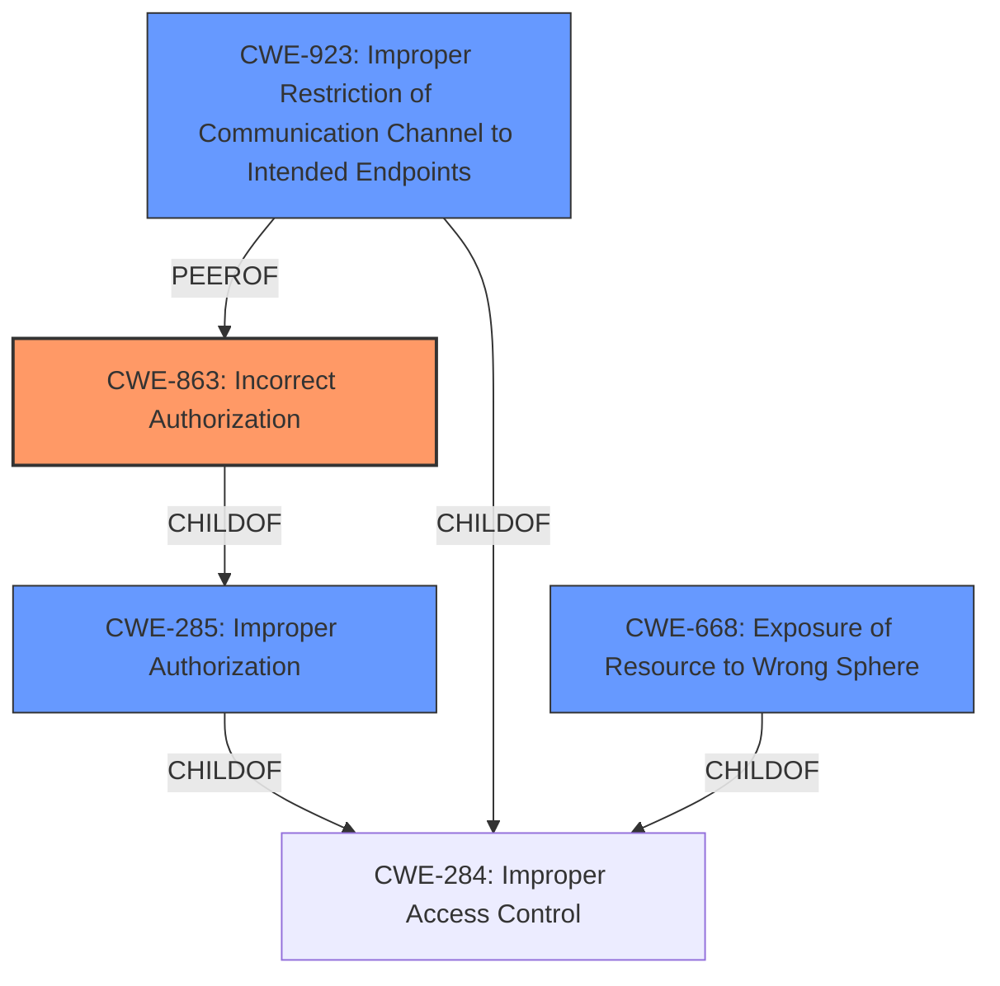

# Analysis for CVE-2022-24721

# Summary
| CWE ID | CWE Name | Confidence | CWE Abstraction Level | CWE Vulnerability Mapping Label | CWE-Vulnerability Mapping Notes |
|---|---|---|---|---|---|
| CWE-863 | Incorrect Authorization | 1.0 | Class | Primary | Allowed-with-Review |
| CWE-285 | Improper Authorization | 0.7 | Class | Secondary | Discouraged |
| CWE-923 | Improper Restriction of Communication Channel to Intended Endpoints | 0.6 | Class | Secondary | Allowed-with-Review |
| CWE-668 | Exposure of Resource to Wrong Sphere | 0.5 | Class | Secondary | Discouraged |

## Evidence and Confidence

*   **Confidence Score:** 0.8
*   **Evidence Strength:** HIGH

## Relationship Analysis
The primary relationship influencing the CWE selection is the parent-child relationship, particularly between CWE-285 (Improper Authorization) and CWE-863 (Incorrect Authorization). CWE-863 is a child of CWE-285, providing a more specific classification. While CWE-285 is discouraged due to its high-level nature, it remains a secondary consideration. CWE-923 (Improper Restriction of Communication Channel to Intended Endpoints) is related as it represents a specific type of authorization failure related to communication channels. CWE-668 (Exposure of Resource to Wrong Sphere) is related, but less directly, as it broadly covers resource exposure due to incorrect authorization.

## Vulnerability Chain
The vulnerability chain starts with the **improper authorization** of internal channels, leading to potential exposure and modification of user data and cluster structure.
1.  **Root Cause:** **Improper Authorization** (CWE-863 or CWE-285) - The core issue is the lack of proper authorization checks on Oort and Seti channels.
2.  **Weakness:** Allows unauthorized access to internal channels.
3.  **Impact 1:** Confidentiality breach - Remote users can subscribe and monitor internal traffic, exposing sensitive data.
4.  **Impact 2:** Integrity violation - Remote users can publish and modify user data and cluster structure.

## Summary of Analysis
The initial analysis identified the **improper authorization** as the primary weakness. The vulnerability description explicitly states that internal usage of Oort and Seti channels is **improperly authorized**, allowing remote users to subscribe and publish to these channels. This directly aligns with the description of CWE-863 (Incorrect Authorization): "The product performs an authorization check when an actor attempts to access a resource or perform an action, but it does not correctly perform the check."

The CVE Reference Links Content Summary reinforces this, highlighting "**Improper authorization** for internal usage of Oort and Seti channels" as the root cause. It also mentions "Lack of proper access controls" and "Failure to restrict access to internal channels."

CWE-863 is preferred over its parent CWE-285 (Improper Authorization) because it provides a more specific classification of the weakness. While CWE-285 is a broader category, CWE-863 directly addresses the incorrect performance of an authorization check, which is the core issue in this vulnerability.

CWE-923 (Improper Restriction of Communication Channel to Intended Endpoints) was considered because the vulnerability involves communication channels. However, the primary issue isn't the restriction of the communication channel itself, but the authorization of who can use it. Thus, it is a less direct fit.

CWE-668 (Exposure of Resource to Wrong Sphere) was also considered, as the unauthorized access leads to the exposure of sensitive data. However, the root cause is the **improper authorization**, not simply the exposure of the resource.

The final decision favors CWE-863 due to its precise match with the vulnerability's root cause and the supporting evidence from both the vulnerability description and the CVE Reference Links Content Summary. The selection is also guided by the principle of choosing the most specific applicable CWE.

Relevant CWE Information:

# Enhanced Context (25 CWEs)

## CWE-668: Exposure of Resource to Wrong Sphere
**Abstraction Level**: Class
**Similarity Score**: 0.79
**Source**: dense

**Description**:
The product exposes a resource to the wrong control sphere, providing unintended actors with inappropriate access to the resource.

**Mapping Guidance**:
- Usage: Discouraged
- Rationale: CWE-668 is high-level and is often misused as a catch-all when lower-level CWE IDs might be applicable. It is sometimes used for low-information vulnerability reports [REF-1287]. It is a level-1 Class (i.e., a child of a Pillar). It is not useful for trend analysis.

## CWE-941: Incorrectly Specified Destination in a Communication Channel
**Abstraction Level**: Base
**Similarity Score**: 0.77
**Source**: dense

**Description**:
The product creates a communication channel to initiate an outgoing request to an actor, but it does not correctly specify the intended destination for that actor.

**Mapping Guidance**:
- Usage: Allowed
- Rationale: This CWE entry is at the Base level of abstraction, which is a preferred level of abstraction for mapping to the root causes of vulnerabilities.

## CWE-303: Incorrect Implementation of Authentication Algorithm
**Abstraction Level**: Base
**Similarity Score**: 0.77
**Source**: dense

**Description**:
The requirements for the product dictate the use of an established authentication algorithm, but the implementation of the algorithm is incorrect.

**Mapping Guidance**:
- Usage: Allowed
- Rationale: This CWE entry is at the Base level of abstraction, which is a preferred level of abstraction for mapping to the root causes of vulnerabilities.

## CWE-807: Reliance on Untrusted Inputs in a Security Decision
**Abstraction Level**: Base
**Similarity Score**: 0.77
**Source**: dense

**Description**:
The product uses a protection mechanism that relies on the existence or values of an input, but the input can be modified by an untrusted actor in a way that bypasses the protection mechanism.

**Mapping Guidance**:
- Usage: Allowed
- Rationale: This CWE entry is at the Base level of abstraction, which is a preferred level of abstraction for mapping to the root causes of vulnerabilities.

## CWE-639: Authorization Bypass Through User-Controlled Key
**Abstraction Level**: Base
**Similarity Score**: 0.77
**Source**: dense

**Description**:
The system's authorization functionality does not prevent one user from gaining access to another user's data or record by modifying the key value identifying the data.

**Mapping Guidance**:
- Usage: Allowed
- Rationale: This CWE entry is at the Base level of abstraction, which is a preferred level of abstraction for mapping to the root causes of vulnerabilities.

## CWE-497: Exposure of Sensitive System Information to an Unauthorized Control Sphere
**Abstraction Level**: Base
**Similarity Score**: 0.77
**Source**: dense

**Description**:
The product does not properly prevent sensitive system-level information from being accessed by unauthorized actors who do not have the same level of access to the underlying system as the product does.

**Mapping Guidance**:
- Usage: Allowed
- Rationale: This CWE entry is at the Base level of abstraction, which is a preferred level of abstraction for mapping to the root causes of vulnerabilities.

## CWE-319: Cleartext Transmission of Sensitive Information
**Abstraction Level**: Base
**Similarity Score**: 0.77
**Source**: dense

**Description**:
The product transmits sensitive or security-critical data in cleartext in a communication channel that can be sniffed by unauthorized actors.

**Mapping Guidance**:
- Usage: Allowed
- Rationale: This CWE entry is at the Base level of abstraction, which is a preferred level of abstraction for mapping to the root causes of vulnerabilities.

## CWE-799: Improper Control of Interaction Frequency
**Abstraction Level**: Class
**Similarity Score**: 0.77
**Source**: dense

**Description**:
The product does not properly limit the number or frequency of interactions that it has with an actor, such as