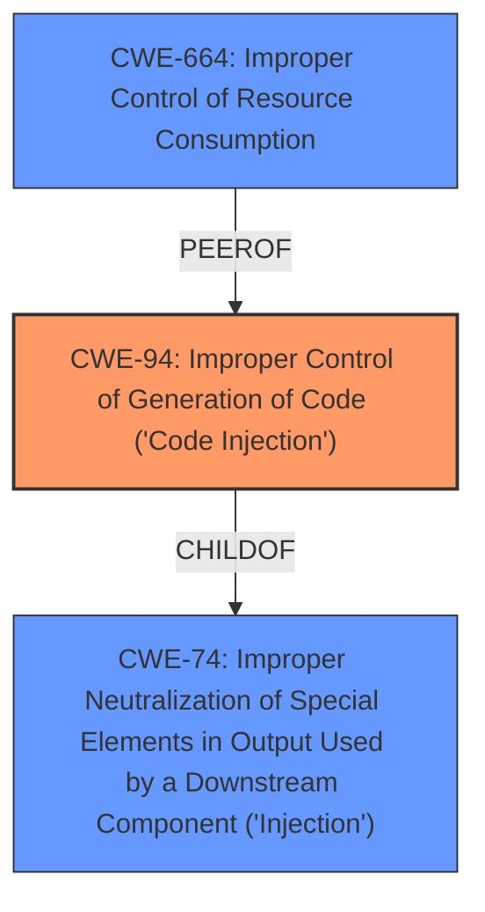

# Raw Analyzer Response for CVE-2022-24735

# Summary
| CWE ID | CWE Name | Confidence | CWE Abstraction Level | CWE Vulnerability Mapping Label | CWE-Vulnerability Mapping Notes |
|---|---|---|---|---|---|
| CWE-94 | Improper Control of Generation of Code ('Code Injection') | 1.0 | Base | Primary | Allowed-with-Review |
| CWE-664 | Improper Control of Resource Consumption | 0.5 | Base | Secondary | Allowed |

## Evidence and Confidence

*   **Confidence Score:** 0.75
*   **Evidence Strength:** MEDIUM

## Relationship Analysis
The primary relationship is that CWE-94 is a child of CWE-74 (Improper Neutralization of Special Elements in Output Used by a Downstream Component ('Injection')), indicating that code injection is a specific type of injection. While CWE-74 is more general, CWE-94 directly addresses the **improper control of code generation**, which aligns well with the **Lua code injection** aspect of the vulnerability. CWE-94 has a Allowed-with-Review usage, and the comments note "This weakness only applies when the product's functionality intentionally constructs all or part of a code segment. It could be that executing code could be the result of other weaknesses that do not involve the construction of code segments.".

## Vulnerability Chain
The vulnerability chain starts with **weaknesses in the Lua script execution environment**, leading to **code injection** and subsequent **privilege escalation**.

Weak Lua Environment -> Code Injection (CWE-94) -> Privilege Escalation

## Summary of Analysis
The initial assessment identifies CWE-94 (Improper Control of Generation of Code) as the primary weakness because the core issue is the ability to inject and execute Lua code due to **insufficient input validation** and **isolation within the Lua scripting environment**. The "CVE Reference Links Content Summary" section explicitly mentions "Code Injection: A less privileged user could inject Lua code that would be executed later by a more privileged user, due to weaknesses in the Lua environment's isolation measures." and "The Lua script execution environment in Redis did not properly isolate scripts from each other, particularly concerning the persistence of side effects and access to global variables."

The relationship graph highlights the connection between CWE-94 and its parent CWE-74 (Improper Neutralization of Special Elements in Output Used by a Downstream Component ('Injection')), reinforcing that **code injection** is a specific type of injection vulnerability.

Given the information and the root cause being the injection of code, CWE-94 is the most appropriate and specific classification.

Relevant CWE Information:
*   **CWE-94 (Improper Control of Generation of Code):** This CWE perfectly aligns with the vulnerability description, as the attacker is injecting Lua code that is then executed by the Redis server. The description states that the product constructs a code segment using externally-influenced input, but it does not neutralize or incorrectly neutralizes special elements.
*   **CWE-664 (Improper Control of Resource Consumption)**: It is possible that the injected Lua script could be crafted to consume excessive resources, but this is a secondary concern. There is not enough information to raise the confidence score for this CWE.