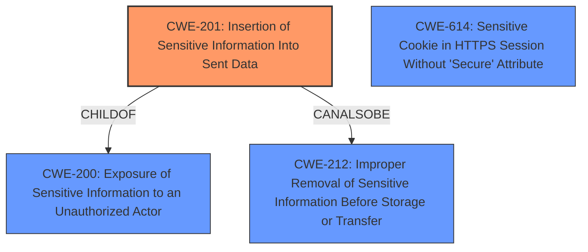

# Raw Analyzer Response for CVE-2022-24737

# Summary
| CWE ID | CWE Name | Confidence | CWE Abstraction Level | CWE Vulnerability Mapping Label | CWE-Vulnerability Mapping Notes |
|---|---|---|---|---|---|
| CWE-201 | Insertion of Sensitive Information Into Sent Data | 0.9 | Base | Allowed | Primary CWE |
| CWE-212 | Improper Removal of Sensitive Information Before Storage or Transfer | 0.7 | Base | Allowed | Secondary Candidate |
| CWE-614 | Sensitive Cookie in HTTPS Session Without 'Secure' Attribute | 0.6 | Variant | Allowed | Secondary Candidate |

## Evidence and Confidence

*   **Confidence Score:** 0.8
*   **Evidence Strength:** HIGH

## Relationship Analysis
The primary relationship that influenced the CWE selection was the parent-child relationship between CWE-200 (Exposure of Sensitive Information to an Unauthorized Actor) and CWE-201 (Insertion of Sensitive Information Into Sent Data). While CWE-200 is a broader class, CWE-201 more precisely describes the vulnerability because the sensitive cookie data is actively inserted into the sent data during a redirect. CWE-212 (Improper Removal of Sensitive Information Before Storage or Transfer) was also considered as a peer, but it focuses on the improper removal of information *before* storage or transfer, which isn't quite the scenario here. CWE-614 is a variant of CWE-319 (Cleartext Transmission of Sensitive Information), which suggests that the cookie is sent in cleartext over HTTP instead of HTTPS, which is not the case in this vulnerability.

## Vulnerability Chain
The vulnerability chain starts with the **weakness** of HTTPie not distinguishing between cookies and the hosts they belong to. This leads to the **impact** of exposing cookies to third-party websites during redirects. The chain is as follows:

1.  **Root Cause:** **HTTPie didn't distinguish between cookies and hosts they belonged** (Improper cookie handling due to not adhering to RFC 6265).
2.  **Weakness:** Cookies meant for a specific domain are inadvertently sent to third-party hosts during redirects (CWE-201 Insertion of Sensitive Information Into Sent Data).
3.  **Impact:** Exposure of sensitive cookie information, potentially including session identifiers, to unintended third-party websites (Information Exposure).
4.  **Potential Consequence:** Potential account takeover or data breach if session cookies are exposed.

## Summary of Analysis
The initial analysis focused on the provided information, particularly the **weakness** of HTTPie not distinguishing between cookies and hosts and the resulting exposure of cookies. The "CVE Reference Links Content Summary" section confirmed this, stating that the vulnerability stemmed from how HTTPie handled cookies within its session management feature and that it did not properly adhere to the RFC 6265 specification regarding the `Domain` attribute of cookies. This caused cookies being shared across all hosts during runtime, including redirects to third-party domains.

The primary reason for selecting CWE-201 (Insertion of Sensitive Information Into Sent Data) is that it directly aligns with the core issue of the vulnerability, where cookie data intended for a specific host is *inserted* into the data being sent to another host. This is supported by the description of CWE-201: "The code transmits data to another actor, but a portion of the data includes sensitive information that should not be accessible to that actor."

CWE-212 (Improper Removal of Sensitive Information Before Storage or Transfer) was considered, but ultimately deemed less suitable because the core issue is not about failing to remove sensitive information *before* storage or transfer. The information is sensitive, and it is being *inserted* into the outgoing data stream intended for a different domain.

CWE-614 (Sensitive Cookie in HTTPS Session Without 'Secure' Attribute) was considered due to the involvement of cookies. However, the vulnerability is not about sending cookies over HTTP instead of HTTPS. The problem is sending cookies to the wrong domain, regardless of the protocol used.

The final decision is based on a comprehensive analysis of the provided information, including the vulnerability description, the CVE Reference Links Content Summary, and the CWE specifications. The chosen CWEs are at the optimal level of specificity, accurately reflecting the root cause and the nature of the vulnerability.

Relevant CWE Information:

# Enhanced Context (25 CWEs)
The following CWEs were identified as potentially relevant to this vulnerability:

## CWE-407: Inefficient Algorithmic Complexity
**Abstraction Level**: Class
**Similarity Score**: 0.77
**Source**: dense

**Description**:
An algorithm in a product has an inefficient worst-case computational complexity that may be detrimental to system performance and can be triggered by an attacker, typically using crafted manipulations that ensure that the worst case is being reached.

**Mapping Guidance**:
- Usage: Allowed-with-Review
- Rationale: This CWE entry is a Class and might have Base-level children that would be more appropriate

## CWE-405: Asymmetric Resource Consumption (Amplification)
**Abstraction Level**: Class
**Similarity Score**: 0.74
**Source**: dense

**Description**:
The product does not properly control situations in which an adversary can cause the product to consume or produce excessive resources without requiring the adversary to invest equivalent work or otherwise prove authorization, i.e., the adversary's influence is "asymmetric."

**Mapping Guidance**:
- Usage: Allowed-with-Review
- Rationale: This CWE entry is a Class and might have Base-level children that would be more appropriate

## CWE-226: Sensitive Information in Resource Not Removed Before Reuse
**Abstraction Level**: Base
**Similarity Score**: 0.74
**Source**: dense

**Description**:
The product releases a resource such as memory or a file so that it can be made available for reuse, but it does not clear or "zeroize" the information contained in the resource before the product performs a critical state transition or makes the resource available for reuse by other entities.

**Mapping Guidance**:
- Usage: Allowed
- Rationale: This CWE entry is at the Base level of abstraction, which is a preferred level of abstraction for mapping to the root causes of vulnerabilities.

## CWE-668: Exposure of Resource to Wrong Sphere
**Abstraction Level**: Class
**Similarity Score**: 0.73
**Source**: dense

**Description**:
The product exposes a resource to the wrong control sphere, providing unintended actors with inappropriate access to the resource.

**Mapping Guidance**:
- Usage: Discouraged
- Rationale: CWE-668 is high-level and is often misused as a catch-all when lower-level CWE IDs might be applicable. It is sometimes used for low-information vulnerability reports [REF-1287]. It is a level-1 Class (i.e., a child of a Pillar). It is not useful for trend analysis.

## CWE-799: Improper Control of Interaction Frequency
**Abstraction Level**: Class
**Similarity Score**: 0.72
**Source**: dense

**Description**:
The product does not properly limit the number or frequency of interactions that it has with an actor, such as the number of incoming requests.

**Mapping Guidance**:
- Usage: Allowed-with-Review
- Rationale: This CWE entry is a Class and might have Base-level children that would be more appropriate

## CWE-41: Improper Resolution of Path Equivalence
**Abstraction Level**: Base
**Similarity Score**: 0.72
**Source**: dense

**Description**:
The product is vulnerable to file system contents disclosure through path equivalence. Path equivalence involves the use of special characters in file and directory names. The associated manipulations are intended to generate multiple names for the same object.

**Mapping Guidance**:
- Usage: Allowed
- Rationale: This CWE entry is at the Base level of abstraction, which is a preferred level of abstraction for mapping to the root causes of vulnerabilities.

## CWE-1176: Inefficient CPU Computation
**Abstraction Level**: Class
**Similarity Score**: 0.72
**Source**: dense

**Description**:
The product performs CPU computations using
         algorithms that are not as efficient as they could be for the
         needs of the developer, i.e., the computations can be
         optimized further.

**Mapping Guidance**:
- Usage: Allowed-with-Review
- Rationale: This CWE entry is a Class and might have Base-level children that would be more appropriate

## CWE-74: Improper Neutralization