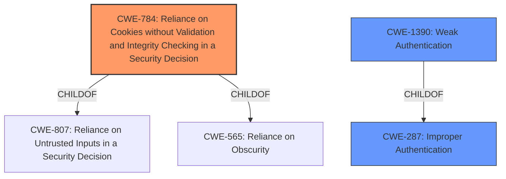

# Analysis Report for CVE-2022-24740

# Vulnerability Analysis Report: CVE-2022-24740

## Description


## Analysis (with Relationship Data)

# Summary
| CWE ID | CWE Name | Confidence | CWE Abstraction Level | CWE Vulnerability Mapping Label | CWE-Vulnerability Mapping Notes |
|---|---|---|---|---|---|
| CWE-784 | Reliance on Cookies without Validation and Integrity Checking in a Security Decision | 0.8 | Variant | Allowed | Primary CWE |
| CWE-287 | Improper Authentication | 0.6 | Class | Discouraged | Secondary Candidate |
| CWE-1390 | Weak Authentication | 0.6 | Class | Allowed-with-Review | Secondary Candidate |

## Evidence and Confidence

*   **Confidence Score:** 0.8
*   **Evidence Strength:** HIGH

## Relationship Analysis
The primary CWE, CWE-784 (Reliance on Cookies without Validation and Integrity Checking in a Security Decision), is a Variant of CWE-807 (Reliance on Untrusted Inputs in a Security Decision) and CWE-565 (Reliance on Obscurity). This indicates that the vulnerability is specifically related to the use of cookies without proper validation.

CWE-287 (Improper Authentication) and CWE-1390 (Weak Authentication) are both Classes. CWE-1390 is a child of CWE-287, indicating a hierarchical relationship where CWE-1390 is a more specific type of authentication issue.



## Vulnerability Chain
The vulnerability chain starts with an **outdated version of the react-cookie library** leading to **insecure cookie handling**, which results in the **replacement of a user's authentication cookie** with another user's cookie, ultimately leading to **account takeover**.

## Summary of Analysis
The initial assessment, supported by the provided evidence, points to a vulnerability where an outdated library leads to insecure cookie handling. This results in the potential for authentication cookies to be swapped between users, ultimately leading to account takeover.

The vulnerability description key phrases highlight the **rootcause** as an **outdated version of the react-cookie library**. The "CVE Reference Links Content Summary" provides evidence of **insecure cookie handling** due to the outdated library and its potential reliance on global state.

The selection of CWE-784 is based on the fact that the **vulnerability stems from reliance on cookies without proper validation and integrity checking**. The outdated library **fails to ensure that the cookie is valid for the associated user**, which aligns directly with the description of CWE-784.

CWE-287 and CWE-1390 were considered due to the authentication context of the vulnerability. However, CWE-784 is more specific to the cookie handling issue, making it a more appropriate primary classification. According to the Mapping Guidance for CWE-287, it is discouraged because lower-level CWEs are likely to be applicable, and CWE-1390 is a child of CWE-287.

The evidence strongly supports CWE-784 as the primary CWE because the **outdated react-cookie library** does not properly validate or ensure the integrity of cookies used for authentication. This **allows a malicious user to potentially replace another user's cookie and take over their account**.

Relevant CWE Information:

# Enhanced Context (25 CWEs)
The following CWEs were identified as potentially relevant to this vulnerability:

## CWE-799: Improper Control of Interaction Frequency
**Abstraction Level**: Class
**Similarity Score**: 0.75
**Source**: dense

**Description**:
The product does not properly limit the number or frequency of interactions that it has with an actor, such as the number of incoming requests.

**Mapping Guidance**:
- Usage: Allowed-with-Review
- Rationale: This CWE entry is a Class and might have Base-level children that would be more appropriate

**Why Not Selected:**
Not selected as the root cause is related to cookie handling and not interaction frequency.

## CWE-1289: Improper Validation of Unsafe Equivalence in Input
**Abstraction Level**: Base
**Similarity Score**: 0.75
**Source**: dense

**Description**:
The product receives an input value that is used as a resource identifier or other type of reference, but it does not validate or incorrectly validates that the input is equivalent to a potentially-unsafe value.

**Mapping Guidance**:
- Usage: Allowed
- Rationale: This CWE entry is at the Base level of abstraction, which is a preferred level of abstraction for mapping to the root causes of vulnerabilities.

**Why Not Selected:**
While there is input validation involved, the vulnerability is specific to cookie handling rather than general input validation.

## CWE-807: Reliance on Untrusted Inputs in a Security Decision
**Abstraction Level**: Base
**Similarity Score**: 0.75
**Source**: dense

**Description**:
The product uses a protection mechanism that relies on the existence or values of an input, but the input can be modified by an untrusted actor in a way that bypasses the protection mechanism.

**Mapping Guidance**:
- Usage: Allowed
- Rationale: This CWE entry is at the Base level of abstraction, which is a preferred level of abstraction for mapping to the root causes of vulnerabilities.

**Why Not Selected:**
CWE-784, a child of CWE-807, provides a more specific classification related to cookies.

## CWE-407: Inefficient Algorithmic Complexity
**Abstraction Level**: Class
**Similarity Score**: 0.75
**Source**: dense

**Description**:
An algorithm in a product has an inefficient worst-case computational complexity that may be detrimental to system performance and can be triggered by an attacker, typically using crafted manipulations that ensure that the worst case is being reached.

**Mapping Guidance**:
- Usage: Allowed-with-Review
- Rationale: This CWE entry is a Class and might have Base-level children that would be more appropriate

**Why Not Selected:**
The vulnerability is not related to algorithmic complexity but to cookie handling.

## CWE-1390: Weak Authentication
**Abstraction Level**: Class
**Similarity Score**: 0.75
**Source**: dense

**Description**:
The product uses an authentication mechanism to restrict access to specific users or identities, but the mechanism does not sufficiently prove that the claimed identity is correct.

**Mapping Guidance**:
- Usage: Allowed-with-Review
- Rationale: This CWE entry is a Class and might have Base-level children that would be more appropriate

**Why Not Selected:**
While related to authentication, the vulnerability is more specifically about the reliance on unvalidated cookies.

## CWE-345: Insufficient Verification of Data Authenticity
**Abstraction Level**: Class
**Similarity Score**: 0.74
**Source**: dense

**Description**:
The product does not sufficiently verify the origin or authenticity of data, in a way that causes it to accept invalid data.

**Mapping Guidance**:
- Usage: Discouraged
- Rationale: This CWE entry is a level-1 Class (i.e., a child of a Pillar). It might have lower-level children that would be more appropriate

**Why Not Selected:**
The vulnerability is related to cookie handling, not general data authenticity.

## CWE-668: Exposure of Resource to Wrong Sphere
**Abstraction Level**: Class
**Similarity Score**: 0.74
**Source**: dense

**Description**:
The product exposes a resource to the wrong control sphere, providing unintended actors with inappropriate access to the resource.

**Mapping Guidance**:
- Usage: Discouraged
- Rationale: CWE-668 is high-level and is often misused as a catch-all when lower-level CWE IDs might be applicable. It is sometimes used for low-information vulnerability reports [REF-1287]. It is a level-1 Class (i.e., a child of a Pillar). It is not useful for trend analysis.

**Why Not Selected:**
The vulnerability is more specific than exposing resources to the wrong sphere; it's about cookie validation.

## CWE-41: Improper Resolution of Path Equivalence
**Abstraction Level**: Base
**Similarity Score**: 0.74
**Source**: dense

**Description**:
The product is vulnerable to file system contents disclosure through path equivalence. Path equivalence involves the use of special characters in file and directory names. The associated manipulations are intended to generate multiple names for the same object.

**Mapping Guidance**:
- Usage: Allowed
- Rationale: This CWE entry is at the Base level of


## CWE Relationship Analysis

Current CWEs represent these abstraction levels: .


### Vulnerability Chain Analysis

**Chain starting from CWE-784:**
- 784 (Reliance on Cookies without Validation and Integrity Checking in a Security Decision) - ROOT


**Chain starting from CWE-41:**
- 41 (Improper Resolution of Path Equivalence) - ROOT


### CWE Relationship Diagram

```mermaid
graph TD
    classDef primary fill:#f96,stroke:#333,stroke-width:2px
    classDef secondary fill:#69f,stroke:#333
    classDef tertiary fill:#9e9,stroke:#333
```


*Report generated on 2025-03-31 12:39:46*
