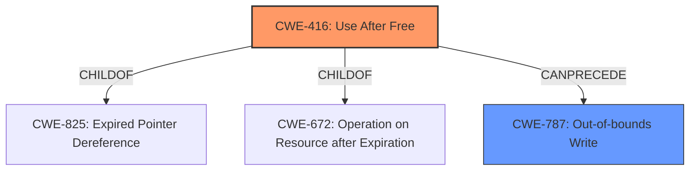

# Raw Analyzer Response for CVE-2022-2477

# Summary
| CWE ID | CWE Name | Confidence | CWE Abstraction Level | CWE Vulnerability Mapping Label | CWE-Vulnerability Mapping Notes |
|---|---|---|---|---|---|
| CWE-416 | Use After Free | 1.0 | Variant | Allowed | Primary CWE |
| CWE-787 | Out-of-bounds Write | 0.5 | Base | Allowed | Secondary CWE |

## Evidence and Confidence

*   **Confidence Score:** 0.8
*   **Evidence Strength:** HIGH

## Relationship Analysis
The primary CWE is CWE-416 **(Use After Free)**, a variant-level CWE. CWE-416 is a child of CWE-825 **(Expired Pointer Dereference)** and CWE-672 **(Operation on Resource after Expiration)**. The description clearly states a **use-after-free** condition, making this the most direct and appropriate mapping. CWE-787 **(Out-of-bounds Write)** is considered as a possible secondary issue, as **heap corruption** is mentioned in the vulnerability description, but the **use-after-free** is the root cause that leads to the **heap corruption**.

## Vulnerability Chain
The vulnerability chain starts with a **use-after-free** condition (CWE-416), which can lead to **heap corruption**, and eventually remote code execution. The **use-after-free** is the root cause.

## Summary of Analysis
The initial analysis correctly identified CWE-416 as the primary weakness based on the explicit mention of "use after free" in the vulnerability description. The **CVE Reference Links Content Summary** section also confirms that the root cause of the vulnerability is a **use-after-free**. The vulnerability description also states there is **heap corruption** from the **use-after-free** which could be classified as CWE-787.

The evidence from the vulnerability description:
- "Use after free in Guest View in Google Chrome prior to 103.0.5060.134 allowed an attacker who convinced a user to install a malicious extension to potentially exploit **heap corruption** via a crafted HTML page."
- **Vulnerability Description Key Phrases**: **rootcause:** **use after free**; **weakness:** **heap corruption**
- **CVE Reference Links Content Summary**: "Root cause of vulnerability": "Use after free"

The retriever results also list CWE-416 as the top candidate. The relationship analysis shows that CWE-416 can precede CWE-787.

The selection of CWE-416 is at the optimal level of specificity because it directly reflects the **use-after-free** condition.

CWE-366 **(Race Condition within a Thread)**, CWE-843 **(Access of Resource Using Incompatible Type ('Type Confusion'))**, CWE-122 **(Heap-based Buffer Overflow)**, CWE-362 **(Concurrent Execution using Shared Resource with Improper Synchronization ('Race Condition'))**, CWE-451 **(User Interface (UI) Misrepresentation of Critical Information)**, CWE-364 **(Signal Handler Race Condition)**, CWE-415 **(Double Free)**, CWE-404 **(Improper Resource Shutdown or Release)**, and CWE-911 **(Improper Update of Reference Count)** were considered but not used because the vulnerability description and supporting evidence point most directly to a **use-after-free** condition. While **heap corruption** is mentioned, it appears to be a consequence of the primary **use-after-free** weakness rather than a separate, independent vulnerability.