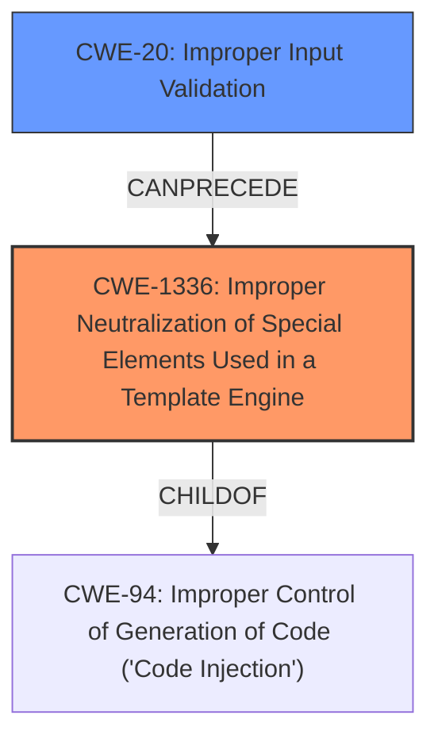

# Analysis for CVE-2022-24780

# Summary
| CWE ID | CWE Name | Confidence | CWE Abstraction Level | CWE Vulnerability Mapping Label | CWE-Vulnerability Mapping Notes |
|---|---|---|---|---|---|
| CWE-1336 | Improper Neutralization of Special Elements Used in a Template Engine | 1.0 | Base | Allowed | Primary CWE |
| CWE-20 | Improper Input Validation | 0.7 | Class | Discouraged | Secondary Candidate |

## Evidence and Confidence

*   **Confidence Score:** 0.9
*   **Evidence Strength:** HIGH

## Relationship Analysis
The primary relationship influencing the decision is that CWE-1336 is a child of CWE-94 (Improper Control of Generation of Code ('Code Injection')). Template injection is a specific form of code injection. Also, CWE-20 (Improper Input Validation) is a broad class that can precede many vulnerabilities, including template injection, but is less specific and thus a secondary consideration.

## Vulnerability Chain
The vulnerability chain starts with **forging specific http queries** to send TWIG code to the server, which leads to the server executing arbitrary code. The root cause is the **improper neutralization** of special elements in the TWIG template engine (CWE-1336). This allows an attacker to bypass security measures and execute arbitrary code on the server.

## Summary of Analysis
The initial analysis focused on the ability to **send TWIG code to the server by forging specific http queries** and then execute arbitrary code on the server. This aligns strongly with CWE-1336 (Improper Neutralization of Special Elements Used in a Template Engine). The "CVE Reference Links Content Summary" provides the following supporting evidence: "The vulnerability stems from a template injection flaw... the `formmanager_data` parameter... allows users to inject TWIG code. This occurs because the `layout.type` parameter... can be modified from `xhtml` to `twig`... The injected TWIG code is then processed by the server, leading to arbitrary code execution."

CWE-20 (Improper Input Validation) was considered because the application does not properly sanitize or validate the injected code. However, CWE-1336 is more specific, as it addresses the **improper neutralization** of special elements within the template engine itself.

The final decision is based on the evidence of template injection and the corresponding weakness in handling special elements in the template engine. CWE-1336 is at the optimal level of specificity because it directly addresses the root cause of the vulnerability, which is the failure to neutralize injected TWIG code.

Relevant CWE Information:
*   **CWE-1336:** Improper Neutralization of Special Elements Used in a Template Engine
    *   **Description:** The product uses a template engine to insert or process externally-influenced input, but it does not neutralize or incorrectly neutralizes special elements or syntax that can be interpreted as template expressions or other code directives when processed by the engine.
    *   **Mapping Guidance:** Usage: Allowed. Rationale: This CWE entry is at the Base level of abstraction, which is a preferred level of abstraction for mapping to the root causes of vulnerabilities.
*   **CWE-20:** Improper Input Validation
    *   **Description:** The product receives input or data, but it does not validate or incorrectly validates that the input has the properties that are required to process the data safely and correctly.
    *   **Mapping Guidance:** Usage: Discouraged. Rationale: CWE-20 is commonly misused in low-information vulnerability reports when lower-level CWEs could be used instead, or when more details about the vulnerability are available.