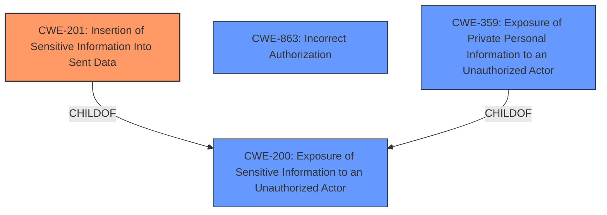

# Raw Analyzer Response for CVE-2022-24782

# Summary
| CWE ID | CWE Name | Confidence | CWE Abstraction Level | CWE Vulnerability Mapping Label | CWE-Vulnerability Mapping Notes |
|---|---|---|---|---|---|
| CWE-201 | Insertion of Sensitive Information Into Sent Data | 0.9 | Base | Allowed | Primary CWE |
| CWE-200 | Exposure of Sensitive Information to an Unauthorized Actor | 0.7 | Class | Discouraged | Secondary Candidate |
| CWE-863 | Incorrect Authorization | 0.6 | Class | Allowed-with-Review | Secondary Candidate |
| CWE-359 | Exposure of Private Personal Information to an Unauthorized Actor | 0.6 | Base | Allowed | Secondary Candidate |

## Evidence and Confidence

*   **Confidence Score:** 0.9
*   **Evidence Strength:** HIGH

## Relationship Analysis
The primary relationship considered was ChildOf. CWE-201 is a child of CWE-200, providing a more specific classification for the vulnerability. While CWE-863 addresses authorization issues, the core problem lies in sensitive data being sent where it shouldn't be, making CWE-201 a more direct fit. CWE-359 is also a child of CWE-200.

## Vulnerability Chain
The chain starts with the **improper** handling of category settings. This leads to the **insertion** of sensitive category names into the user activity export, which results in a data leak.

## Summary of Analysis
The initial analysis focused on identifying the root cause of the data leak. The vulnerability description and CVE reference links content summary pointed to the fact that the user activity export functionality in Discourse was not properly checking user permissions for secure categories. This lead to the names of secure categories being included in the export, even if the user did not have permission to see them normally.

The retriever results suggested several CWEs, including CWE-538, CWE-201, CWE-863, CWE-359 and CWE-200. However, after careful consideration, CWE-201 was selected as the primary CWE because it directly addresses the **insertion** of sensitive information (secure category names) into sent data (user activity export).

CWE-200 was considered but ultimately deemed less specific. While it's true that sensitive information is being exposed, CWE-201 pinpoints the action that causes the exposure i.e., inserting the information into the sent data. As the MITRE mapping guidance discourages using CWE-200 when more specific options are available, I opted for CWE-201.

CWE-863 was also considered as the export functionality **incorrectly** authorized users to view category names they shouldn't have access to. However, the primary issue is the **insertion** of the data, not the authorization process itself.

CWE-359 was considered because the information being leaked could be considered private. However, the description doesn't explicitly state that the category names are private personal information.

The selection of CWE-201 is based on the following evidence from the vulnerability description and CVE reference links content summary:

*   **Vulnerability Description Key Phrases:** "data leak" indicates sensitive information is being exposed.
*   **CVE Reference Links Content Summary:** "The user activity export functionality... would sometimes include the names of secure categories in the export data, even if the user did not have permission to see them normally." This directly supports the **insertion** of sensitive information into sent data.

Therefore, CWE-201 is the most accurate and specific representation of the vulnerability.

Relevant CWE Information:

# Enhanced Context (25 CWEs)

## CWE-538: Insertion of Sensitive Information into Externally-Accessible File or Directory
**Abstraction Level**: Base
**Similarity Score**: 0.79
**Source**: dense

**Description**:
The product places sensitive information into files or directories that are accessible to actors who are allowed to have access to the files, but not to the sensitive information.

**Mapping Guidance**:
- Usage: Allowed
- Rationale: This CWE entry is at the Base level of abstraction, which is a preferred level of abstraction for mapping to the root causes of vulnerabilities.
**Comments:** Carefully read both the name and description to ensure that this mapping is an appropriate fit. Do not try to 'force' a mapping to a lower-level Base/Variant simply to comply with this preferred level of abstraction.
**Reasons:**
- Acceptable-Use

## CWE-201: Insertion of Sensitive Information Into Sent Data
**Abstraction Level**: Base
**Similarity Score**: 0.76
**Source**: dense

**Description**:
The code transmits data to another actor, but a portion of the data includes sensitive information that should not be accessible to that actor.

**Mapping Guidance**:
- Usage: Allowed
- Rationale: This CWE entry is at the Base level of abstraction, which is a preferred level of abstraction for mapping to the root causes of vulnerabilities.
**Comments:** Carefully read both the name and description to ensure that this mapping is an appropriate fit. Do not try to 'force' a mapping to a lower-level Base/Variant simply to comply with this preferred level of abstraction.
**Reasons:**
- Acceptable-Use

## CWE-863: Incorrect Authorization
**Abstraction Level**: Class
**Similarity Score**: 0.77
**Source**: dense

**Description**:
The product performs an authorization check when an actor attempts to access a resource or perform an action, but it does not correctly perform the check.

**Mapping Guidance**:
- Usage: Allowed-with-Review
- Rationale: This CWE entry is a Class and might have Base-level children that would be more appropriate
**Comments:** Examine children of this entry to see if there is a better fit
**Reasons:**
- Abstraction

## CWE-359: Exposure of Private Personal Information to an Unauthorized Actor
**Abstraction Level**: Base
**Similarity Score**: 0.76
**Source**: dense

**Description**:
The product does not properly prevent a person's private, personal information from being accessed by actors who either (1) are not explicitly authorized to access the information or (2) do not have the implicit consent of the person about whom the information is collected.

**Mapping Guidance**:
- Usage: Allowed
- Rationale: This CWE entry is at the Base level of abstraction, which is a preferred level of abstraction for mapping to the root causes of vulnerabilities.
**Comments:** Carefully read both the name and description to ensure that this mapping is an appropriate fit. Do not try to 'force' a mapping to a lower-level Base/Variant simply to comply with this preferred level of abstraction.
**Reasons:**
- Acceptable-Use

## CWE-200: Exposure of Sensitive Information to an Unauthorized Actor
**Abstraction Level**: Class
**Similarity Score**: 0.76
**Source**: dense

**Description**:
The product exposes sensitive information to an actor that is not explicitly authorized to have access to that information.

**Mapping Guidance**:
- Usage: Discouraged
- Rationale: CWE-200 is commonly misused to represent the loss of confidentiality in a vulnerability, but confidentiality loss is a technical impact - not a root cause error. As of CWE 4.9, over 400 CWE entries can lead to a loss of confidentiality. Other options are often available. [REF-1287].
**Comments:** If an error or mistake causes information to be disclosed, then use the CWE ID for that error. Consider starting with improper authorization (CWE-285), insecure permissions (CWE-732), improper authentication (CWE-287), etc. Also consider children such as Insertion of Sensitive Information Into Sent Data (CWE-201), Observable Discrepancy (CWE-203), Insertion of Sensitive Information into Externally-Accessible File or Directory (CWE-538), or others.
**Reasons:**
- Frequent Misuse