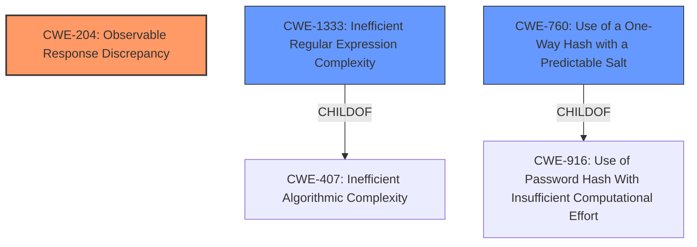

# Analysis Report for CVE-2022-24784

# Vulnerability Analysis Report: CVE-2022-24784

## Description


## Analysis (with Relationship Data)

# Summary
| CWE ID | CWE Name | Confidence | CWE Abstraction Level | CWE Vulnerability Mapping Label | CWE-Vulnerability Mapping Notes |
|---|---|---|---|---|---|
| CWE-204 | Observable Response Discrepancy | 0.8 | Base | Allowed | Primary CWE |
| CWE-1333 | Inefficient Regular Expression Complexity | 0.6 | Base | Allowed | Secondary Candidate |
| CWE-760 | Use of a One-Way Hash with a Predictable Salt | 0.5 | Variant | Allowed | Secondary Candidate |

## Evidence and Confidence

*   **Confidence Score:** 0.7
*   **Evidence Strength:** HIGH

## Relationship Analysis
The primary CWE identified is CWE-204, which describes a scenario where the product provides different responses in a way that reveals internal state. This is directly related to the vulnerability where the presence or absence of a user record reveals information about the password hash.

CWE-1333 (Inefficient Regular Expression Complexity) is considered as a secondary CWE because the vulnerability relies on specially crafted regular expressions to probe the password hash. While not the primary weakness, the complexity of the regex contributes to the exploitability.

CWE-760 (Use of a One-Way Hash with a Predictable Salt) is also considered because the vulnerability allows confirming characters of a user's password hash. While there is no mention of the salt, the ability to reveal the characters of the hash could be used to crack the password, assuming a weak hash or a predictable salt.



## Vulnerability Chain
The vulnerability chain starts with the **IMPROPER** use of a regular expression filter in the users endpoint of the REST API, leading to an **OBSERVABLE RESPONSE DISCREPANCY** that allows an attacker to confirm characters of a user's password hash. If the hashing algorithm is weak with a predictable salt, the attacker could reconstruct the password hash over time.

## Summary of Analysis
The initial analysis focused on identifying the root cause and the immediate impact of the vulnerability. The primary CWE, CWE-204, was chosen because the vulnerability's core mechanism involves using observable differences in API responses to infer information about the password hash.

The selection of CWE-204 is strongly supported by the following evidence from the vulnerability description and CVE summary:
- "it is possible to confirm a single character of a users password hash using a specially crafted regular expression filter"
- "the presence or absence of a result confirms if the character is in the right position"
- "The system allowed attackers to incrementally discover password hashes by crafting specific regular expression filters. Even though the hash itself wasn't returned in the response, the presence or absence of a response allowed attackers to confirm the presence of a character at a specific position of the hash."

CWE-1333 and CWE-760 are included as contributing factors. CWE-1333 is related to the crafted regular expressions, and CWE-760 is related to the potential weakness of the password hashing mechanism.

The chosen CWEs are at the appropriate level of specificity. CWE-204 is a Base level CWE that directly describes the observable response discrepancy. CWE-1333 and CWE-760 are also at the Base and Variant levels, respectively, providing more specific details about the vulnerability.

Relevant CWE Information:
- CWE-204: Observable Response Discrepancy
- CWE-1333: Inefficient Regular Expression Complexity
- CWE-760: Use of a One-Way Hash with a Predictable Salt


## CWE Relationship Analysis

Current CWEs represent these abstraction levels: .


### Vulnerability Chain Analysis

**Chain starting from CWE-916:**
- 916 (Use of Password Hash With Insufficient Computational Effort) - ROOT


**Chain starting from CWE-760:**
- 760 (Use of a One-Way Hash with a Predictable Salt) - ROOT


### CWE Relationship Diagram

```mermaid
graph TD
    classDef primary fill:#f96,stroke:#333,stroke-width:2px
    classDef secondary fill:#69f,stroke:#333
    classDef tertiary fill:#9e9,stroke:#333
```


*Report generated on 2025-03-30 13:11:10*
