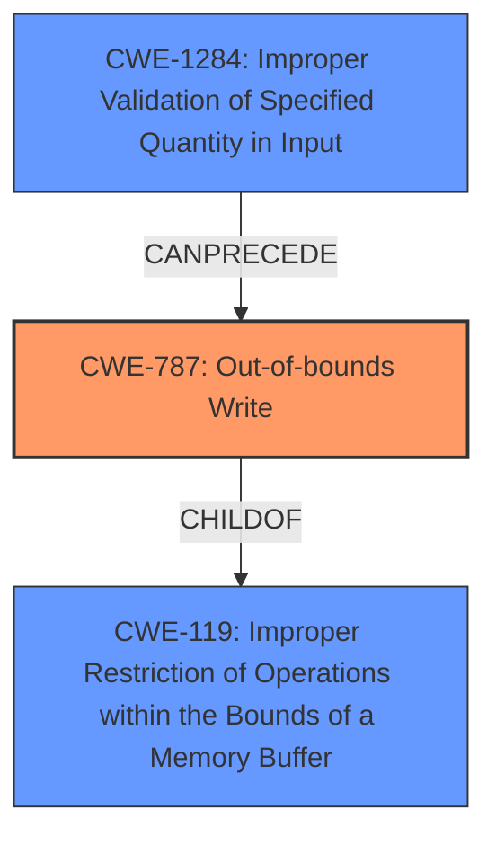

# Raw Analyzer Response for CVE-2022-24788

# Summary
| CWE ID | CWE Name | Confidence | CWE Abstraction Level | CWE Vulnerability Mapping Label | CWE-Vulnerability Mapping Notes |
|---|---|---|---|---|---|
| CWE-787 | Out-of-bounds Write | 0.9 | Base | Allowed | Primary CWE |
| CWE-1284 | Improper Validation of Specified Quantity in Input | 0.7 | Base | Allowed | Secondary CWE |

## Evidence and Confidence

*   **Confidence Score:** 0.8
*   **Evidence Strength:** HIGH

## Relationship Analysis
The primary weakness is CWE-787, representing the **buffer overrun**. CWE-1284 can precede CWE-787, indicating a possible cause where the input size isn't validated, contributing to the **buffer overrun**. CWE-787 is a child of CWE-119, indicating a general class of **improper buffer restrictions**, but CWE-787 is more specific because it involves writing beyond buffer boundaries.

## Vulnerability Chain
The vulnerability chain starts with **improper input validation** (CWE-1284), leading to a missing bytes length clamp, and culminating in a **buffer overrun** (CWE-787) when a function returns `bytes` without proper validation. The fix addresses the missing length check, preventing the overrun.

## Summary of Analysis
The primary assessment is based on the provided evidence, specifically the key phrases and CVE reference content summary. The root cause is the **bytecode which does not clamp bytes length**, resulting in a **buffer overrun**.

> **Vulnerability Description Key Phrases**
> - **rootcause:** **bytecode which does not clamp bytes length**
> - **weakness:** **buffer overrun**

The relationship analysis reinforces the selection of CWE-787 as the primary issue and CWE-1284 as a contributing factor. The level of specificity is optimal because CWE-787 clearly describes the type of **buffer overrun**, while CWE-1284 describes the **improper input validation**.

Relevant CWE Information:

# Enhanced Context (25 CWEs)
The following CWEs were identified as potentially relevant to this vulnerability:

## CWE-191: Integer Underflow (Wrap or Wraparound)
**Abstraction Level**: Base
**Similarity Score**: 0.79
**Source**: dense
## CWE-124: Buffer Underwrite ('Buffer Underflow')
**Abstraction Level**: Base
**Similarity Score**: 0.77
**Source**: dense
## CWE-131: Incorrect Calculation of Buffer Size
**Abstraction Level**: Base
**Similarity Score**: 0.77
**Source**: dense
## CWE-190: Integer Overflow or Wraparound
**Abstraction Level**: Base
**Similarity Score**: 0.77
**Source**: dense
## CWE-680: Integer Overflow to Buffer Overflow
**Abstraction Level**: Compound
**Similarity Score**: 0.76
**Source**: dense
## CWE-789: Memory Allocation with Excessive Size Value
**Abstraction Level**: Variant
**Similarity Score**: 0.76
**Source**: dense
## CWE-197: Numeric Truncation Error
**Abstraction Level**: Base
**Similarity Score**: 0.75
**Source**: dense
## CWE-805: Buffer Access with Incorrect Length Value
**Abstraction Level**: Base
**Similarity Score**: 0.75
**Source**: dense
## CWE-681: Incorrect Conversion between Numeric Types
**Abstraction Level**: Base
**Similarity Score**: 0.75
**Source**: dense
## CWE-126: Buffer Over-read
**Abstraction Level**: Variant
**Similarity Score**: 0.75
**Source**: dense
## CWE-190: Integer Overflow or Wraparound
**Abstraction Level**: Base
**Similarity Score**: 8108.28
**Source**: sparse
## CWE-125: Out-of-bounds Read
**Abstraction Level**: Base
**Similarity Score**: 7715.08
**Source**: sparse
## CWE-1284: Improper Validation of Specified Quantity in Input
**Abstraction Level**: Base
**Similarity Score**: 7645.22
**Source**: sparse
## CWE-193: Off-by-one Error
**Abstraction Level**: Base
**Similarity Score**: 7546.73
**Source**: sparse
## CWE-789: Memory Allocation with Excessive Size Value
**Abstraction Level**: Variant
**Similarity Score**: 7481.36
**Source**: sparse
## CWE-120: Buffer Copy without Checking Size of Input ('Classic Buffer Overflow')
**Abstraction Level**: base
**Similarity Score**: 4.82
**Source**: graph
## CWE-123: Write-what-where Condition
**Abstraction Level**: base
**Similarity Score**: 4.33
**Source**: graph
## CWE-787: Out-of-bounds Write
**Abstraction Level**: base
**Similarity Score**: 4.33
**Source**: graph
## CWE-770: Allocation of Resources Without Limits or Throttling
**Abstraction Level**: base
**Similarity Score**: 4.33
**Source**: graph
## CWE-170: Improper Null Termination
**Abstraction Level**: base
**Similarity Score**: 4.33
**Source**: graph
## CWE-1284: Improper Validation of Specified Quantity in Input
**Abstraction Level**: base
**Similarity Score**: 4.33
**Source**: graph
## CWE-617: Reachable Assertion
**Abstraction Level**: base
**Similarity Score**: 4.33
**Source**: graph
## CWE-476: NULL Pointer Dereference
**Abstraction Level**: base
**Similarity Score**: 4.33
**Source**: graph
## CWE-128: Wrap-around Error
**Abstraction Level**: base
**Similarity Score**: 3.57
**Source**: graph
## CWE-1325: Improperly Controlled Sequential Memory Allocation
**Abstraction Level**: Base
**Similarity Score**: 3.32
**Source**: graph

**CWE-787: Out-of-bounds Write**
*   **Technical Explanation:** The vulnerability involves writing data beyond the intended boundaries of a buffer, leading to memory corruption. In this case, the missing length clamp on returned bytes from external calls allows writing beyond the buffer's allocated size.
*   **Security Implications:** Out-of-bounds writes can overwrite critical data, leading to unpredictable behavior, denial of service, or potentially arbitrary code execution.
*   **Relationship:** CWE-787 is a child of CWE-119 (Improper Restriction of Operations within the Bounds of a Memory Buffer), indicating a general class of buffer-related weaknesses.
*   **Primary/Secondary:** Primary.
*   **Mapping Guidance:** Allowed.

**CWE-1284: Improper Validation of Specified Quantity in Input**
*   **Technical Explanation:** The vulnerability's root cause is the lack of validation on the length of the returned `bytes` data. This falls under the category of improperly validating a specified quantity in input, which in this case is the size of the byte array.
*   **Security Implications:** The lack of validation allows for a larger-than-expected byte array to be processed, eventually leading to a buffer overflow (CWE-787).
*   **Relationship:** CWE-1284 can precede CWE-787 in a vulnerability chain, as the missing input validation is a prerequisite for the out-of-bounds write.
*   **Primary/Secondary:** Secondary, contributing factor.
*   **Mapping Guidance:** Allowed.

**CWEs Considered but Not Used:**

*   **CWE-119: Improper Restriction of Operations within the Bounds of a Memory Buffer:** While technically correct, CWE-119 is a broad class. CWE-787 provides a more specific description of the vulnerability.
*   **CWE-120: Buffer Copy without Checking Size of Input ('Classic Buffer Overflow'):** While similar, this CWE applies specifically to buffer copy operations. The provided context suggests that the vulnerability stems from missing length checks after the function call, not necessarily during a buffer copy.
*   **CWE-789: Memory Allocation with Excessive Size Value:** This CWE is about allocating memory with an excessive size. While memory