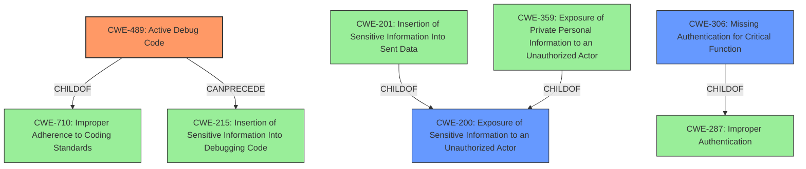

# Analysis for CVE-2022-24797

# Summary
| CWE ID  | CWE Name  | Confidence | CWE Abstraction Level | CWE Vulnerability Mapping Label | CWE-Vulnerability Mapping Notes |
|---|---|---|---|---|---|
| **CWE-489** | Active Debug Code | 0.9 | Base | Primary | Allowed |
| CWE-200 | Exposure of Sensitive Information to an Unauthorized Actor | 0.6 | Class | Secondary | Discouraged |
| CWE-306 | Missing Authentication for Critical Function | 0.5 | Base | Secondary | Allowed |

## Evidence and Confidence

*   **Confidence Score:** 0.8
*   **Evidence Strength:** HIGH

## Relationship Analysis
The primary CWE, CWE-489, is a Base level weakness describing vulnerabilities due to debug code being active in production. It is related to CWE-710 (Improper Adherence to Coding Standards) as a child. It can precede CWE-215 (Insertion of Sensitive Information Into Debugging Code). CWE-200 is a Class level weakness and a parent of CWE-201 (Insertion of Sensitive Information Into Sent Data), and CWE-359 (Exposure of Private Personal Information to an Unauthorized Actor). CWE-306 is a Base level weakness and a child of CWE-287 (Improper Authentication).

## Vulnerability Chain
The vulnerability chain starts with the **improper access control** which exposed the pprof debug and Prometheus metrics handlers to untrusted traffic. This led to information leakage and potential denial of service. The root cause is the presence of active debug code in the deployed service. The lack of proper authentication on these endpoints exacerbated the issue.

## Summary of Analysis
The initial assessment pointed towards **improper access control**, leading to information leakage and denial of service. The presence of active debug code (CWE-489) in the Pomerium Authenticate service, when running in distributed service mode, exposed pprof debug and Prometheus metrics handlers to untrusted traffic. This aligns with the vulnerability description stating that the Authenticate service exposes pprof debug and prometheus metrics handlers to untrusted traffic. The CVE Reference Links Content Summary confirms that the debug and metrics endpoints were served on the same listener as the main application logic instead of being isolated.

The selection of CWE-489 is based on the evidence that debug and metrics endpoints, which should have been protected, were exposed to untrusted traffic. This is a direct consequence of having active debug code in a production environment. The "**rootcause:** **improper access control**" reinforces this assessment.

The relationship graph highlights that CWE-489 can lead to CWE-215 (Insertion of Sensitive Information Into Debugging Code), which aligns with the potential leakage of sensitive environmental information.

The selected CWEs are at the optimal level of specificity, with CWE-489 being a Base level weakness that accurately describes the root cause, and CWE-200 and CWE-306 highlighting the impacts and contributing factors.

Relevant CWE Information:

**CWE-489: Active Debug Code:** This is the primary CWE because the root cause of the vulnerability is the presence of active debug code in the production environment. The vulnerability description states that the pprof debug and prometheus metrics handlers were exposed to untrusted traffic, which is a direct consequence of this weakness.

**CWE-200: Exposure of Sensitive Information to an Unauthorized Actor:** This CWE is a secondary consideration because the exposed debug and metrics endpoints could leak sensitive environmental information. While CWE-200 is a Class level weakness and generally discouraged, it is relevant in highlighting the potential impact of the vulnerability.

**CWE-306: Missing Authentication for Critical Function:** This CWE is a secondary consideration because the exposed debug and metrics endpoints lacked proper authentication, allowing unauthorized access. This lack of authentication contributed to the vulnerability and its potential impact.