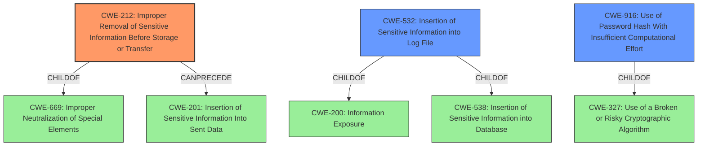

# Analysis Report for CVE-2022-24798

# Vulnerability Analysis Report: CVE-2022-24798

## Description


## Analysis (with Relationship Data)

# Summary
| CWE ID | CWE Name | Confidence | CWE Abstraction Level | CWE Vulnerability Mapping Label | CWE-Vulnerability Mapping Notes |
|---|---|---|---|---|---|
| CWE-212 | Improper Removal of Sensitive Information Before Storage or Transfer | 1.00 | Base | Primary | Allowed |
| CWE-532 | Insertion of Sensitive Information into Log File | 0.75 | Base | Secondary | Allowed |
| CWE-916 | Use of Password Hash With Insufficient Computational Effort | 0.60 | Base | Secondary | Allowed |

## Evidence and Confidence

*   **Confidence Score:** 0.85
*   **Evidence Strength:** HIGH

## Relationship Analysis
The primary CWE is CWE-212, which is at the Base level of abstraction. It has a parent-child relationship with CWE-669 (Improper Neutralization of Special Elements) and can precede CWE-201 (Insertion of Sensitive Information Into Sent Data). These relationships help clarify that the root cause is the **failure to remove sensitive data** before it's shared, which can then lead to the insertion of that data into a communication channel.
CWE-532 is a child of CWE-200 and CWE-538.
CWE-916 is a child of CWE-327.



## Vulnerability Chain
The vulnerability chain starts with the **root cause**: IRRd **did not always filter password hashes in query responses**. This leads to the **weakness**: sensitive information (password hashes) being exposed. The **impact** is that adversaries can retrieve these hashes, attempt to crack them, and potentially gain unauthorized access to modify IRR objects.

## Summary of Analysis
The initial analysis focused on the **root cause**: "**did not always filter password hashes in query responses**".

The primary CWE is CWE-212 (Improper Removal of Sensitive Information Before Storage or Transfer). The vulnerability description states that IRRd "**did not always filter password hashes in query responses** relating to `mntner` objects and database exports." The CVE Reference Links Content Summary reinforces this, stating, "The vulnerability stems from **insufficient filtering of password hashes** in specific IRRd query responses and database exports." The evidence strongly supports this classification, as the core issue is the **failure to properly remove sensitive information** (password hashes) before making it available in query responses and database exports. The selection is at the optimal level of specificity because it clearly identifies the weakness.

CWE-532 (Insertion of Sensitive Information into Log File) was considered because the CVE Reference Links Content Summary mentions "journal entries" as a place the hashes were exposed. If these journal entries were being written to a log file, then CWE-532 would apply. Since that wasn't clearly indicated, this is only a secondary candidate.

CWE-916 (Use of Password Hash With Insufficient Computational Effort) was considered because the vulnerability allows retrieval of password hashes, which could then be cracked. However, the primary weakness is the exposure of the hashes, not the strength of the hashing algorithm itself. If the hashes had been properly filtered, the strength of the hashing algorithm would be irrelevant. Therefore, while potentially relevant, this is only a secondary consideration.

Relevant CWE Information:

# Enhanced Context (25 CWEs)
The following CWEs were identified as potentially relevant to this vulnerability:

## CWE-1391: Use of Weak Credentials
**Abstraction Level**: Class
**Similarity Score**: 0.76
**Source**: dense

**Description**:
The product uses weak credentials (such as a default key or hard-coded password) that can be calculated, derived, reused, or guessed by an attacker.

**Mapping Guidance**:
- Usage: Allowed-with-Review
- Rationale: This CWE entry is a Class and might have Base-level children that would be more appropriate


## CWE-1390: Weak Authentication
**Abstraction Level**: Class
**Similarity Score**: 0.76
**Source**: dense

**Description**:
The product uses an authentication mechanism to restrict access to specific users or identities, but the mechanism does not sufficiently prove that the claimed identity is correct.

**Mapping Guidance**:
- Usage: Allowed-with-Review
- Rationale: This CWE entry is a Class and might have Base-level children that would be more appropriate


## CWE-319: Cleartext Transmission of Sensitive Information
**Abstraction Level**: Base
**Similarity Score**: 0.75
**Source**: dense

**Description**:
The product transmits sensitive or security-critical data in cleartext in a communication channel that can be sniffed by unauthorized actors.

**Mapping Guidance**:
- Usage: Allowed
- Rationale: This CWE entry is at the Base level of abstraction, which is a preferred level of abstraction for mapping to the root causes of vulnerabilities.


## CWE-303: Incorrect Implementation of Authentication Algorithm
**Abstraction Level**: Base
**Similarity Score**: 0.75
**Source**: dense

**Description**:
The requirements for the product dictate the use of an established authentication algorithm, but the implementation of the algorithm is incorrect.

**Mapping Guidance**:
- Usage: Allowed
- Rationale: This CWE entry is at the Base level of abstraction, which is a preferred level of abstraction for mapping to the root causes of vulnerabilities.


## CWE-226: Sensitive Information in Resource Not Removed Before Reuse
**Abstraction Level**: Base
**Similarity Score**: 0.75
**Source**: dense

**Description**:
The product releases a resource such as memory or a file so that it can be made available for reuse, but it does not clear or "zeroize" the information contained in the resource before the product performs a critical state transition or makes the resource available for reuse by other entities.

**Mapping Guidance**:
- Usage: Allowed
- Rationale: This CWE entry is at the Base level of abstraction, which is a preferred level of abstraction for mapping to the root causes of vulnerabilities.


## CWE-639: Authorization Bypass Through User-Controlled Key
**Abstraction Level**: Base
**Similarity Score**: 0.75
**Source**: dense

**Description**:
The system's authorization functionality does not prevent one user from gaining access to another user's data or record by modifying the key value identifying the data.

**Mapping Guidance**:
- Usage: Allowed
- Rationale: This CWE entry is at the Base level of abstraction, which is a preferred level of abstraction for mapping to the root causes of vulnerabilities.


## CWE-807: Reliance on Untrusted Inputs in a Security Decision
**Abstraction Level**: Base
**Similarity Score**: 0.74
**Source**: dense

**Description**:
The product uses a protection mechanism that relies on the existence or values of an input, but the input can be modified by an untrusted actor in a way that bypasses the protection mechanism.

**Mapping Guidance**:
- Usage: Allowed
- Rationale: This CWE entry is at the Base level of abstraction, which is a preferred level of abstraction for mapping to the root causes of vulnerabilities.


## CWE-212: Improper Removal of Sensitive Information Before Storage or Transfer
**Abstraction Level**: Base
**Similarity Score**: 0.74
**Source**: dense

**Description**:
The product stores, transfers, or shares a resource that contains sensitive information, but it does not properly remove that information before the product makes the resource available to unauthorized actors.

**Mapping Guidance**:
- Usage: Allowed
- Rationale: This CWE entry is at the Base level of abstraction, which is a preferred level of abstraction for mapping to the root causes of vulnerabilities.


## CWE-312: Cleartext Storage of


## CWE Relationship Analysis

Current CWEs represent these abstraction levels: .


### Vulnerability Chain Analysis

**Chain starting from CWE-916:**
- 916 (Use of Password Hash With Insufficient Computational Effort) - ROOT


**Chain starting from CWE-201:**
- 201 (Insertion of Sensitive Information Into Sent Data) - ROOT


### CWE Relationship Diagram

```mermaid
graph TD
    classDef primary fill:#f96,stroke:#333,stroke-width:2px
    classDef secondary fill:#69f,stroke:#333
    classDef tertiary fill:#9e9,stroke:#333
```


*Report generated on 2025-03-31 00:12:34*
