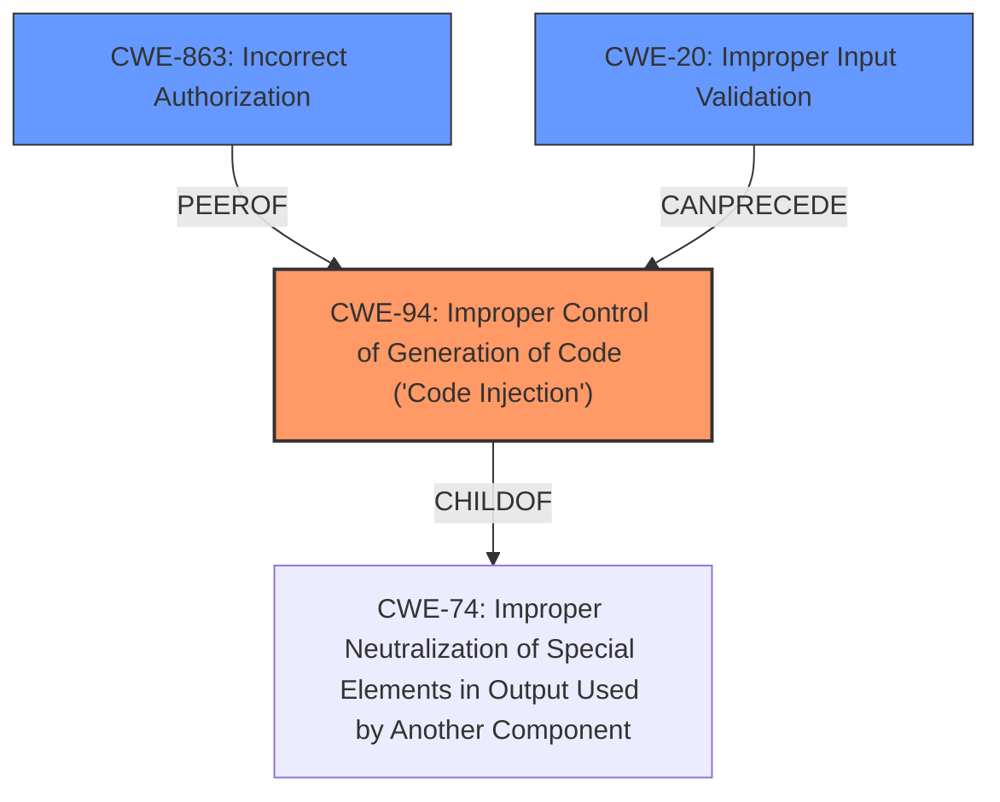

# Raw Analyzer Response for CVE-2022-24817

# Summary
| CWE ID | CWE Name | Confidence | CWE Abstraction Level | CWE Vulnerability Mapping Label | CWE-Vulnerability Mapping Notes |
|---|---|---|---|---|---|
| CWE-94 | Improper Control of Generation of Code ('Code Injection') | 0.9 | Base | Primary | Allowed-with-Review |
| CWE-863 | Incorrect Authorization | 0.7 | Class | Secondary | Allowed-with-Review |
| CWE-20 | Improper Input Validation | 0.6 | Class | Secondary | Discouraged |

## Evidence and Confidence

*   **Confidence Score:** 0.8
*   **Evidence Strength:** HIGH

## Relationship Analysis
The primary relationship that influenced my decision was the parent-child relationship between CWE-74 (Improper Neutralization of Special Elements in Output Used by Another Component) and CWE-94 (Improper Control of Generation of Code ('Code Injection')). CWE-94 is a more specific type of injection where the injected content is code, aligning well with the **code injection** identified in the vulnerability description.

CWE-863 (Incorrect Authorization) is a related weakness because the **code injection** can lead to privilege escalation, suggesting an authorization bypass.

CWE-20 (Improper Input Validation) is a general class that applies because the root cause involves **improper validation** of the `kubeconfig` file. However, CWE-94 is more specific to the vulnerability.

## Vulnerability Chain
The vulnerability chain starts with the **improper input validation** of the `kubeconfig` file, leading to **code injection**, which then results in potential privilege escalation.

*   **Root Cause:** Improper input validation of kubeconfig files.
*   **Weakness:** Code Injection (CWE-94).
*   **Impact:** Privilege escalation (related to CWE-863).

## Summary of Analysis
The analysis is based on the provided vulnerability description and the CVE Reference Links Content Summary. The key evidence is the **code injection** vulnerability caused by **improper validation** of the `kubeconfig` file.

The graph relationships helped to narrow down the CWE selection to CWE-94 as the primary weakness, as it is a more specific type of injection. CWE-863 and CWE-20 are related but less specific.

CWE-94 is at the Base level of abstraction, which is the optimal level for representing the root cause of the vulnerability.

The selection of CWE-94 is justified by the following evidence from the provided text:

*   "Vulnerable to **Code Injection** via malicious Kubeconfig."
*   "The vulnerability stems from **improper validation** of `kubeconfig` files used by Flux2 to reconcile the state of remote Kubernetes clusters."
*   "Specifically, `kubeconfig` files can contain command execution instructions that are used to generate authentication tokens. The controllers did not properly sanitize or restrict these commands, allowing a malicious user to execute arbitrary code."

I considered CWE-707 (Improper Neutralization of Special Elements), as suggested in the CVE Reference Links Content Summary. However, CWE-94 is a more specific category of weakness related to **code injection** and **generation of code**, which more closely matches the vulnerability description.

Relevant CWE Information:

# Enhanced Context (25 CWEs)

## CWE-280: Improper Handling of Insufficient Permissions or Privileges
This CWE was considered, but the vulnerability is not primarily about handling insufficient permissions.

## CWE-266: Incorrect Privilege Assignment
This CWE was considered, but the vulnerability is not directly related to the assignment of privileges.

## CWE-1289: Improper Validation of Unsafe Equivalence in Input
This CWE was considered, but it doesn't precisely describe the nature of the vulnerability, which is more about **code injection** than equivalence.

## CWE-274: Improper Handling of Insufficient Privileges
Similar to CWE-280, this CWE is not the primary issue.

## CWE-668: Exposure of Resource to Wrong Sphere
This CWE is too high-level and doesn't capture the specific weakness of **code injection**.

## CWE-807: Reliance on Untrusted Inputs in a Security Decision
This CWE is related, but it's not as specific as **code injection** through improper handling of code generation.

## CWE-664: Improper Control of a Resource Through its Lifetime
This CWE is too high-level and doesn't capture the specific weakness.

## CWE-404: Improper Resource Shutdown or Release
This CWE is not relevant to the vulnerability.

## CWE-1220: Insufficient Granularity of Access Control
This CWE is not relevant to the vulnerability.

## CWE-653: Improper Isolation or Compartmentalization
This CWE is not relevant to the vulnerability.

## CWE-1284: Improper Validation of Specified Quantity in Input
This CWE is not the primary issue, although input validation plays a role.

## CWE-789: Memory Allocation with Excessive Size Value
This CWE is not relevant to the vulnerability.

## CWE-770: Allocation of Resources Without Limits or Throttling
This CWE is not the primary issue.

## CWE-863: Incorrect Authorization
This CWE is relevant as a secondary weakness, since the **code injection** can lead to privilege escalation.

## CWE-190: Integer Overflow or Wraparound
This CWE is not relevant to the vulnerability.

## CWE-41: Improper Resolution of Path Equivalence
This CWE is not relevant to the vulnerability.

## CWE-1325: Improperly Controlled Sequential Memory Allocation
This CWE is not relevant to the vulnerability.

## CWE-789: Memory Allocation with Excessive Size Value
This CWE is not relevant to the vulnerability.

## CWE-22: Improper Limitation of a Pathname to a Restricted Directory ('Path Traversal')
This CWE is not relevant to the vulnerability.

## CWE-770: Allocation of Resources Without Limits or Throttling
This CWE is not relevant to the vulnerability.

## CWE-190: Integer Overflow or Wraparound
This CWE is not relevant to the vulnerability.

## CWE-1284: Improper Validation of Specified Quantity in Input
This CWE is not the primary issue.

## CWE-252: Unchecked Return Value
This CWE is not relevant to the vulnerability.

## CWE-476: NULL Pointer Dereference
This CWE is not relevant to the vulnerability.

## CWE-178: Improper Handling of Case Sensitivity
This CWE is not relevant to the vulnerability.