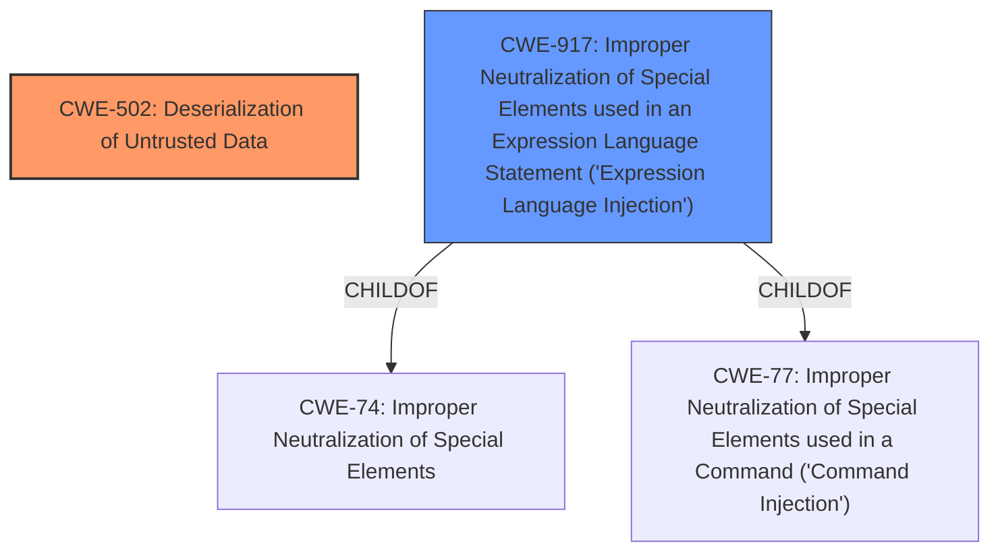

# Analysis for CVE-2022-24818

# Summary
| CWE ID  | CWE Name                                                                                         | Confidence | CWE Abstraction Level | CWE Vulnerability Mapping Label | CWE-Vulnerability Mapping Notes |
| :-------- | :------------------------------------------------------------------------------------------------- | :---------- | :---------------------- | :------------------------------ | :-------------------------------- |
| CWE-502 | Deserialization of Untrusted Data                                                              | 0.90      | Base                    | Primary                         | Allowed                           |
| CWE-917 | Improper Neutralization of Special Elements used in an Expression Language Statement ('Expression Language Injection') | 0.70      | Base                    | Secondary                         | Allowed                           |

## Evidence and Confidence

*   **Confidence Score:** 0.80
*   **Evidence Strength:** HIGH

## Relationship Analysis
The primary weakness is **CWE-502 Deserialization of Untrusted Data**, which directly stems from the **unchecked JNDI lookups**. This **CWE-502** can be related to **CWE-917 Improper Neutralization of Special Elements used in an Expression Language Statement ('Expression Language Injection')** because the JNDI lookup allows for user-provided input to be used as an expression. Therefore, a chain exists from the initial **improper input validation/neutralization** to the **deserialization of untrusted data**, leading to arbitrary code execution. **CWE-917** is a child of **CWE-74 (Improper Neutralization of Special Elements in Output Used by a Downstream Component ('Injection'))** and **CWE-77 (Improper Neutralization of Special Elements used in a Command ('Command Injection'))**.

## Vulnerability Chain
The vulnerability chain starts with the **unchecked JNDI lookups**, leading to **class deserialization**, and culminating in **arbitrary code execution**.
  - **Root Cause:** **Unchecked JNDI lookups** (Improper Input Validation).
  - **Weakness:** **Class Deserialization** (**CWE-502 Deserialization of Untrusted Data**).
  - **Impact:** Arbitrary Code Execution.

## Summary of Analysis
The initial assessment pointed towards **CWE-502 Deserialization of Untrusted Data** as the primary weakness, given the **class deserialization** aspect of the vulnerability. The retriever results also highlighted other potential CWEs such as **CWE-917 Improper Neutralization of Special Elements used in an Expression Language Statement ('Expression Language Injection')**, **CWE-1333 Inefficient Regular Expression Complexity**, and **CWE-1336 Improper Neutralization of Special Elements Used in a Template Engine**.

The evidence supporting **CWE-502 Deserialization of Untrusted Data** is derived from the vulnerability description and the CVE reference links content summary. The vulnerability description explicitly mentions **class deserialization**, and the CVE reference links content summary further elaborates that the unchecked JNDI lookup can be exploited to perform **class deserialization**, leading to arbitrary code execution.

The inclusion of **CWE-917 Improper Neutralization of Special Elements used in an Expression Language Statement ('Expression Language Injection')** as a secondary CWE is due to the fact that the **unchecked JNDI lookups** allow for user-provided input to be used as an expression, which aligns with the description of **CWE-917**.

The final decision is based on the available evidence and the relationships between the CWEs. **CWE-502** is the primary weakness because it directly addresses the **class deserialization** aspect of the vulnerability. **CWE-917** is a secondary weakness because the **unchecked JNDI lookups** allow for user-provided input to be used as an expression, which aligns with the description of **CWE-917**.

The selected CWEs are at the optimal level of specificity because they accurately represent the root cause and the weakness of the vulnerability. **CWE-502** is a Base level CWE, which is the preferred level of abstraction for mapping to the root causes of vulnerabilities. **CWE-917** is also a Base level CWE, which is also the preferred level of abstraction for mapping to the root causes of vulnerabilities.

Relevant CWE Information:

# Enhanced Context (25 CWEs)
The following CWEs were identified as potentially relevant to this vulnerability:

## CWE-917: Improper Neutralization of Special Elements used in an Expression Language Statement ('Expression Language Injection')
**Abstraction Level**: Base
**Similarity Score**: 0.79
**Source**: dense

**Description**:
The product constructs all or part of an expression language (EL) statement in a framework such as a Java Server Page (JSP) using externally-influenced input from an upstream component, but it does not neutralize or incorrectly neutralizes special elements that could modify the intended EL statement before it is executed.

**Mapping Guidance**:
- Usage: Allowed
- Rationale: This CWE entry is at the Base level of abstraction, which is a preferred level of abstraction for mapping to the root causes of vulnerabilities.

## CWE-74: Improper Neutralization of Special Elements in Output Used by a Downstream Component ('Injection')
**Abstraction Level**: Class
**Similarity Score**: 0.79
**Source**: dense

**Description**:
The product constructs all or part of a command, data structure, or record using externally-influenced input from an upstream component, but it does not neutralize or incorrectly neutralizes special elements that could modify how it is parsed or interpreted when it is sent to a downstream component.

**Mapping Guidance**:
- Usage: Discouraged
- Rationale: CWE-74 is high-level and often misused when lower-level weaknesses are more appropriate.

## CWE-116: Improper Encoding or Escaping of Output
**Abstraction Level**: Class
**Similarity Score**: 0.77
**Source**: dense

**Description**:
The product prepares a structured message for communication with another component, but encoding or escaping of the data is either missing or done incorrectly. As a result, the intended structure of the message is not preserved.

**Mapping Guidance**:
- Usage: Allowed-with-Review
- Rationale: This CWE entry is a Class and might have Base-level children that would be more appropriate

## CWE-138: Improper Neutralization of Special Elements
**Abstraction Level**: Class
**Similarity Score**: 0.77
**Source**: dense

**Description**:
The product receives input from an upstream component, but it does not neutralize or incorrectly neutralizes special elements that could be interpreted as control elements or syntactic markers when they are sent to a downstream component.

**Mapping Guidance**:
- Usage: Discouraged
- Rationale: This CWE entry is a level-1 Class (i.e., a child of a Pillar). It might have lower-level children that would be more appropriate

## CWE-184: Incomplete List of Disallowed Inputs
**Abstraction Level**: Base
**Similarity Score**: 0.77
**Source**: dense

**Description**:
The product implements a protection mechanism that relies on a list of inputs (or properties of inputs) that are not allowed by policy or otherwise require other action to neutralize before additional processing takes place, but the list is incomplete.

**Mapping Guidance**:
- Usage: Allowed
- Rationale: This CWE entry is at the Base level of abstraction, which is a preferred level of abstraction for mapping to the root causes of vulnerabilities.

## CWE-1289: Improper Validation of Unsafe Equivalence in Input
**Abstraction Level**: Base
**Similarity Score**: 0.77
**Source**: dense

**Description**:
The product receives an input value that is used as a resource identifier or other type of reference, but it does not validate or incorrectly validates that the input is equivalent to a potentially-unsafe value.

**Mapping Guidance**:
- Usage: Allowed
- Rationale: This CWE entry is at the Base level of abstraction, which is a preferred level of abstraction for mapping to the root causes of vulnerabilities.

## CWE-838: Inappropriate Encoding for Output Context
**Abstraction Level**: Base
**Similarity Score**: 0.76
**Source**: dense

**Description**:
The product uses or specifies an encoding when generating output to a downstream component, but the specified encoding is not the same as the encoding that is expected by the downstream component.

**Mapping Guidance**:
- Usage: Allowed
- Rationale: This CWE entry is at the Base level of abstraction,