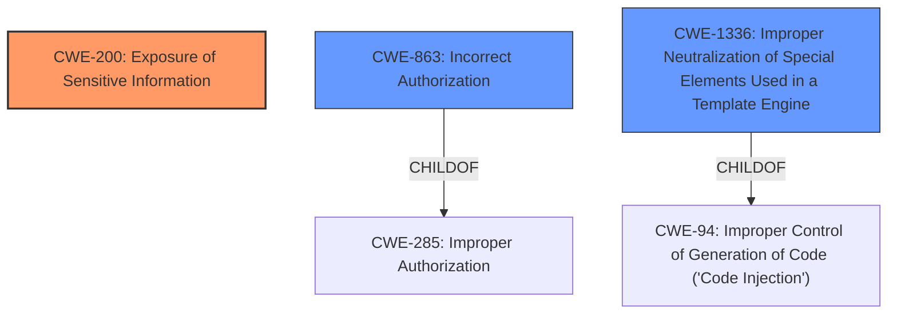

# Analysis for CVE-2022-24820

# Summary

| CWE ID | CWE Name | Confidence | CWE Abstraction Level | CWE Vulnerability Mapping Label | CWE-Vulnerability Mapping Notes |
|---|---|---|---|---|---|
| CWE-200 | Exposure of Sensitive Information | 0.9 | Class | Primary | Allowed |
| CWE-863 | Incorrect Authorization | 0.7 | Class | Secondary | Allowed-with-Review |
| CWE-1336 | Improper Neutralization of Special Elements Used in a Template Engine | 0.6 | Base | Secondary | Allowed |

## Evidence and Confidence

*   **Confidence Score:** 0.8
*   **Evidence Strength:** HIGH

## Relationship Analysis
The primary relationship that influenced the selection of CWE-200 **Exposure of Sensitive Information** is its central role in describing the impact of the vulnerability. The ability for unauthorized users to list documents they should not have access to directly relates to information exposure.

CWE-863 **Incorrect Authorization** is linked to the fact that the system **does not correctly perform the check** when an actor attempts to access a resource or perform an action.

CWE-1336 **Improper Neutralization of Special Elements Used in a Template Engine** is related because the vulnerability occurs during the rendering of Velocity documents.

## Vulnerability Chain
The vulnerability chain starts with **inadequate access control**, leading to **information disclosure** through the rendering of Velocity documents:

1.  **Inadequate Access Control:** Guest users can access Velocity templates without proper permission checks.
2.  **Information Disclosure:** Templates reveal document lists, including hidden documents, to unauthorized users.

## Summary of Analysis
Initially, the analysis focused on the **inadequate access control** as the root cause. However, the primary impact is the **Exposure of Sensitive Information**. Therefore, CWE-200 is selected as the primary CWE.

The vulnerability description states, "A guest user without the right to view pages of the wiki can still list documents by rendering some velocity documents." This clearly indicates an **Exposure of Sensitive Information** (CWE-200). The "CVE Reference Links Content Summary" further supports this, stating "The core issue is that unauthenticated users (guests) were able to access and execute Velocity templates designed for retrieving document lists" and "The primary impact is the disclosure of potentially sensitive information to unauthenticated users."

CWE-863, **Incorrect Authorization**, is a relevant secondary weakness since the application fails to properly authorize access to the Velocity templates. The **templates did not correctly check user permissions** before revealing document information.

CWE-1336, **Improper Neutralization of Special Elements Used in a Template Engine**, is considered as a possible cause because the vulnerability occurs when rendering Velocity templates. The description mentions "rendering some velocity documents" which falls under template engine use.

The final selection prioritizes CWE-200 due to its direct representation of the vulnerability's impact, with CWE-863 and CWE-1336 representing the underlying causes.

Relevant CWE Information:

# Enhanced Context (25 CWEs)

## CWE-807: Reliance on Untrusted Inputs in a Security Decision
**Abstraction Level**: Base
**Similarity Score**: 0.79
**Source**: dense
**Description**: The product uses a protection mechanism that relies on the existence or values of an input, but the input can be modified by an untrusted actor in a way that bypasses the protection mechanism.
**Rationale for Not Selecting**: While untrusted input is used, it doesn't directly bypass a protection mechanism but rather exploits a **lack of authorization**.

## CWE-538: Insertion of Sensitive Information into Externally-Accessible File or Directory
**Abstraction Level**: Base
**Similarity Score**: 0.78
**Source**: dense
**Description**: The product places sensitive information into files or directories that are accessible to actors who are allowed to have access to the files, but not to the sensitive information.
**Rationale for Not Selecting**: This CWE is about placing information into accessible files/directories, which doesn't align with the vulnerability. The issue is about information being disclosed through a query, not placed in a file.

## CWE-639: Authorization Bypass Through User-Controlled Key
**Abstraction Level**: Base
**Similarity Score**: 0.78
**Source**: dense
**Description**: The system's authorization functionality does not prevent one user from gaining access to another user's data or record by modifying the key value identifying the data.
**Rationale for Not Selecting**: This CWE involves modifying a key value to access another user's data. The current vulnerability doesn't have this characteristic. It's about a guest user listing documents they shouldn't have access to.

## CWE-552: Files or Directories Accessible to External Parties
**Abstraction Level**: Base
**Similarity Score**: 0.78
**Source**: dense
**Description**: The product makes files or directories accessible to unauthorized actors, even though they should not be.
**Rationale for Not Selecting**: This CWE is close, but it focuses on files/directories being directly accessible. In this case, the information is exposed through a template rendering, making it more related to information exposure and incorrect authorization.

## CWE-74: Improper Neutralization of Special Elements in Output Used by a Downstream Component ('Injection')
**Abstraction Level**: Class
**Similarity Score**: 0.78
**Source**: dense
**Description**: The product constructs all or part of a command, data structure, or record using externally-influenced input from an upstream component, but it does not neutralize or incorrectly neutralizes special elements that could modify how it is parsed or interpreted when it is sent to a downstream component.
**Rationale for Not Selecting**: While Velocity templates are used, there's no explicit evidence of **improper neutralization** of special elements. The core issue is the **lack of authorization**.

## CWE-303: Incorrect Implementation of Authentication Algorithm
**Abstraction Level**: Base
**Similarity Score**: 0.78
**Source**: dense
**Description**: The requirements for the product dictate the use of an established authentication algorithm, but the implementation of the algorithm is incorrect.
**Rationale for Not Selecting**: This CWE is about incorrect implementation of an authentication algorithm. The vulnerability is about **missing/incorrect authorization**, not authentication.

## CWE-41: Improper Resolution of Path Equivalence
**Abstraction Level**: Base
**Similarity Score**: 0.78
**Source**: dense
**Description**: The product is vulnerable to file system contents disclosure through path equivalence. Path equivalence involves the use of special characters in file and directory names. The associated manipulations are intended to generate multiple names for the same object.
**Rationale for Not Selecting**: This CWE is about path equivalence issues for file system disclosure, which is not relevant to the vulnerability description.

## CWE-319: Cleartext Transmission of Sensitive Information
**Abstraction Level**: Base
**Similarity Score**: 0.77
**Source**: dense
**Description**: The product transmits sensitive or security-critical data in cleartext in a communication channel that can be sniffed by unauthorized actors.
**Rationale for Not Selecting**: This CWE is about transmitting sensitive information in cleartext, which is not relevant.

## CWE-668: Exposure of Resource to Wrong Sphere
**Abstraction Level**: Class
**Similarity Score**: 0.77
**Source**: dense
**Description**: The product exposes a resource to the wrong control sphere, providing unintended actors with inappropriate access to the resource.
**Rationale for Not Selecting**: CWE-668 is a high-level CWE. The more specific CWE-200 is more appropriate here.

## CWE-116: Improper Encoding or Escaping of Output
**Abstraction Level**: Class
**Similarity Score**: 0.77
**Source**: dense
**Description**: The product prepares a structured message for communication with another component, but encoding or escaping of the data is either missing or done incorrectly. As a result, the intended structure of the message is not preserved.
**Rationale for Not Selecting**: There's no indication of encoding/escaping issues in the description.

## CWE-1336: Improper Neutralization of Special Elements Used in a Template Engine
**Abstraction Level**: Base
**Similarity Score**: 6764.44
**Source**: sparse
**Description**: The product uses a template engine to insert or process externally-influenced input, but it does not neutralize or incorrectly neutralizes special elements or syntax that can be interpreted